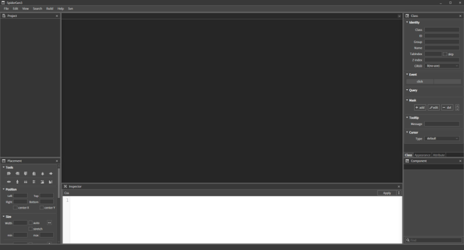
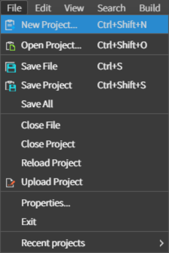
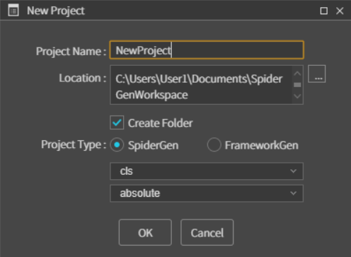
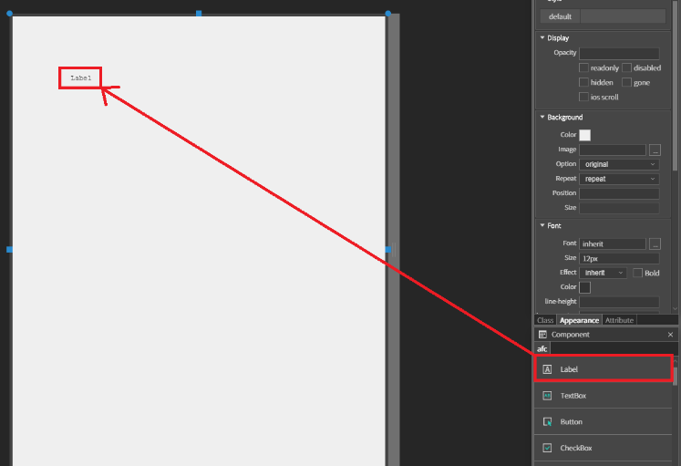
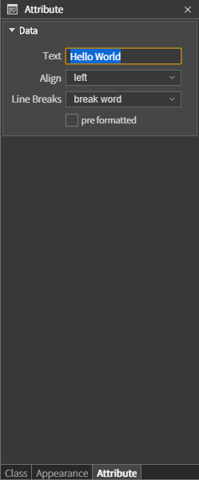
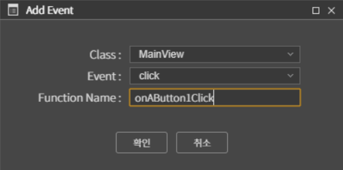
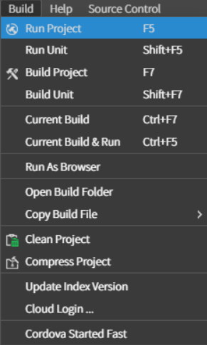
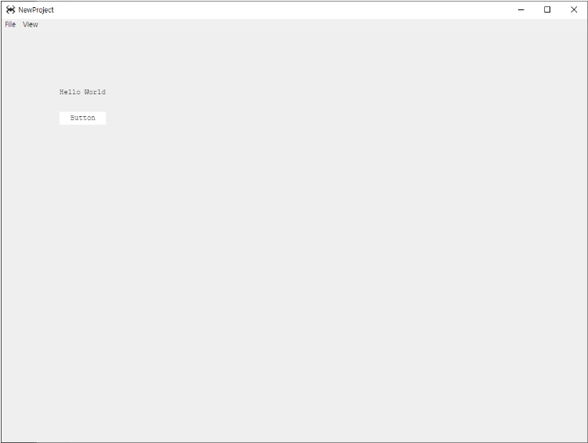
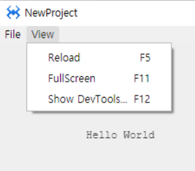
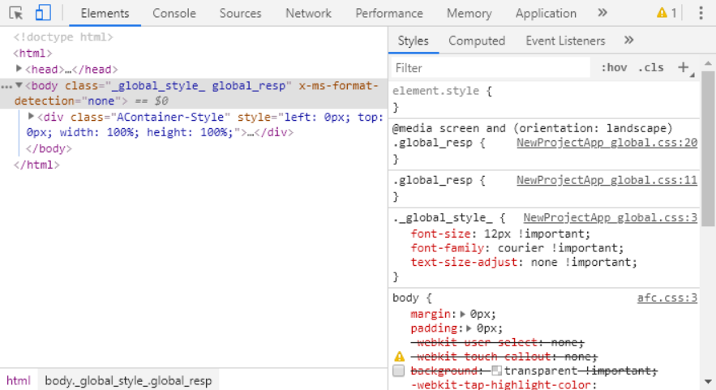

# 00. 스파이더젠 시작하기

## 1. SpiderGen 다운로드Test

스파이더젠의 다운로드는 아래 링크에서 가능합니다.

설치하려는 특정 버전이 있지 않다면 자신의 OS에 맞는 최신버전의 파일을 다운로드 합니다.

* [**스파이더젠 다운로드**](https://www.spidergen.org:3003/?pid=T040000)

## 2. 스파이더젠 실행 및 프로젝트 생성

스파이더젠 다운로드 후 압축을 풀고 폴더내의 SpiderGen3.exe 파일을 실행하면 가장 처음에 빈 화면이 뜹니다.



### 2.1 프로젝트 생성

상단의 메뉴 중 File > New Project…(Ctrl + Shift + N)를 선택합니다.



이 후 Project Name에 NewProject 혹은 원하는 이름을 입력하고 프로젝트를 생성합니다.\
단, 특수문자는 사용할 수 없습니다.



### 2.2 기본적인 사용 방법

프로젝트가 생성되면 아래와 같이 프로젝트 트리가 보입니다.


최초에 프로젝트를 생성하면 Source 폴더 안에 **프로젝트이름App.cls, MainView.cls, MainView.lay** 파일이 생성됩니다.

**프로젝트이름App.cls**는 프로젝트 실행 시 최초로 실행되는 파일입니다. **MainView.cls**와 **MainView.lay**파일은 서로 짝을 이루는 파일이며 cls파일과 lay파일은 각각 아래와 같은 특징이 있습니다.

* cls 파일

같은 이름의 lay파일과 짝을 이루며 lay파일의 컴포넌트들을 컨트롤 하거나 원하는 기능들을 사용할 수 있게 코드를 편집하는 파일입니다. 자바스크립트문법을 따르고 있습니다.

* lay 파일

같은 이름의 cls파일과 짝을 이루며 실행 시 화면에서 보일 컴포넌트들을 추가하고 모양을 만드는 파일입니다. 각 컴포넌트들의 id를 지정하여 cls파일에서 사용할 수 있습니다.

### 2.2.1 컴포넌트 추가하기

MainView.lay를 열어보면 비어있는 흰색 배경의 뷰가 보입니다. 이 위치가 작업 뷰입니다.

우측 하단의 Component 에는 스파이더젠에서 사용할 수 있는 각종 컴포넌트들이 모여 있습니다.

만약 Component가 보이지 않는다면 상단 메뉴 중 View > Component(Ctrl + 1)을 선택 하면 찾을 수 있습니다.



Label을 더블클릭 하거나 드래그하여 작업 뷰에 올려놓으면 새 라벨이 생성되어 작업 뷰 상에 Label이라는 글자가 보입니다.

우측의 Attribute를 선택하여 라벨의 속성을 볼 수 있습니다.

만약 Attribute가 보이지 않는다면 마찬가지로 상단 메뉴 중 View > Attribute(Ctrl + 6)를 선택하면 찾을 수 있습니다.



Attribute > Data > Text 에 'Hello World'를 입력합니다.


라벨을 클릭 한 상태에서 F2를 눌러서 작업 뷰 상에서 바로 수정 할 수 있습니다.

작업 뷰의 라벨이 Hello World라고 변경되었는지 확인합니다.

### 2.2.2 이벤트 만들기

이번에는 오픈되어있는 MainView.lay파일에서 Button을 추가합니다.

Label과 똑같이 Component에서 Button을 더블클릭 하거나 드래그하여 작업 뷰로 올리면 생성됩니다.


이런식으로 버튼이 추가되었다면 버튼을 누르고 우측의 Class를 선택하여 버튼의 분류와 이벤트 등을 확인 할 수 있습니다.

만약 Class가 보이지 않는다면 상단 메쥬 중 View > Class(Ctrl + 4)를 선택하면 찾을 수 있습니다.


이와같이 Class를 확인하면 Event를 추가할 수 있는 그리드가 있는데, 버튼 클릭 시의 이벤트를 추가할 것이므로 click을 더블클릭하여 Add Event 창을 오픈합니다.



확인을 누르면 cls파일이 오픈되며 이벤트 생성 시 정한 이름의 함수가 추가됩니다.

TODO:edit here 부분에 알림창을 띄우는 함수를 추가합니다.

```javascript
function MainView*onAButton1Click(comp, info, e)
{

    //TODO:edit here
    alert('Hello World');

};
```

## 빌드 및 실행

### 3.1 시뮬레이터

만들어진 프로젝트를 실행하기 위해 상단의 메뉴 중 Build > Run Project(F5)를 선택 합니다.



실행하여 아래와같이 보인다면 성공입니다.



lay파일에서 만들었던 Button을 클릭합니다.


### 3.1.1 시뮬레이터 디버깅 툴

좌측 상단의 메뉴에서 View를 누르면 시뮬레이터뷰를 컨트롤할 수 있는 메뉴가 나옵니다.



* Reload : 시뮬레이터를 새로고침 하고 스파이더젠에서 새로 빌드된 사항을 적용합니다.
* FullScreen : 시뮬레이터 창을 최대화 합니다.
* Show DevTools… : Developer Tools 를 오픈 합니다.

이 메뉴 중에서 Developer Tools에서는 각 컴포넌트의 속성과 스타일을 확인 할 수 있고 코드의 디버깅이 가능하기 때문에 프로젝트를 진행하다보면 자주 사용하게 될 툴이니 살펴봐두면 좋습니다.



크롬 기반 개발자 툴이며 이 곳에서 사용법을 확인할 수 있습니다.

### 3.2 모바일

SpiderGen 프로젝트는 하나의 소스로 안드로이드, iOS 모두에서 사용할 수 있습니다.

사용하기 위해서는 우선 Cordova를 설치하고 플랫폼을 추가해야합니다.

Cordova의 설치와 모바일 빌드는 다음 07. 웹 & 모바일에서 실행하기단계에서 소개합니다.
