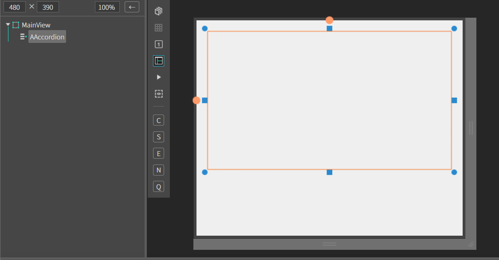
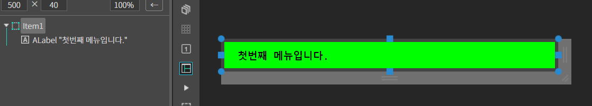
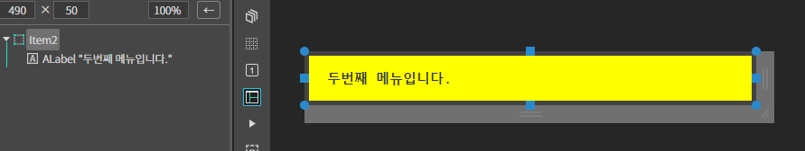
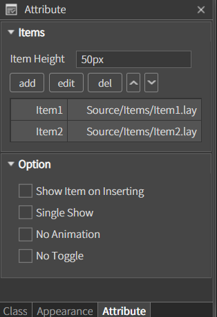
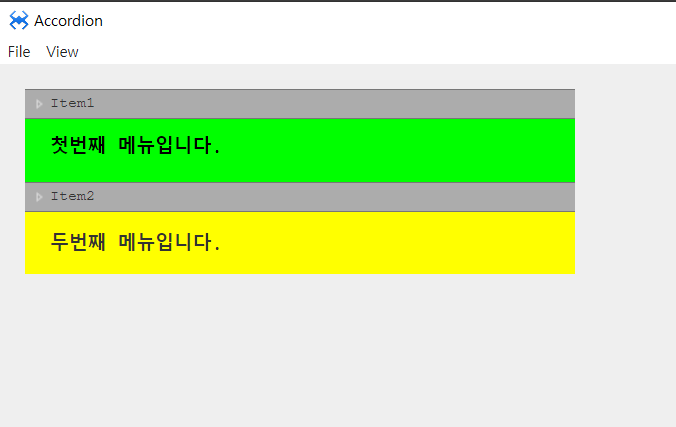

# 1.Accordion 
아코디언 컴포넌트 입니다.

특정 구조(p,div)로 된 태그 정보를 파라미터로 받아 accordion 메뉴를 구성한다.

## a. Accordion Attribute

### **Item** 

**Item Height** 아이템의 높이를 설정하는 속성입니다.
* **add** : 아이템을 추가하는 속성입니다. 
  * **Title** : 아이템의 title 입니다. 
  * **URL**  :  아이템과 매칭될 URL 입니다. 
* **edit**  : 아이템의 설정 내용을 수정하는 속성입니다. 
* **del**  : 선택한 아이템을 삭제합니다. 
* **up**  : 선택한 아이템의 순서를 한스탭 앞으로 이동합니다. 
* **down**  : 선택한 아이템의 순서를 한스탭 뒤로 이동합니다. 

### **Option** 
**Show item on inserting**  : 메뉴를 모두 보여주는 옵션입니다.  
**Single Show**  : 메뉴를 하나씩 보여주는 옵션입니다.  
**no animation**  : 애니메이션 효과를 없애주는 옵션입니다.  
**No Toggle**   : 토글 기능을 없애주는 옵션입니다.  

## b. Accordion Example

### 1. MainView.lay의 레이아웃에 컴포넌트를 추가합니다. 

 

### 2. Source 폴더 아래에 Items 폴더를 생성합니다  
### 3. 생성 된 Items 폴더에 Item1, Item2 뷰를 생성합니다 

 

 

### 4. MainView.lay 
 * Accordion 컴포넌트 선택 후 Attribute > Items Item Height : 50px로 설정해 주고 
추가한 뷰 Item1, Item2 를 add를 눌러 추가해줍니다.

 

### 5.F5를 누르거나 Build > Run Project 를 클릭하여 프로젝트를 Run 합니다.

 

 * Item1 ,Item2를 클릭해서 아이템뷰가 잘 출력되는지 확인합니다.
