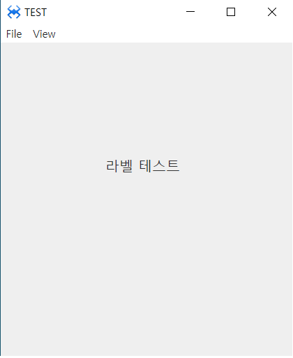

#  A.Label 
라인 텍스트를 출력하는 컴포넌트입니다.

## a.Label Attribute
Label 속성입니다. 글로벌 속성은 4. Gloval Properties 속성을 참고해주세요.

### **Data**<br>

**Text  :** 텍스트를 설정하는 속성입니다.<br>
**Align   :** 텍스트의 정렬을 설정하는 속성입니다.<br>
* **left  :** 텍스트를 좌측 정렬합니다.<br>
* **center  :** 텍스트를 중앙 정렬합니다.<br>
* **right  :** 텍스트를 우측 정렬합니다.<br>

**Line Break  :** 텍스트 줄바꿈 옵션을 설정하는 속성입니다.<br>
* **break word  :** 단어 단위로 줄바꿈을 실행하는 속성입니다.<br>
* **break all  :** 글자 단위로 줄바꿈을 실행하는 속성입니다.<br>
* **pre formatted  :** 텍스트를 형식화하여 입력된 원래 형식으로 줄바꿈 됩니다.<br>

## b. Label Example

### 1. MainView.lay의 레이아웃에 컴포넌트를 추가합니다.<br>

<br>
 * 컴포넌트 리스트에서 Label 컴포넌트를 더블 클릭하거나 컴포넌트 리스트에서 레이아웃으로 드래그하여 위와 같이 배치합니다.<br>
<br>

<br>

 * class pane에서 ID를 'LabelID'로 설정합니다.<br><br>
 
<br>
 * 레이아웃에서 Label에 텍스트를 설정하는 두 가지 방법입니다<br>
1 레이아웃의 Label을 더블 클릭해서 Text를 설정할 수 있습니다<br>
2 Attribute pane에서 Text에 입력해서 설정할 수 있습니다.<br>

 * Text를 다음과 같이 설정 합니다.<br>
Attribute > Data > Text : Label Example<br>

### 2. F5를 누르거나 Build > Run Project 를 클릭하여 프로젝트를 Run 합니다.

<br>

 * Label에 설정 된 텍스트가 출력되는 것을 확인할 수 있습니다

### 3. 소스코딩을 이용하여 Label에 텍스트를 설정합니다.<br>

 * MainView.cls 파일을 오픈합니다.<br>
 * 상단의 파일탭에서 MainView.lay 탭을 더블 클릭하거나 우측의 프로젝트 트리에서 MainView.cls 파일을 더블 클릭합니다.<br>
 * 모든 화면뷰는 onInitDone() 함수가 존재하며 이 함수는 화면이 생성될 때 딱 한번 실행됩니다.<br>
 * onInitDone() 함수에서 레이블의 텍스트 내용을 아래와 같이 코드를 입력합니다.<br>
```javascript
function MainView*onInitDone()
{
	super.onInitDone();

        //Label 컴포넌트에 ID가 부여되었으면 
        //this.컴포넌트아이디 형태로 바로 접근이 가능합니다. 
	
	   this.LabelID.setText('라벨 테스트');    
	
};
```

### 5.F5를 누르거나 Build > Run Project 를 클릭하여 프로젝트를 Run 합니다.<br>


<br>

 * Label에 텍스트가 바뀌어서 출력되는 것을 확인할 수 있습니다.<br>