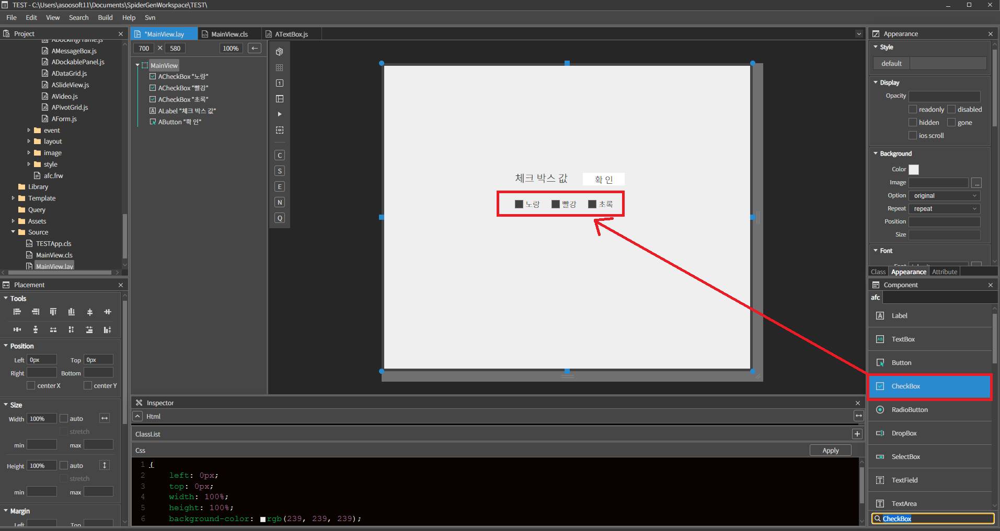
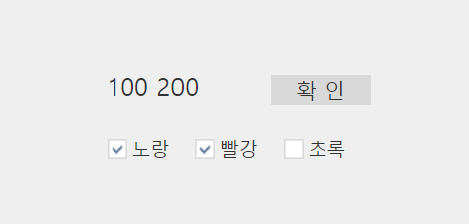

#  D. CheckBox
체크박스 컴포넌트 입니다.

## a.CheckBox Attribute

### **Data**<br>
**Text  :** 체크박스의 텍스트를 설정하는 속성입니다.<br>

**Align  :** 텍스트 정렬을 설정하는 속성입니다
* **left :**  텍스트를 좌측으로 정렬합니다.
* **center :**  텍스트를 중앙으로 정렬합니다.
* **right  :** 텍스트를 우측으로 정렬합니다.

**Check Pos**
* **left :**  체크박스를 텍스트 좌측에 위치
* **right :**  체크박스를 텍스트 우측에 위치

 **Value**<br>
 * **Check  :** check value값을 설정합니다.<br>
 * **Uncheck :**  Uncheck value값을 설정합니다.<br>
 * **setcheck  :**  기본값이 체크 상태가 됩니다<br>


## b. CheckBox Example

### 1. MainView의 레이아웃에 컴포넌트를 추가합니다.<br>

 * 아래 정보를 참고해서 컴포넌트를 배치합니다. 

|component|ID|Group|Text|Value > Check|
|------|---|---|---|---|
|ALabel|labelID||체크박스값|
|AButton|btnID||확인|
|ACheckBox||checks|노랑|100
|ACheckBox||checks|빨강|200
|ACheckBox||checks|초록|300

<br>

### 2. 스파이더젠에서 컴포넌트 객체에 접근하는 방법으로는 컴포넌트의 ID를 이용하는 방법과 Group을 이용하는 방법이 있습니다.

 * **ID를 이용하는 방법** *.cls 파일에서 this.컴포넌트ID 형태로 접근하거나 findCompById('컴포넌트ID') 함수를 이용해서 레이아웃의 컴포넌트 객체에 접근 할 수 있습니다.<br>

 * **Group 이용하는 방법** Class Pane > Identity > Group에 동일한 그룹명을 입력하고 findCompByGroup('그룹명') 함수를 이용하면 컴포넌트 객체들에 접근 할 수 있는 배열객체를 리턴받아 접근 할 수 있습니다. 배열의 인덱스 순서는 레이아웃의 객체 순서와 동일 합니다.

### 3. MainView.cls 파일을 오픈하고 다음과 같이 소스 내용을 수정합니다.

 * MainView() 클래스 함수에 멤버변수를 추가 합니다.
```javascript
class MainView()
{
    super();
    this.chks = null; // 체크박스 배열 변수     
} 
extends AView; 
```
 * Init 이벤트 메소드에 체크박스에 접근하기 위한 배열을 위한 멤버변수를 등록합니다.
```javascript
function MainView*init(context, evtListener)
{
	super.init(context, evtListener);

    this.chks = this.findCompByGroup('checks');     
};
```
 * 버튼 컴포넌트에 클릭 이벤트를 다시 설정 합니다. Class Pane > Event > Click 우측 영역을 더블클릭하고 이벤트 메소드 함수명은 기본으로 등록합니다.<br>
 * 해당 이벤트 메소드의 내용은 다음과 같이 수정합니다.
```javascript
function MainView*onBtnIDClick(comp, info, e)
{

	var chkValue = ''; 

    for(var chk in this.chks) 
    { 
        var currChk = this.chks[chk]; 

        //체크된 체크박스일 경우 
        if(currChk.isChecked){ 
            chkValue += currChk.getValue() + ' '; 
        } 
    } 

    this.labelID.setText(chkValue); //레이블에 출력 

};

```

### 4. F5를 누르거나 Build > Run Project 를 클릭하여 프로젝트를 Run 합니다

 * 실행된 화면에서 체크박스를 선택하고 확인버튼을 클릭합니다.

<br>

 * Label에 선택된 체크박스의 Value 값이 출력되는 것을 확인합니다.
