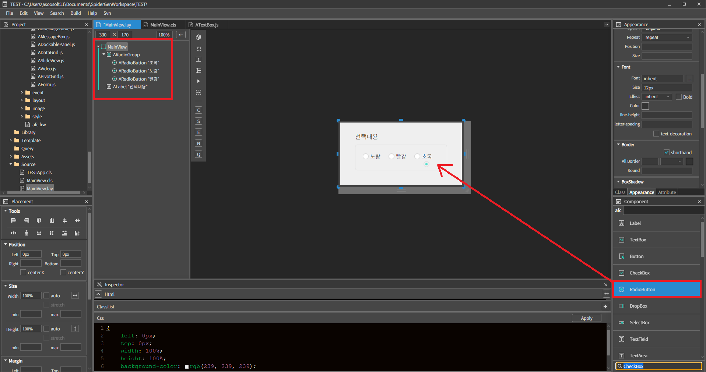
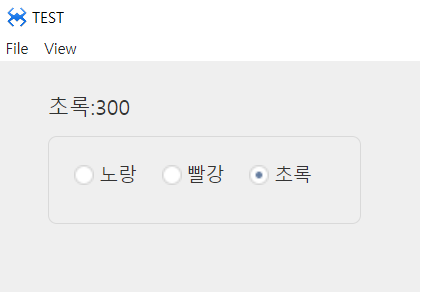

#  E. Radio Button
라디오 버튼 컴포넌트 입니다

## a. Radio Button Attribute

### **Data**<br>
**Text :** 라디오박스의 텍스트를 설정하는 속성입니다<br>

**Align  :** 텍스트 정렬을 설정하는 속성입니다
* **left  :** 텍스트를 좌측으로 정렬합니다.
* **center :**  텍스트를 중앙으로 정렬합니다.
* **right :**  텍스트를 우측으로 정렬합니다.

**Check Pos**
* **left :**  라디오버튼을 텍스트 좌측에 위치
* **right :**  라디오버튼을 텍스트 우측에 위치

**Value  :** 라디오버튼의 보유값을 설정하는 속성입니다.<br>

## b. Radio Button Example

### 1. MainView.lay의 레이아웃에 컴포넌트를 추가합니다.<br>

 * 아래 정보를 참고해서 컴포넌트를 배치합니다.  

| component|id|group|text|value|
| ---------|--|-----|----|-----|
| ARadioGroup   | rdoGroup01 |        |       |       |
| ARadioButton |             | Rdos | 노랑 | 100 | 
| ARadioButton |             | Rdos | 빨강 | 200 |
| ARadioButton |             | Rdos | 초록 | 300 |
| ALabel | labelID | |  선택내용 | | 
<br>

<br>

 * 위 그림에서 보듯이 라디오버튼을 라디오그룹 내에 배치합니다. <br>
* 라디오그룹 컴포넌트는 그룹 내에서 1개의 라디오버튼만 선택될 수 있게하는 매니저 기능을 합니다. 

1. 좌측 레이아웃 트리에서 라디오버튼을 드래그하여 라디오 그룹 내에 배치하는 방법
2. 우측 컴포넌트 리스트에서 레이아웃에 있는 라디오 그룹 안에 라디오 버튼을 드래그하여 배치하는 방법

### 2. 라디오 버튼에 클릭 이벤트를 설정합니다. 
  * 3개의 라디오 버튼의 클릭 이벤트에 동일한 이벤트 함수를 매핑 합니다. <br>
  * 함수명을 onARadioButtonsClick 로 합니다. <br>
  * 다수의 컴포넌트에 동일한 이벤트 함수를 매핑 할 경우 함수의 파라미터로 이벤트 발생 객체를 구분 할 수 있습니다. <br>
   * 이벤트 함수는 내용은 다음과 같이 작성합니다. <br>
   
```javascript
  function MainView*onARadioButtonsClick(comp, info, e)
{

 /** 
        comp : 클릭 이벤트가 발생한 객체 
        info : 컴포넌트마다 다른 정보가 전달됨. 컴포넌트 api 참조 
        e : 오리지널 이벤트 객체 
    */ 

    //선택되었을 경우 
    if(comp.getSelect()) 
    { 
        this.labelID.setText(comp.getText() + ':' + comp.getValue());     
    }     
};
  
```

### 3. F5를 누르거나 Build > Run Project 를 클릭하여 프로젝트를 Run 합니다

* 실행된 화면에서 라디오 버튼을 클릭합니다.<br>

<br>

 * Label에 선택된 라디오 버튼의 Value 값을 출력하는걸 확인합니다.
