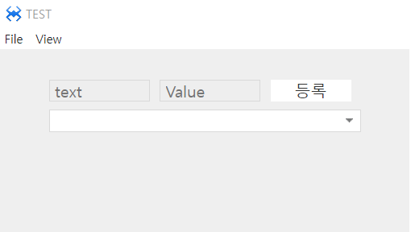
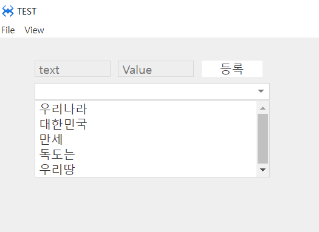

#  F. DropBox
드롭박스 컴포넌트 입니다. 목록 리스트를 검색 가능 합니다.
## a. DropBox Attribute
### **Data**<br>
**Placeholder  :** 플레이스홀더 텍스트를 설정하는 속성입니다. <br>

**Align  :**  텍스트의 정렬을 설정하는 속성입니다
* **left :**  텍스트를 좌측으로 정렬합니다.
* **center :**  텍스트를 중앙으로 정렬합니다.
* **right :**  텍스트를 우측으로 정렬합니다.

## b. dropBox Example

### 1. MainView.lay의 레이아웃에 컴포넌트를 추가합니다.<br>

* 아래 정보를 참고해서 컴포넌트를 배치합니다. 

|component|ID|Text|placeholder|
|------|---|---|---|
|ATextField|txtText||text|
|ATextField|txtValue||Value|
|AButton|btnAddData|등록||
|ADropBox|drop|||
<br>

<br>

* 아래와 같이 드롭박스 클릭 후 Appearance < Display < readonly 체크해  주세요<br>
<br>


### 2. 등록 버튼에 클릭 이벤트를 설정합니다. 

```javascript
function MainView*onBtnAddDataClick(comp, info, e)
{
    //입력 텍스트와 데이터 값을 저장합니다. 
	var iTxt = this.txtText.getText(), 
   		iData = this.txtValue.getText();

	if(iTxt.trim()=='' || iData.trim()=='') 
	{ 
		alert('텍스트와 데이터 내용을 입력하세요.');         
	} 
	else 
	{         
		this.drop.addItem(iTxt, iData); //드롭박스에 데이터를 추가합니다.

		//입력 초기화 
		this.txtText.setText(''); 
		this.txtValue.setText('');

		alert(iTxt + ',' + iData + ' 데이터를 추가');  
	}
};
```
### 3. 드롭박스를 선택하고 Class Pane > Event > select 이벤트를 설정합니다.

* 이벤트명은 onDropSelect라고 사용합니다. 처리 내용은 드롭박스의 아이템이 선택되면 선택된 내용을 확인하는 토스트 메시지를 출력하도록 합니다.
```javascript
function MainView*onDropSelect(comp, info, e)
{

	alert(comp.getSelectedItemText() + ':' + comp.getSelectedItemData()); 

};
```

### 4. F5를 누르거나 Build > Run Project 를 클릭하여 프로젝트를 Run 합니다

 <br>

실행 화면에서 데이터를 입력 후 등록 버튼을 눌러줍니다.<br> 입력 데이터 내용은 아래와 같습니다.<br>

 * text : 우리나라, value : 1 <br> 
 * text : 대한민국, value : 2 <br>
 * text : 만세!!, value : 3 <br>
 * text : 독도는, value : 4 <br>
 * text : 우리땅, value : 5<br>
<br>
* 등록 후 <br>

<br>
