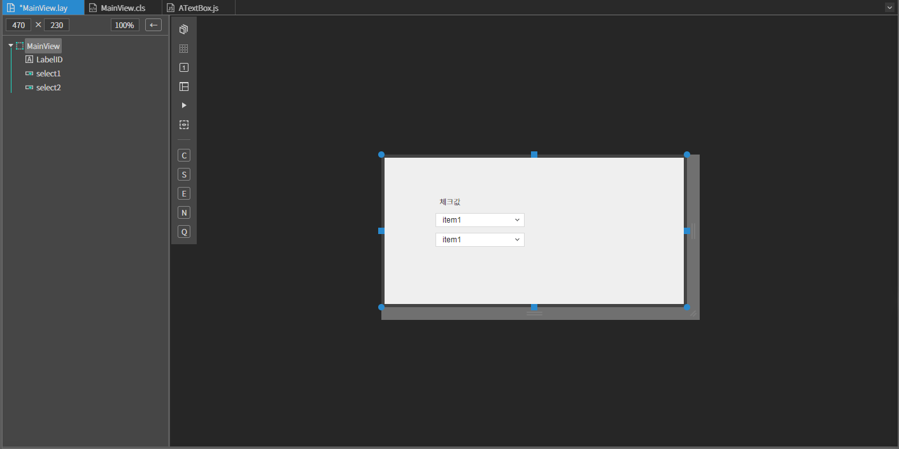
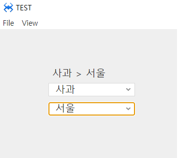

#  G. SelectBox
셀렉트박스 컴포넌트 입니다.
## a. SelectBox Attribute
### **Data**<br>
**Default Data  :** 셀렉트박스에 보여질 리스트 데이터를 설정합니다. 텍스트와 값은 (,) 콤머로 구분하고 이이템들은 개행(엔터)으로 구분합니다.

## b. SelectBox Example

### 1. MainView.lay의 레이아웃에 컴포넌트를 추가합니다.<br>
 
* 아래 정보를 참고해서 컴포넌트를 배치합니다. 

|component|ID|Text|
|------|---|---|
|ALabel|labelID|체크값|
|ASelectBox|select1||
|ASelectBox|select2||

<br>


### 2. Mainview.cls 에서 내용을 아래와 같이 수정합니다.

* 클래스 함수에 멤버변수 data를 생성합니다

```javascript
class MainView()
{
	super();
	
	 this.data = [ 
        {text : '사과' , items : ['서울', '경기', '강원']}, 
        {text : '포도' , items : ['경북', '경남', '충북', '충남']}, 
        {text : '오렌지', items : ['전남', '전북', '제주']} 
    ];    

}
extends AView;
```

* onInitDone() 함수에서 컴포넌트들의 초기화를 하고 첫번째 셀렉트박스 (select1)에 아이템 데이터를 추가합니다.
```javascript
function MainView*onInitDone()
{
	super.onInitDone();
	
	//레이블 초기화 
    this.labelID.setText('선택내용'); 

    //셀렉트박스 초기화(아이템 모두 삭제) 
    this.select1.removeAll();     

    //첫번째 셀렉트박스 데이터 초기화     
    var i=0, imax = this.data.length; 
    for(i=0; i < imax; i++){ 
        //addItem(text, value, data)     
        this.select1.addItem(this.data[i].text, i, this.data[i].items); 
    } 
};
```
### 3. 셀렉트 박스에 change 이벤트를 설정합니다. 
* 첫번째 셀렉트박스 (select1)에 change 이벤트를 설정하고 설정 함수를 아래와 같이 추가합니다<br>
* 첫번째 셀렉트박스 (select1)이 선택되면 두번째 셀렉트박스 (select2)에 아이템 데이터를 동적으로 추가합니다.

```javascript
function MainView*onSelect1Change(comp, info, e)
{
 //현재 셀렉트된 아이템의 data
    var selItemData = comp.getSelectedItemData();


    //두번째 셀렉트박스 아이템 초기화(모두 삭제)
    this.select2.removeAll(); 


    //선택아이템
    this.select2.addItem('지역선택', '');

    var i=0, imax = selItemData.length, 
        selitem = null;

    for(i=0; i < imax; i++)
    {
        selitem = selItemData[i];
        this.select2.addItem(selitem, selitem);
    }

};
```
* 두번째 셀렉트박스(select2) 에 change 이벤트를 설정하고 설정 함수를 아래와 같이 수정합니다.
```javascript
function MainView*onSelect2Change(comp, info, e)
{
 //지역선택 아이템을 선택했을 경우 토스트 알림
    if(!info)
    {
       alert('지역을 선택하세요.');
        return;
    }

    //배열의 join 기능을 이용한 텍스트 결합
    this.labelID.setText([
        this.select1.getSelectedItem().text,
        ' > ',
        this.select2.getSelectedItem().text
    ].join(''));

};

```

* 마지막으로 onActiveDone 이벤트에 컴포넌트 초기값 설정을 아래 내용과 같이 수정합니다.<br>
* 화면이 활성화 완료설정값을 초기화 하도록 합니다.

```javascript
 //화면 활성화가 완료될때마다 
function MainView*onActiveDone(isFirst)
{
	super.onActiveDone(isFirst);
	
    //value가 0인 아이템을 기본 셀렉트 되게 
    this.select1.selectItem(this.select1.indexOfValue('0'));     

    //선택되어서 변경된 이벤트 발생시키기 
    this.select1.reportEvent('change'); 
};
```

### 4.F5를 누르거나 Build > Run Project 를 클릭하여 프로젝트를 Run 합니다


<br>