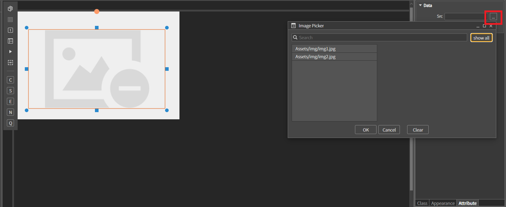
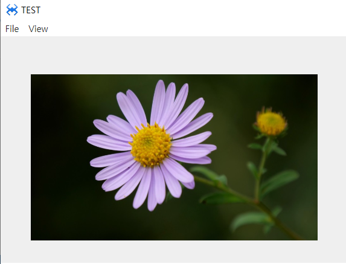

# K. Image
원하는 영역 및 위치에 이미지를 로드하는 컴포넌트 입니다.
## a. Image Attribute
### **Data** 
**Src :**  이미지의 프로젝트내 위치 경로를 설정하는 속성입니다. 
**Alt :**  이미지의 대체 텍스트를 설정하는 속성입니다.

## b. Image Example

### 1. 프로젝트 폴더에 이미지 파일 넣기

  * 윈도우 파일 탐색기에서 프로젝트 폴더를 열고 Img 폴더를 생성 후 사용할 이미지 파일을 넣습니다 

 *  스파이더젠 프로젝트 트리에서 Assets 폴더 위에서 컨텍스트 메뉴를 오픈합니다.(마우스 우측 버튼을 클릭) 

 *  

 * 컨텍스트 메뉴에서 Add existing files in directory... 메뉴를 클릭합니다. 
   *  해당 메뉴는 선택된 폴더내의 모든 파일을 프로젝트로 로드합니다.
   
* 오픈된 폴더 찾기 다이얼로그에서 앞에서 생성한 '프로젝트이름' > Img 폴더를 선택합니다.

### 2. MainView의 레이아웃에 컴포넌트를 추가합니다. 

  

 *  Data Src ...을 클릭하고 showall을 클릭하면 프로젝트 내 로드 된 이미지 파일을 모두 보여줍니다. 선택하여 이미지를 설정할 수 있습니다.

### 3.F5를 누르거나 Build > Run Project 를 클릭하여 프로젝트를 Run 합니다

  