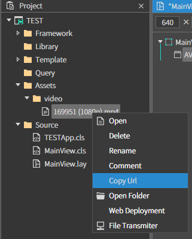
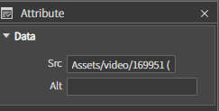
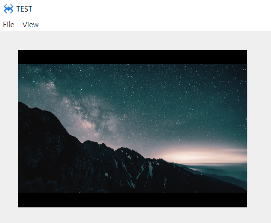

# L. Video
원하는 영역 및 위치에 동영상을 로드하는 컴포넌트 입니다.
## a. Video Attribute
### **Data** 
**Src :**  동영상 경로를 설정하는 속성입니다. 
**Alt :**   동영상의 대체 텍스트를 설정하는 속성입니다.

## b. Video Example

### 1. 프로젝트 폴더에 비디오 파일 넣기

  * 윈도우 파일 탐색기에서 프로젝트 폴더를 열고 video 폴더를 생성 후 사용할 이미지 파일을 넣습니다 

 *  스파이더젠 프로젝트 트리에서 Assets 폴더 위에서 컨텍스트 메뉴를 오픈합니다.(마우스 우측 버튼을 클릭) 

 *  

 * 컨텍스트 메뉴에서 Add existing files in directory... 메뉴를 클릭합니다. 
   *  해당 메뉴는 선택된 폴더내의 모든 파일을 프로젝트로 로드합니다.
   
* 오픈된 폴더 찾기 다이얼로그에서 앞에서 생성한 '프로젝트이름' > video 폴더를 선택합니다.

### 2. MainView의 레이아웃에 컴포넌트를 추가합니다. 

 

  
 

* 프로젝트에 로드된 비디오 Url을 복사해서 Attribute < Data < Src 에 붙여넣기 해줍니다.
 

### 3.F5를 누르거나 Build > Run Project 를 클릭하여 프로젝트를 Run 합니다

  