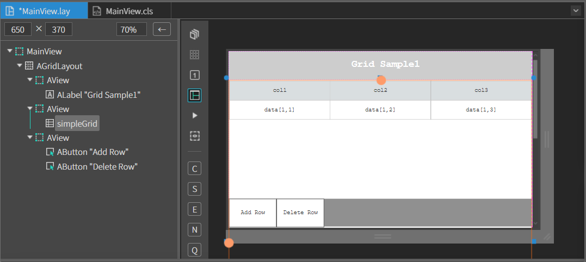
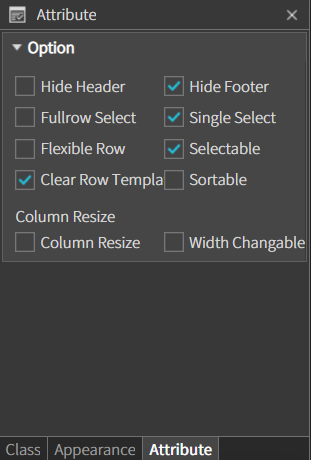
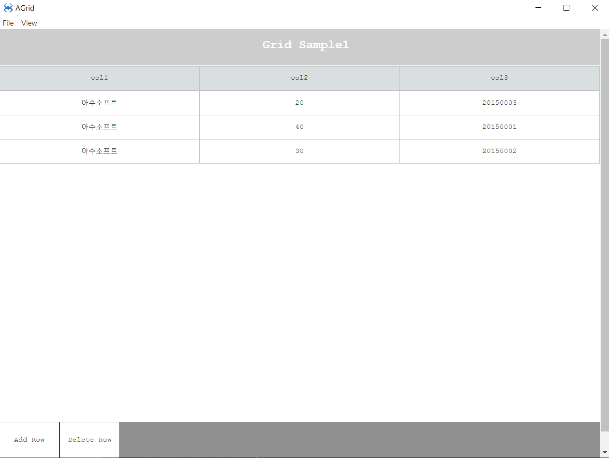
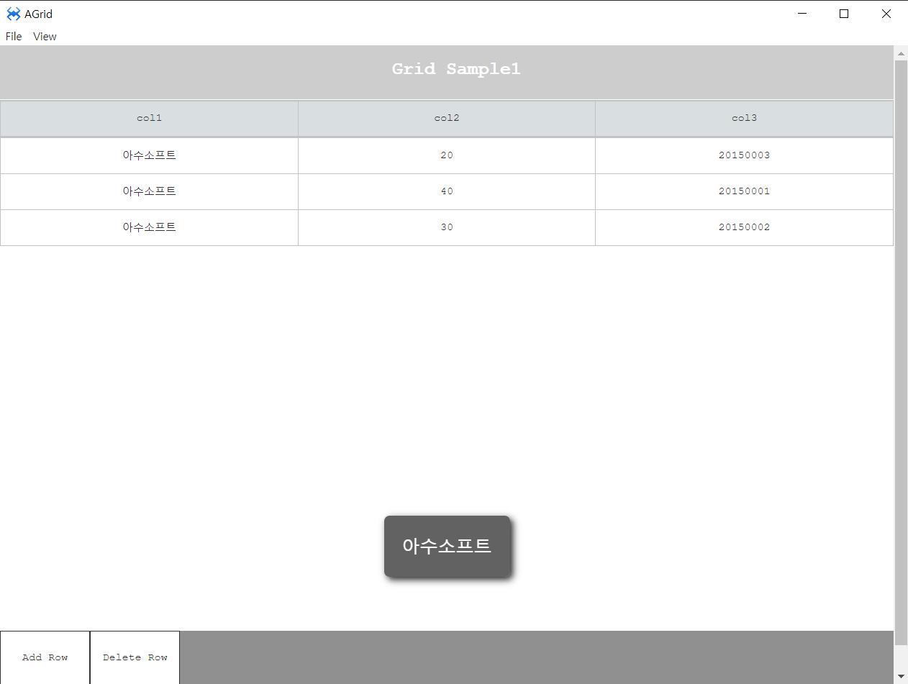

# N. Grid

## a. Grid Attribute

### **Option**<br>
* **Hide Header  :** header 숨김 여부 옵션입니다
* **Hide Footer  :** footer 숨김 여부 옵션입니다.
* **Fullrow Select  :** 특정 cell 을 클릭해도 그 row 전체가 선택되는 옵션입니다.
* **Single Select  :** ctrl 키를 누르고 선택해도 하나만 선택되는 옵션입니다. 
* **Flexible Row :** TR의 높이를 TABLE 높이에 풀로 맞추는 옵션입니다.
* **Selectable  :** 선택 [불]가능 옵션 플래그입니다.
* **Clear Row Templa  :** 그리드 초기화 후 Template 로우를 그대로 보존할 지에 대한 옵션입니다
* **Sortable  :** 헤더 선택시 정렬처리 여부 옵션입니다

**Columm Resize**
* **Columm Resize  :** 컬럼 리사이즈 여부 옵션입니다<br>
* **Width Changable :**  컬럼 리사이즈시 그리드 넓이 변경 여부 옵션입니다<br>


## b. Grid Example

### 1. MainView.lay의 레이아웃에 컴포넌트를 추가합니다.<br>

* 아래 정보를 참고해서 컴포넌트를 배치합니다. 

|component|ID|Text|
|---------|--|----|
|ALabel||Grid Sample1|
|AGrid|simpleGrid|
|AButton||Add Row|
|AButton||Delete Row|
<br>

<br>

<br>
 * 위의 사진을 참고하여 옵션을 변경해줍니다.


 ### 2. MainView.cls 파일을 오픈하고 다음과 같이 소스 내용을 수정합니다.

 ```javascript
 class MainView()
{
	super();

	this.inx = 0;
	this.isAsc = true;

}
extends AView;
```
 ```javascript
function MainView*init(context, evtListener)
{
	super.init(context, evtListener);

	this.simpleGridData = 
	[
		['아수소프트', '40', '20150001'],
		['아수소프트', '30', '20150002'],
		['아수소프트', '20', '20150003']
	];
	
};
 ```
### 3. AddBtn 에 click 이벤트를 설정합니다.

```javascript
function MainView*onAddBtnClick(comp, info, e)
{
	//해당 그리드 컴포넌트의 row 객체를 추가한다.
	
	this.simpleGrid.addRow(this.simpleGridData[this.inx]);
	
	this.inx++;
	if(this.inx == 3) this.inx = 0;

};
```

```javascript
//심플그리드의 셀을 선택했을 시...
function MainView*onSimpleGridSelect(comp:AGrid, info, event)
{
	var cell = info[0];
	
	if(cell.isHeader)
	{
		var colInx = comp.colIndexOfCell(cell);	//선택한 cell 의 컬럼 index 를 얻어온다.
		
		//그리드 옵션으로 sort 기능을 활성화 할 수 있지만 
		//샘플로 기능을 구현해 본다.
		comp.sortColumn(colInx, this.isAsc);
		
		this.isAsc = !this.isAsc;
	}
	else
	{
		//파라미터로 넘어온 cell 의 row, column 정보를 배열로 리턴한다. -> [row, col]
		var pos = comp.indexOfCell(info);
		
		//추가된 로우가 없는 경우
		if(pos[0]<0) return;

		//셀의 텍스트를 가져온다.
		alert( comp.getCellText(pos[0], pos[1]) );
	}

};
```
### 4.DeleteBtn에 click 이벤트를 설정합니다.

```javascript
function MainView*onDeleteBtnClick(comp, info, e)
{
	//row의 index 값을 넣으면 해당 그리드 컴포넌트의 row 객체를 삭제한다.
	this.simpleGrid.removeRow(0);
	
};

```


### 4.F5를 누르거나 Build > Run Project 를 클릭하여 프로젝트를 Run 합니다.<br>

<br>
 * AddBtn 을 눌러 Cell이 추가 되는 것을 확인합니다.

<br>
 * cell을 클릭하면 alert이 출력되는 것을 확인합니다.