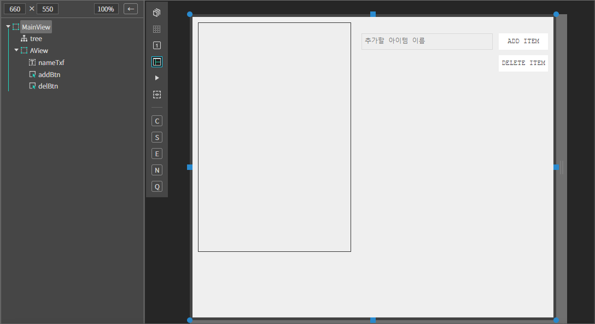
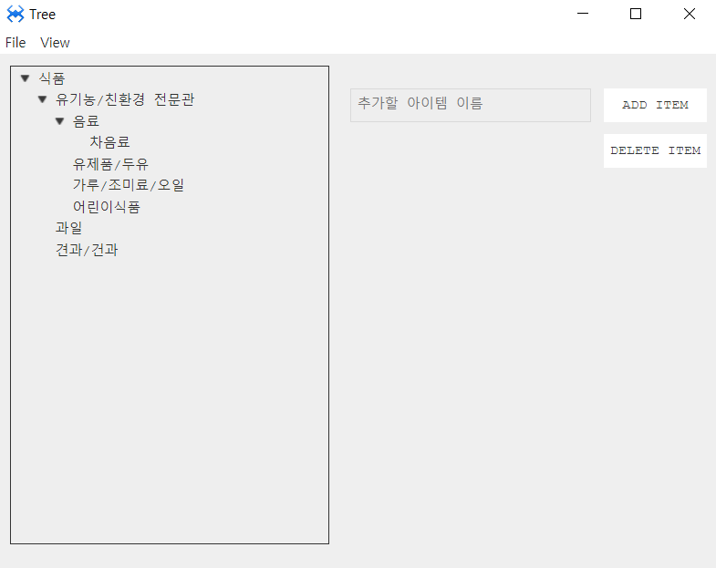
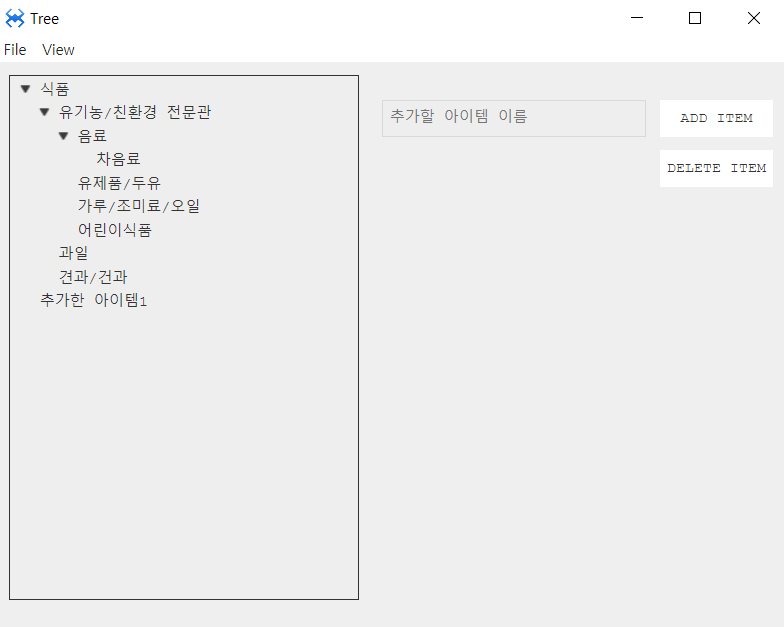

#  O. tree
트리 컴포넌트 입니다.

## a. tree Attribute

## b. tree Example


### 1. MainView.lay의 레이아웃에 Button 컴포넌트를 추가합니다.<br>
 * 아래 정보를 참고해서 컴포넌트를 배치합니다.
 
|component|ID|Text|placeholder
|------|---|---|---|
|ATree|tree||
|ATextField|nameTxf||추가할 아이템 이름
|AButton|addBtn|ADD ITEM
|AButton|delBtn|DELETE ITEM
<br>

<br>

### 2.Mainview.cls 에서 내용을 아래와 같이 수정합니다.
```javascript
function MainView*init(context, evtListener)
{
	super.init(context, evtListener);

	this.tree.setOption({
			isSingleSelect: true,		//ctrl 키를 누르고 선택해도 하나만 선택된다. 
			isFullSelect: false,        //아이템 선택시 선택표시가 라인 전체로 표시된다.
			isDraggable: true,   	    //트리 드래그 여부
			dragIcon: './Source/img/drag.png'	//드래그 아이콘
		});
		this.tree.initTree(); //(iconMap);
		this.initTreeData();

};
```

```javascript
function MainView*initTreeData(comp, info, e)
{
	var data = {
			name: '식품',
			sub: [{
				name: '유기농/친환경 전문관',
				sub: [{
					name: '음료',
					sub: [{
						name: '차음료'
					}]
				},{
					name: '유제품/두유',
				},{
					name: '가루/조미료/오일',
				},{
					name: '어린이식품',
				}]
			}, {
				name: '과일'
			}, {
				name: '견과/건과'
			}]
		};
		this.insertItemInfo(data);

};
```
```javascript
function MainView*insertItemInfo(info)
	{
		const item = this.tree.insertItemObj(info, true);
		//this.tree.insertItemObj(itemInfo, isExpand, mergeHistory)
		//this.tree.insertItem(pItem, pos, name, data, icon, isExpand, mergeHistory)
		if(info.sub) {
			info.sub.forEach(subInfo => {
				subInfo.pItem = item;
				this.insertItemInfo(subInfo, item);
			});
		}
		
		return item;
	};

```

### 3. addbtn 에 click 이벤트를 설정합니다.

```javascript
function MainView*onAddBtnClick(comp, info, e)
{

	var name = this.nameTxf.getText();
		if(name) {
			this.insertItemInfo({
				pItem: this.tree.getSelectedItems()[0],
				pos: null, 
				name: name,
				//data: data,
				//icon: 0
			});
		}
		this.nameTxf.reset();

};
```

### 3. Delbtn 에 click 이벤트를 설정합니다.

```javascript
function MainView*onDelBtnClick(comp, info, e)
{

		const item = this.tree.getSelectedItems()[0];
		if(item) this.tree.deleteItem(item);

};
```


### 4. F5를 누르거나 Build > Run Project 를 클릭하여 프로젝트를 Run 합니다.

<br>

* 추가할 아이템 이름을 적고 ADD Item 버튼을 눌러봅니다.

<br>

 * 아이템이 추가되는 것을 확인할 수 있습니다.