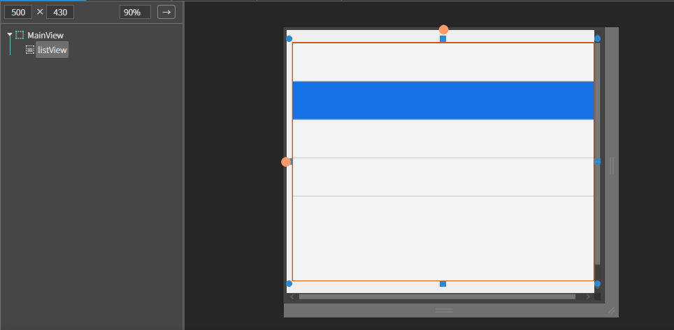
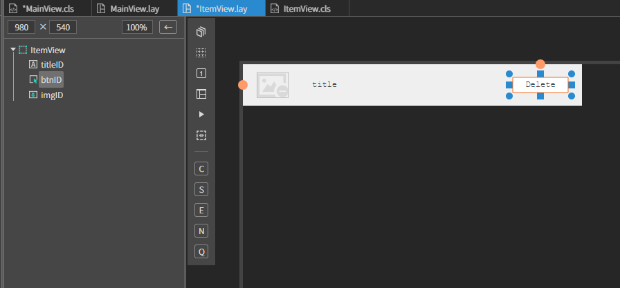
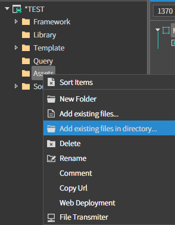
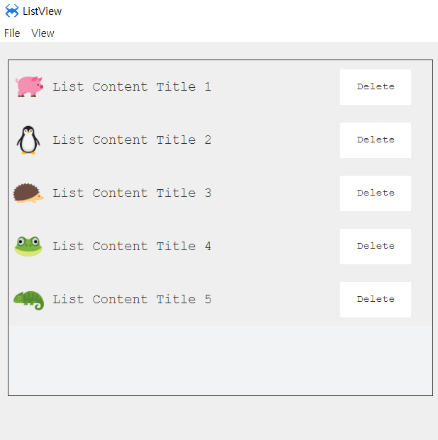
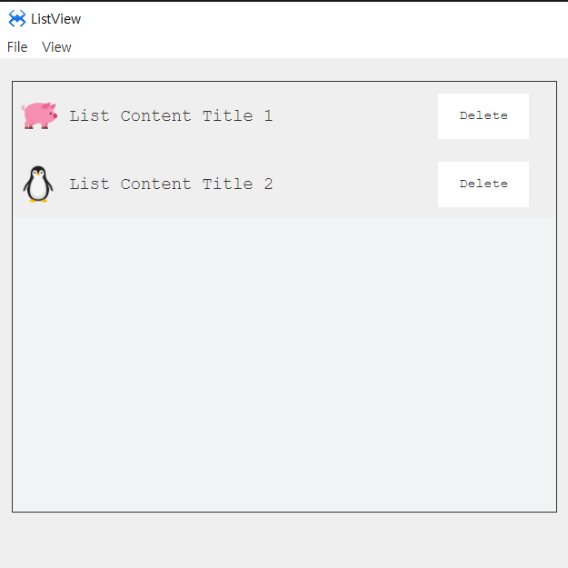

# S. Listview
리스트뷰 컴포넌트 입니다.
## a. Listview Attribute
### **Item**<br>
**Height  :** 리스트의 아이템 높이를 지정하는 속성입니다.
### **Contents**<br> 
**Default Url**
* **add :**  아이템을 추가하는 속성입니다.<br>
  * **URL  :**  매칭될 아이템의 URL 입니다.<br>
* **edit**:  아이템의 설정 내용을 수정하는 속성입니다.<br>
* **del :**  선택한 아이템을 삭제합니다.<br>
* **up  :** 선택한 아이템의 순서를 한스탭 앞으로 이동합니다.<br>
* **down :**  선택한 아이템의 순서를 한스탭 뒤로 이동합니다.<br>

### **Option**<br>
**Direction :**  자식 요소의 방향성을 설정하는 속성입니다.
* **vertical :**   자식 요소가 수직 방향으로 삽입 됩니다.
* **horizontal :** 자식 요소가 수평 방향으로 삽입 됩니다.
* **Selectable :**  선택 [불]가능 옵션 플래그입니다.
* **Wrap  :** 가로로 배치하다 공간이 없으면 개행하여 다시 추가하는 옵션입니다.

## b. Listview Example

### 1. MainView.lay의 레이아웃에 컴포넌트를 추가합니다.<br>

<br>

### 2. Source 폴더 안에 Items폴더를 생성합니다.
* 생성한 Items 폴더 내에 ItemView 이름의 뷰를 추가하고 
아래 정보를 참고해서 컴포넌트를 배치합니다. 

|component|ID|position|size|Text|
|------|---|---|---|---|
|ItemView|||width:100%, height:50px|
|ALabel|titleID|left:50px, center Y |w-stretch:90px, height:40px
|AButton|btnID|right:5px,  center Y |width:80px, height:40px
|Aimage|imgID|left:5px,  center Y |width:40px, height:40px|Delete
<br>

<br>

### 3.  프로젝트 폴더에 이미지 파일 넣기

윈도우 파일 탐색기에서 프로젝트 폴더를 열고 Img 폴더를 생성 후 사용할 이미지 파일을 넣습니다<br>

 *  스파이더젠 프로젝트 트리에서 Assets 폴더 위에서 컨텍스트 메뉴를 오픈합니다.(마우스 우측 버튼을 클릭)<br>

 * <br>

 * 컨텍스트 메뉴에서 Add existing files in directory... 메뉴를 클릭합니다. 
   *  해당 메뉴는 선택된 폴더내의 모든 파일을 프로젝트로 로드합니다.
   
* 오픈된 폴더 찾기 다이얼로그에서 앞에서 생성한 '프로젝트이름' > Img 폴더를 선택합니다.


### 4. 먼저 리스트뷰에 추가할 데이터를 만들고 아이템뷰를 리스트합니다.

*  MainView.cls 파일을 오픈하고 다음과 같이 클래스에 멤버변수를 만들고 데이터를 설정합니다.
```javascript
class MainView()
{
	super();

	 this.listData = [ 
			{ 
				img : 'Assets/img/img1.png',  
				title : 'List Content Title 1' 
			}, 
			{    img : 'Assets/img/img2.png',  
				title : 'List Content Title 2' 
			},
			 { 
				img : 'Assets/img/img3.png',  
				title : 'List Content Title 3' 
			}, 
			{    img : 'Assets/img/img4.png',  
				title : 'List Content Title 4' 
			},
			{    img : 'Assets/img/img5.png',  
				title : 'List Content Title 5' 
			}
		]; 
		
}
extends AView;

```
```javascript
function MainView*onActiveDone(isFirst)
{
	super.onActiveDone(isFirst);

	// 리스트뷰에 데이터만큼의 아이템뷰를 추가한다.  
    this.listView.addItem('Source/Items/ItemView.lay', this.listData);
};
```

### 5.리스트 되는 ItemView를 수정해서 이미지와 레이블 내용을 추가하겠습니다.
* ItemView.cls 파일을 오픈하고 클래스에 설정되는 데이터를 저장하기 위한 멤버 변수를 추가합니다.
```javascript
class ItemView()
{
	super();

	 this.data = null; 

}
extends AView;

```
### 6. 데이터가 바인딩 될때 호출되는 setData 메소드를 추가하고 내용을 다음과 같이 수정합니다.

```javascript

function ItemView*setData(data)
{
	 this.data = data; 

    this.img001.setImage(this.data.img); 
    this.lbl001.setText(this.data.title); 
};
```
### 7. Btn001 에 click 이벤트를 설정합니다
```javascript
function ItemView*onBtn001Click(comp, info, e)
{

    //아이템의 상위객체 리스트뷰에 정의 함수 호출 
    this.owner.removeItem(this._item); 
};

```
### 8. F5를 누르거나 Build > Run Project 를 클릭하여 프로젝트를 Run 합니다

<br>

* Delete 버튼을 눌러 삭제가 되는지 확인합니다.

<br>
