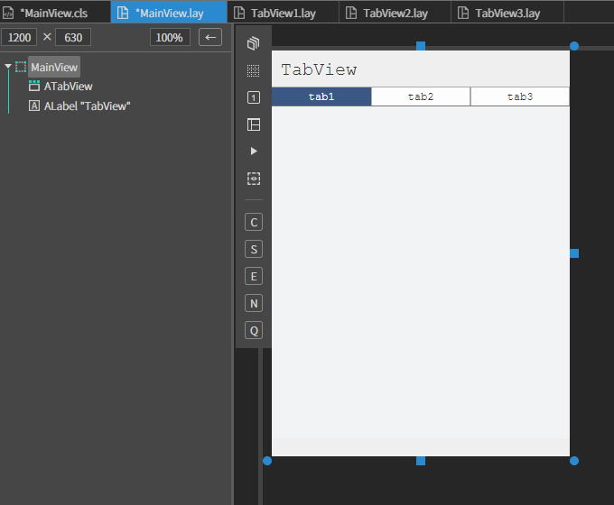
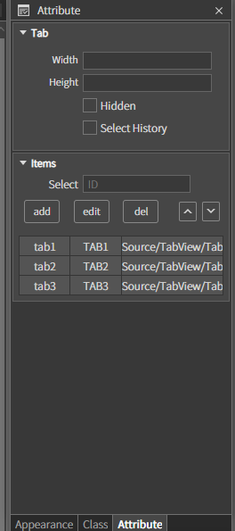
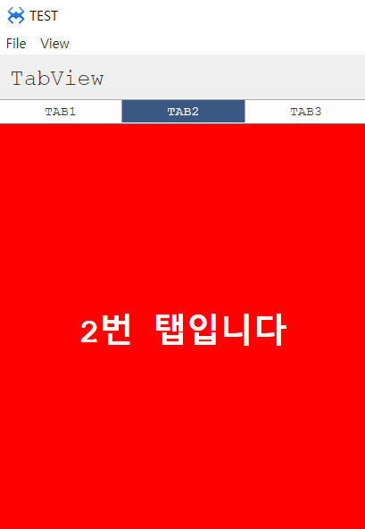

# T. TabView
탭뷰 컴포넌트 입니다.
## a. TabView Attribute
### **Tab** 
**Width  :** 탭의 가로 사이즈를 지정하는 속성입니다 
**Height :**  탭의 높이를 지정하는 속성입니다. 
**Hidden :**  탭의 표시여부를 설정하는 속성입니다. 
**Select History :** 탭을 이동할 때마다 히스토리를 저장하는 속성입니다 
### **Items** 

**Select  :** 탭뷰 중 기본적으로 선택될 탭아이디를 설정하는 속성입니다. 
* **add :**  탭뷰를 추가하는 속성입니다. 
  * **ID  :** 탭을 구분하기 위한 ID 입니다. 
  * **Name :**  탭에 표시될 텍스트 입니다. 
  * **URL :**  탭과 매칭될 탭뷰의 URL 입니다. 
* **edit :**  탭의 설정 내용을 수정하는 속성입니다. 
* **del :**  선택한 탭을 삭제합니다. 
* **up  :** 선택한 탭의 순서를 한스탭 앞으로 이동합니다. 
* **down  :** 선택한 탭의 순서를 한스탭 뒤로 이동합니다. 

## b. TabView Example

### 1. MainView.lay의 레이아웃에 컴포넌트를 추가합니다. 
 
* 아래 정보를 참고해서 컴포넌트를 배치합니다. 

 

### 2. Views 폴더를 생성합니다.
*  TabView 폴더에 TabView1, TabView2, TabView3 이름으로 3개의 뷰를 추가합니다.

 

### 3. 추가한 TabView의 배경색을 각각 파랑, 빨강, 노랑색으로 변경합니다.
* MainView의 tabView 컴포넌트 Attribute > Items에 위에서 생성한 TabView를 추가합니다.

|Id |name|Url|
|------|---|---|
|tab1|TAB1|Source/TabView/TabView1.lay|
|tab2|TAB2|Source/TabView/TabView2.lay|
|tab3|TAB3|Source/TabView/TabView3.lay|

 

### 4.F5를 누르거나 Build > Run Project 를 클릭하여 프로젝트를 Run 합니다

* 탭을 클릭하면 화면의 상단 레이블에 텍스트로 변경되는 걸 확인합니다. 

 

