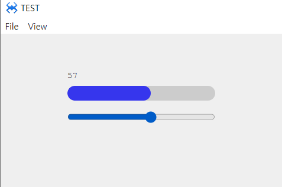

# W. Slider
슬라이더  컴포넌트 입니다.

## a. Slider Attribute

### **Data**
**Value :**  슬라이더 현재 값을 설정하는 속성입니다.<br>
**Min :**  슬라이더 최소값을 설정하는 속성입니다.<br>
**Max :**  슬라이더 최대값을 설정하는 속성입니다.<br>
**Step :**  슬라이더 단위를 설정하는 속성입니다.<br>

## b. Slider Example

### 1. MainView.lay의 레이아웃에 컴포넌트를 추가합니다.<br>

* 아래 정보를 참고해서 컴포넌트를 배치합니다. 

|component|ID|Text|
|---------|--|----|
|AProgress|prog||
|ASlider|slider||
|ALabel|labelID|현재값|

<br>


### 2.  슬라이더에 설정된 값을 표현하기 위한 사용자 함수 doSetValue(val)를 다음과 같이 추가합니다.
```javascript
function MainView:doSetValue(val) 
{          
    this.labelID.setText(val); 
    this.prog.setValue(val); 
};  

```

 ### 3. slider에 change 이벤트를 설정합니다.
 ```javascript
 function MainView*onASlider1Change(comp, info, e)
{

    this.doSetValue(comp.getValue());     

};
 ```
 ### 4. 마지막으로 메인뷰 onInitDone() 에 슬라이더 컴포넌트의 기본값을 설정합니다.
```javascript
function MainView*onInitDone()
{
	super.onInitDone();

	this.doSetValue(this.slider.getValue()); 
	
};
```
### 4. F5를 누르거나 Build > Run Project 를 클릭하여 프로젝트를 Run 합니다.
* 슬라이더에 바를 움직여 값을 조정해 봅니다.

<br>

* 조정된 값에 따라 프로그래스바가 변경되는걸 확인합니다.