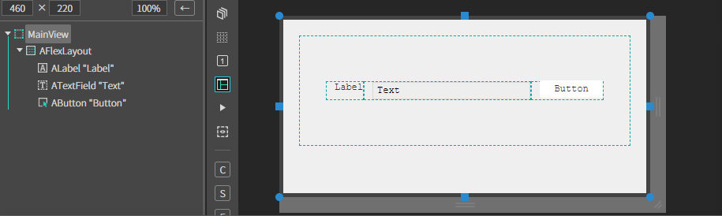
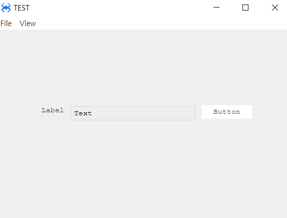
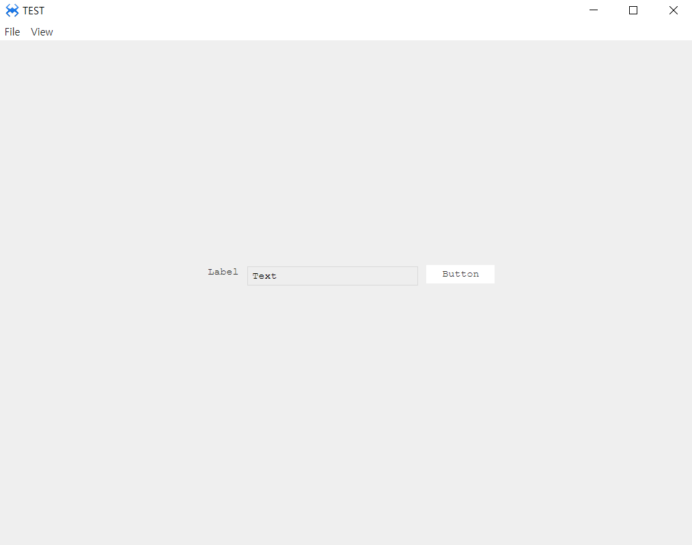

# V. FlexLatout
컴포넌트 배열과 정렬을 위해 사용하는 플랙스레이아웃 컴포넌트 입니다.

## a. FlexLayout Attribute

### **Data**
**Direction  :** 자식 요소의 방향성을 설정하는 속성입니다. 
* **row  :** 기본값. 자식 요소의 방향을 수평방향(좌 -> 우)으로 표현합니다. 
* **row reverse :**  자식 요소의 방향을 수평방향(우 -> 좌)으로 표현합니다. 
* **column :**  자식 요소의 방향을 수직방향(상 -> 하)으로 표현합니다. 
* **column reverse :**  자식 요소의 방향을 수직방향(하 -> 상)으로 표현합니다. 

**Wrap :**  자식 요소의 줄넘김 처리를 설정하는 속성입니다. 
* **no wrap  :** 기본값. 자식 요소를 한줄에 모두 표현합니다. 
* **wrap  :** 자식 요소가 적정 길이보다 길면 다음줄에 표현합니다. 
* **wrap reverse  :** wrap과 같으나 역방향으로 표현합니다. 

**Justify Content :**  자식 요소의 수평방향 정렬 속성입니다. 
* **flex-start  :** 자식요소를 한 덩어리로 묶어, 수평 방향의 시작점에 위치합니다. 
* **center  :** 자식요소를 한 덩어리로 묶어, 수평 방향의 중앙에 위치합니다. 
* **flex-end :**  자식요소를 한 덩어리로 묶어, 수평 방향의 끝점에 위치합니다. 
* **space-between  :** 컨테이너의 양쪽 끝에 맞추어 자식요소를 정렬합니다. 
* **space-aroud  :** 컨테이너의 양쪽 끝에 동일한 간격의 공간을 갖고 각 자식요소 전, 후에 일정한 간격의 공간을 만든다. 
* **space-evenly  :** 각 자식요소 전, 후에 일정한 간격의 공간을 만들어 정렬합니다. 

**Align items :**  자식요소의 수직방향 정렬 속성입니다. 
* **stretch  :** 자식요소를 한 덩어리로 묶어, 수직 방향의 시작점에 위치합니다. 
* **flex-start  :** 자식요소를 한 덩어리로 묶어, 수직 방향의 끝점에 위치합니다. 
* **center  :** 자식요소를 한 덩어리로 묶어, 수직 방향의 중간점에 위치합니다. 
* **flex-end  :** 자식요소를 한 덩어리로 묶어, 수직 방향의 시작점에서 끝점까지 늘립니다. 
* **baseline  :** 자식요소를 한 덩어리로 묶어, 수직 방향의 베이스라인에 위치합니다. 

**Align Content**
* **flex-start  :** 자식요소를 한 덩어리로 묶어, 수평 방향의 시작점에 위치합니다. 
* **center :**  자식요소를 한 덩어리로 묶어, 수평 방향의 중앙에 위치합니다. 
* **flex-end  :** 자식요소를 한 덩어리로 묶어, 수평 방향의 끝점에 위치합니다. 
* **space-between  :** 컨테이너의 양쪽 끝에 맞추어 자식요소를 정력합니다. 
* **space-aroud :**  컨테이너의 양쪽 끝에 동일한 간격의 공간을 갖고 각 자식요소 전, 후에 일정한 간격의 공간을 만든다

### **Property**
**order  :** 배치된 아이템들의 순서를 변경하는 옵션입니다 
**grow  :** 아이템의 가중치 공간을 설정하는 옵션입니다 
**shrink :**  Container에 공간이 부족해질 때 Item의 크기가 얼마나 줄어들 수 있는지 설정하는 옵션입니다.  

**align**
* **auto :** 선택 된 아이템이 자동으로 위치합니다. 
* **flex-start  :** 선택 된 아이템이 수평 방향의 시작점에 위치합니다. 
* **flex-end :** 선택 된 아이템이 수평 방향의 끝점에 위치합니다 
* **center  :** 선택 된 아이템이 수평 방향의 중앙에 위치합니다. 
* **baseline :** 선택 된 아이템이 수직 방향의 베이스라인에 위치합니다. 
 * **stretch  :** 선택 된 아이템이 수직 방향의 시작점에 위치합니다. 

**basis  :** 아이템 공간을 설정하는 옵션입니다. 
**padding :**  item padding 설정 속성입니다 
**margin :**  item margin 설정 속성입니다 

### 1. MainView.lay의 레이아웃에 컴포넌트를 추가합니다. 

### 2 ALabel, ATextField, AButton 을 FlexLayout의 자식 요소로 추가 합니다.

* 다음 내용을 참고해서 컴포넌트를 배치합니다.

|component|size|margin|etc|
|------|---|--|--|
|AFlexLayout|w-stretch:20px, height:50px||Direction:row, Wrap:wrap, Justify Content:center, Align Items:center, Align Coontent:center
|ALabel|w-stretch:100px, height:22px|left:10px	
|ATextField|width:80px, height:22px|left:10px	
|AButton|width:80px, height:22px|left:10px	|

 

### 3.F5를 누르거나 Build > Run Project 를 클릭하여 프로젝트를 Run 합니다

 

 
* 창의 높이를 늘렸다가 줄여봅니다. 컴포넌트들이 높이, 넓이의 중앙에 위치하는걸 확인합니다.