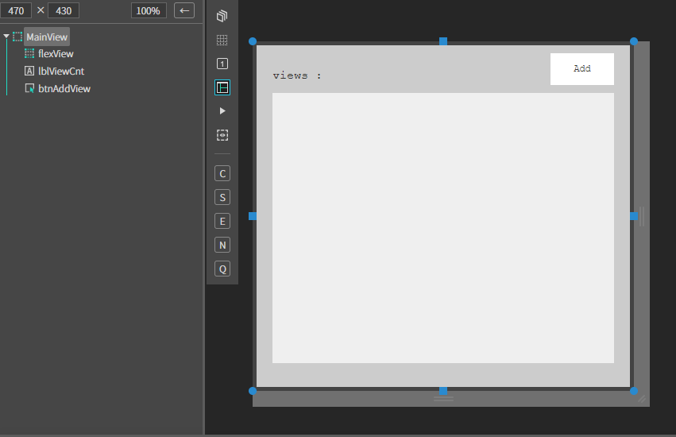
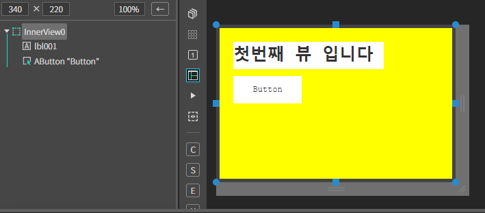
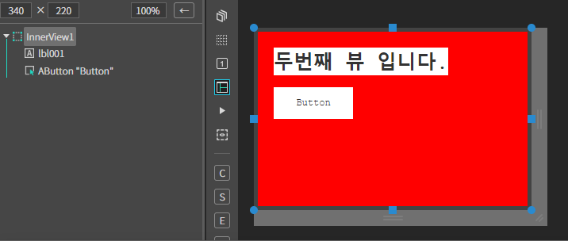
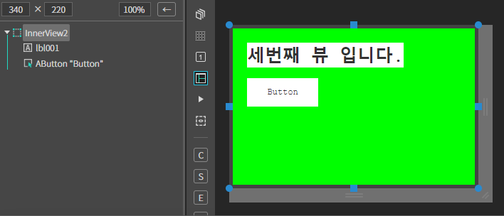
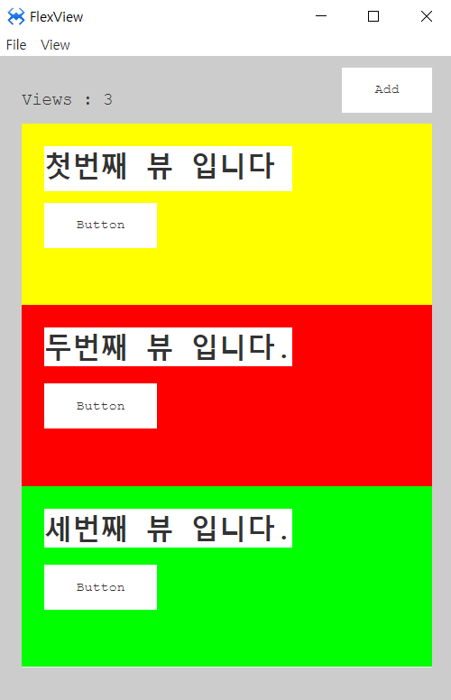
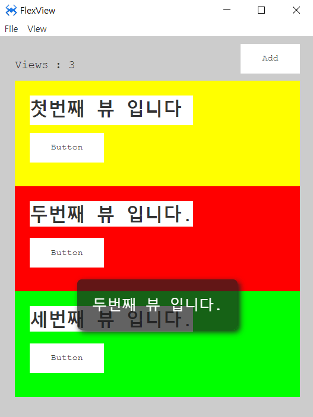

#  Z. FlexView
플랙스뷰는 뷰의 크기를 균등 분할하여 생성하는 뷰 컴포넌트 입니다.
## a. FlexView Attribute

## b. FlexView Example

### 1. MainView.lay의 레이아웃에 컴포넌트를 추가합니다.<br>


 * 다음 내용을 참고해서 컴포넌트를 배치합니다.

|component|id|position|size|text|etc|
|---------|--|--------|----|----|---|
|AFlexView|flexView|left:20px, top:60px|w-stretch:20px, h-stretch:60px||
|AButton|btnAddView|right:20px, top:10px|width:80px, height:40px|Add|
|ALabel|lblViewcnt|left:20px, top:30px  |width:auto, height:auto|views:|

<br>

<br>

### 2. Source 폴더 아래 Views 폴더를 생성합니다. 

### 3. Views 폴더 내에 InnerView0,InnerView1,InnerView2 뷰를 각각 추가합니다.

|view|background|label id|text|
|----|----------|--------|----|
|InnerView0|yellow|lbl001|첫번째 뷰 입니다|
|InnerView1|red|lbl001|두번째 뷰 입니다|
|InnerView2|green|lbl001|세번째 뷰 입니다|

<br>
<br>
<br>

### 4. InnerView 버튼에 Click 이벤트를 설정합니다.

```javascript
function InnerView0*onAButton1Click(comp, info, e)
{

    alert(this.lbl001.getText()); 

};


```
 * 나머지 InnerView도 위 내용을 참고하여 추가합니다.

 ### 5.MainView.cls 파일을 오픈하고 다음과 같이 소스 내용을 수정합니다.
 * cnt 멤버변수를 추가합니다. 이 변수는 현재 추가되는 뷰의 카운트를 저장하는 변수입니다
 ```javascript
 class MainView()
{
	super();

	 this.cnt = 0; // InnerView 카운트 
}
extends AView;
 
 ```

### 6. Add 버튼에 Click 이벤트를 설정합니다.
 * 버튼이 클릭되면 카운트 멤버변수를 이용해서 InnerView를 Insert 합니다.
```javascript
function MainView*onBtnAddViewClick(comp, info, e)
{
    if(this.cnt >= 2){
       alert('더이상 뷰를 추가 할 수 없습니다.');
        return;
    }
    this.cnt = this.flexView.views.length;

    this.flexView.insertView('Source/Views/InnerView' + this.cnt + '.lay');
   
    //현재 insert된 뷰의 수
    this.lblViewCnt.setText('Views : ' + (this.cnt+1) );

};
```

### 7.F5를 누르거나 Build > Run Project 를 클릭하여 프로젝트를 Run 합니다.

 * Add 버튼을 클릭해서 뷰를 Insert 합니다.

<br>

* InnerView 안에 버튼을 클릭하여 Toast가 출력되는지 확인합니다.<br>

<br>


