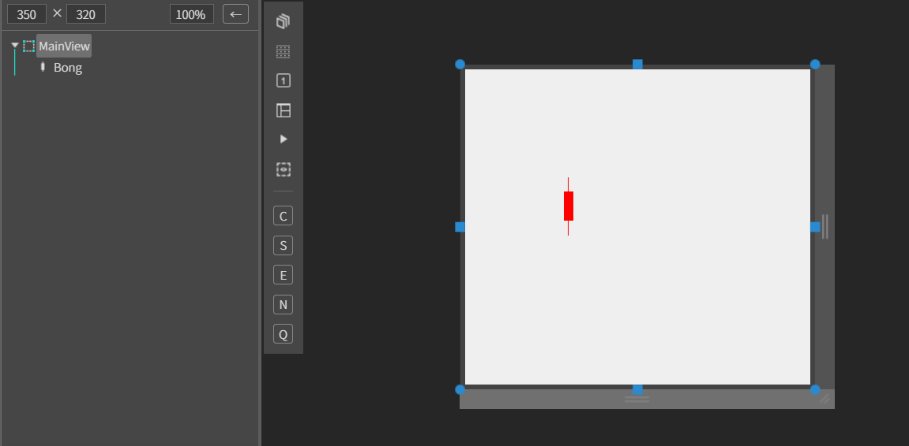
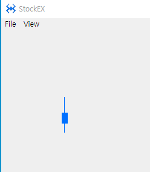

# EXBong

봉 차트 컴포넌트

## a. EXBong Appearance

### Data

**Up Color** : 상한, 상승 색상 설정<br>
**Down Color**  하한, 하락 색상 설정<br>

**Direction**  방향 설정<br>
**portrait** 세로 설정

## b. EXBong Example


### 1. MainView의 레이아웃에 EXBong 컴포넌트를 추가합니다.<br>

<br>

컴포넌트 ID : Bong

### 2. 컴포넌트 데이터 세팅

```js
function MainView*onInitDone()
{
	super.onInitDone();
    
	 			//시가, 고가, 저가,종가
	var ValueArr = [55, 100, 0, 25];

	this.Bong.setData(ValueArr);
};

```
### 3. F5를 누르거나 Build > Run Project 를 클릭하여 프로젝트를 Run 합니다.
<br>

