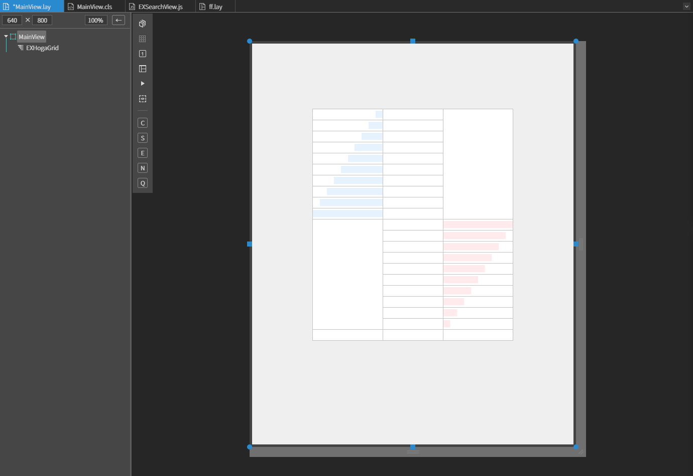
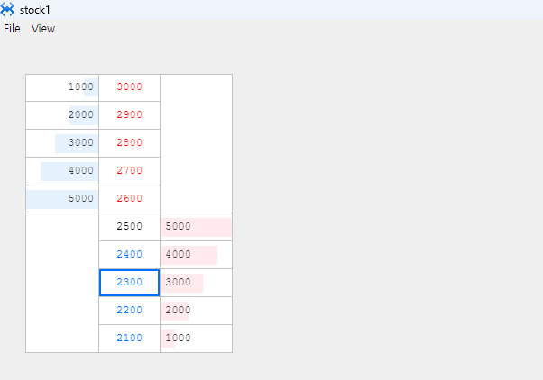

# EXHogaGrid

호가와 거래량을 2열로 표시하는 호가그리드. 

## a. EXMiniHoga Attribute

### Data
**Current Price :** 매핑된 쿼리파일의 현재값의 필드명을 입력합니다.<br>
**Base Price :** 매핑된 쿼리파일의 기본값의 필드명을 입력합니다.<br>
**Bottom Row :** 호가를 하단에 표현될 로우의 개수를 지정합니다.<br>
**Quote Count :** 호가의 단계를 설정합니다.<br>


### Price Color

**Up :** 호가 상승색을 설정합니다.<br>
**Down :** 호가 하락색을 설정합니다.<br>
**Steady :** 호가 보합색을 설정합니다.<br>

### bar Style
**Size :** 호가 잔량을 표현하는 바의 높이를 지정합니다.<br>
**Ask Position :** 매도 잔량바의 위치를 지정합니다.<br>
**Bid Position :** 매수 잔량바의 위치를 지정합니다.<br>
**Ask Color :** 매도 잔량바의 색을 지정합니다.<br>
**Bid Color :** 매수 잔량바의 색을 지정합니다.<br>


### option

**Hide Header :** header 숨김 여부 옵션입니다.<br>
**Single Select :** ctrl 키를 누르고 선택해도 하나만 선택되는 옵션입니다.<br>
**Fullrow Select :** 특정 cell 을 클릭해도 그 row 전체가 선택되는 옵션입니다.<br>
**Selectable :** 선택 [불]가능 옵션 플래그입니다.<br>
**Flexable Row :** TR의 높이를 TABLE 높이에 풀로 맞추는 옵션입니다.<br>


## b. EXHogaGrid Example

### 1. MainView의 레이아웃에 EXHogaGrid 컴포넌트를 추가합니다.<br>

<br>

컴포넌트 ID : hogaGrid


### 2. 컴포넌트 데이터 세팅

호가창의 표현을 위해 가데이터를 넣어줍니다.

```js
function MainView*onInitDone()
{
	super.onInitDone();

    // 1. 첫번째 방법 키값으로 세팅
	this.hogaGrid.setData([{
    ask_remain5: 1000,  ask_hoga5: 3000, tmp: '',
    ask_remain4: 2000,  ask_hoga4: 2900,
    ask_remain3: 3000,  ask_hoga3: 2800,
    ask_remain2: 4000,  ask_hoga2: 2700,
    ask_remain1: 5000,  ask_hoga1: 2600,
    tmp2: '',           bid_hoga1: 2500, bid_remain1: 5000, 
                        bid_hoga2: 2400, bid_remain2: 4000,
                        bid_hoga3: 2300, bid_remain3: 3000, 
                        bid_hoga4: 2200, bid_remain4: 2000, 
                        bid_hoga5: 2100, bid_remain5: 1000, 

    // 현재가와 기본가를 설정하는 방법 1)setData 안에서 이렇게 바로 설정 할 수 있다.
	//cur_price: 2500,    base_price: 2300
}]);

    // 2) 현재가와 기본가를 설정하는 함수를 이용 할 수 있다.
    this.hogaGrid.setBasePrice(2500);
	this.hogaGrid.setCurrentPrice(2300);
	


    // 2. 두번째 방법 배열만으로 세팅

//     this.hogaGrid.setData([[
//     1000,   3000, '',
//     2000,   2900,
//     3000,   2800,
//     4000,   2700,
//     5000,   2600,
//     '',     2500, 5000,
//             2400, 4000, 
//             2300, 3000, 
//             2200, 2000, 
//             2100, 1000
// ]]);
//      this.hogaGrid.setBasePrice(2500);
//      this.hogaGrid.setCurrentPrice(2300);
};

```


### 3. F5를 누르거나 Build > Run Project 를 클릭하여 프로젝트를 Run 합니다.

<br>

#### 가운데 2열은 매수,매도호가 입니다. 2500원인 기준가는 검정색, 2500원 보다 높은 가격은 빨간색, 낮은 가격은 파란색으로 나타냅니다.  
#### 2300원인 현재가에는 해당칸 색깔인 네모 테두리로 나타냅니다. 2열 기준 양 옆은 거래량을 나타냅니다.