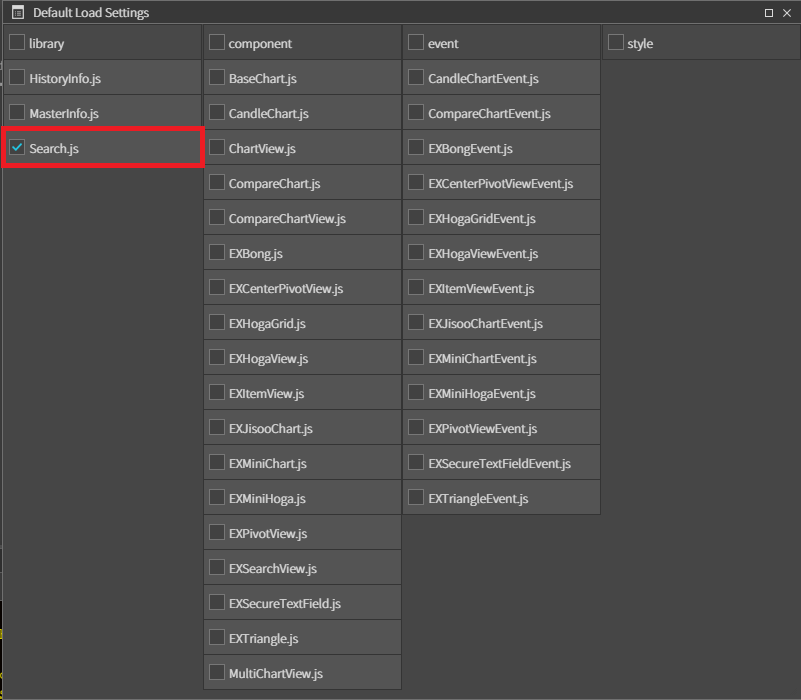

# EXItemView

종목 선택 뷰 컴포넌트

## a. EXItemView Appearance

### Info
**Drop Url :**<br>
**Max Count :**<br>
**Search Url:**<br>

## b. EXItemView Example


### 1. MainView의 레이아웃에 EXItemView 컴포넌트를 추가합니다.<br>
 아래 내용을 참고하여 컴포넌트를 배치합니다. 

<br>

|component|id|text|Event|
|---------|--|----|-----|
|EXItemView|itemView||change :onItemViewChange
|AView|||
|ATextField|srchTxf||change : onOpenDrop <br>focus :onSrchTxfFocus<br> blur :onSrchTxfBlur|
|AButton|dropBtn|히스토리|click : onOpenDrop
|AButton|srchBtn|검색 |click : onSrchBtnClick
|ALabel|prcLbl|
|ALabel|payCodeLbl|원

### 2. libray 추가

Project > Framework >afc (우클릭) > Default Load Settings... 을 클릭합니다.


library 에서 AFrameWnd.js, AGrid.js 에 체크한 뒤 x 버튼을 클릭해서 저장해줍니다.

<br>

Project > Framework >stock (우클릭) > Default Load Settings... 을 클릭합니다.


library 에서 Search.js 에 체크한 뒤 x 버튼을 클릭해서 저장해줍니다.



### 2. 데이터 셋팅

사용할 데이터를 선언합니다.

```js
function MainView*init(context, evtListener)
{
	super.init(context, evtListener);
	
	this.Data = 
	[
		{
			name: "삼성전자",
			code: "005930",
			type: "001",
			curprc : "69400"
		}, 
		{
			name: "LG",
			code: "003550",
			type: "002",
			curprc : "83600",
			
		}, 
		{
			name: "현대자동차",
			code: "005380",
			type: "003",
			curprc : "188500",
			
		}, 
		{
			name: "SK",
			code: "034730",
			type: "004",
			curprc : "152000",
			
			
		}, 
		{
			name: "KT",
			code: "030200",
			type: "005",
			curprc : "33350",
			
		},
		{
			name: "에코프로",
			code: "086520",
			type: "006",
			curprc : "830000",
			
		}
	];	
};

```


```js
function MainView*onInitDone()
{
	super.onInitDone();

	// 종목 뷰에서 쓰일 종목 마스터 객체를 지정합니다.
	EXItemView.setMasterInfo(new MasterInfo());
	
	this.MTInfo = EXItemView.getMasterInfo();
	
    // 데이터를 MasterInfo 에 저장합니다.
	this.MTInfo.set(this.Data);

    // 종목을 세팅합니다. 
	this.itemView.setItemInfo(['005930', '삼성전자', '001'], true);
	
	this.sendData();

};
```

```js
// 종목 선택에 따라 금액을 셋팅해주는 메서드 입니다. 
function MainView*sendData()
{
	var itemInfo = this.itemView.getItemInfo();
	var item = this.MTInfo.itemObj;

	for(var i=0; i<item.length; i++)
	{
		if(itemInfo[1] == item[i].name){
		
		this.prcLbl.setText(item[i].curprc);
		}
    }
};
```


### 3. 이벤트 설정

```js
// search 히스토리를 검색하는 이벤트
function MainView*onOpenDrop(comp, info, e)
{
	this.itemView.openDrop(EXItemView.historyInfo.search(comp.getText(), this.typeArr));
};
```

```js
// 검색 윈도우창을 오픈한다.
function MainView*onSrchBtnClick(comp, info, e)
{
	// MaterInFo에 저장된 종목을 팝업으로 띄어준다. 
	this.itemView.openSearchWindow();
};
```
```js
// 종목을 선택하면 그 종목에 맞는 금액을 셋팅해줍니다.
function MainView*onItemViewChange(comp, info, e)
{
	this.sendData();
};
```

```js 
function MainView*onSrchTxfFocus(comp, info, e)
{
	comp.setText('');
	this.onOpenDrop(comp, info, e);
};
```

```js
function MainView*onSrchTxfBlur(comp, info, e)
{
	comp.setText(this.itemView.getItemInfo()[1]);

};
```


### 4. F5를 누르거나 Build > Run Project 를 클릭하여 프로젝트를 Run 합니다.


<br>


<br>

srchBtn 을 클릭했을 때 팝업창이 뜬 화면입니다. 선택할 종목을 클릭합니다.

<br>


srchTxf 클릭하여 이 전에 선택했던 종목을 필드에 적어주면 아래 종목이 검색되는 것을 볼 수 있습니다. 