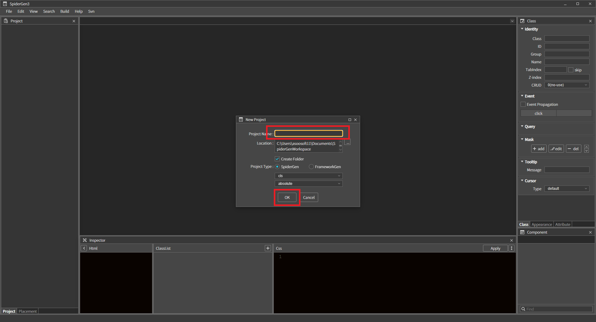
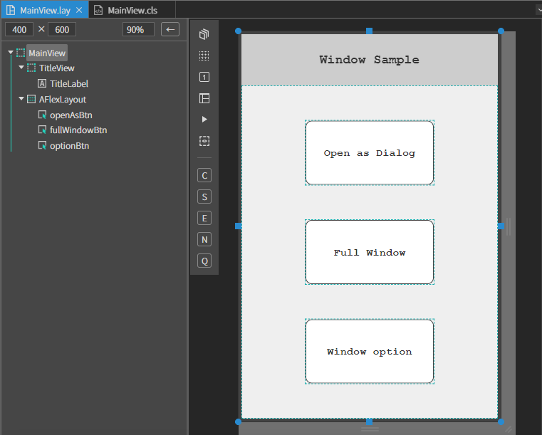
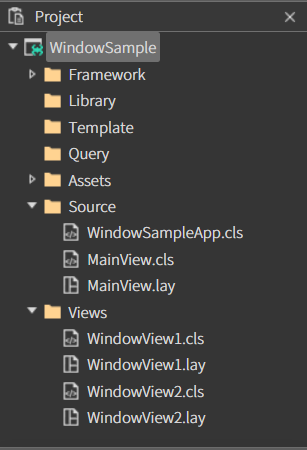
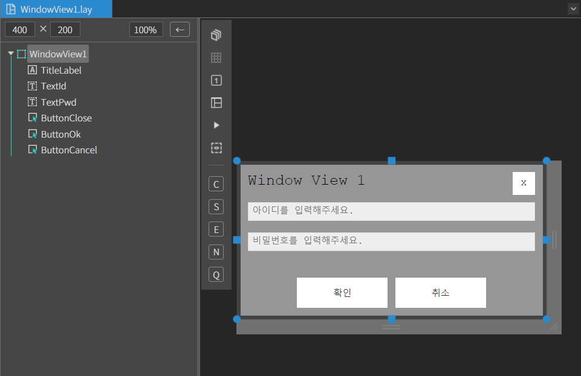
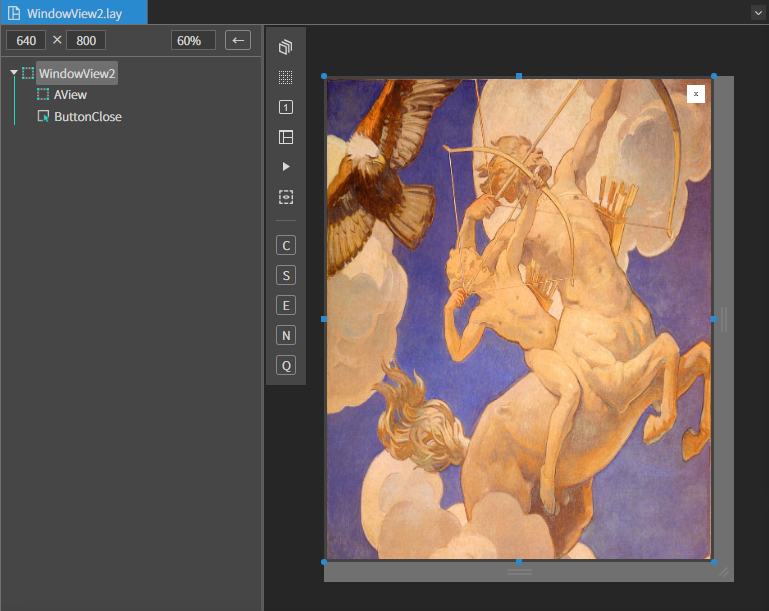
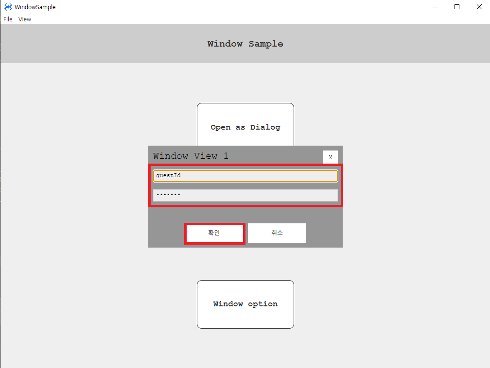
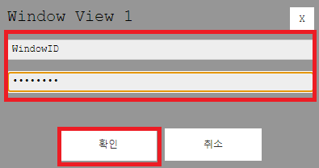
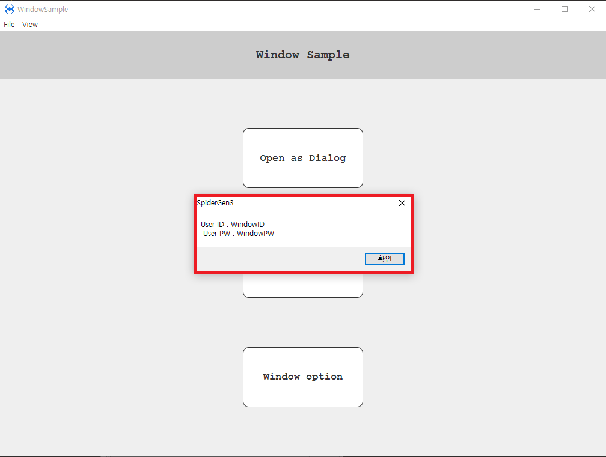
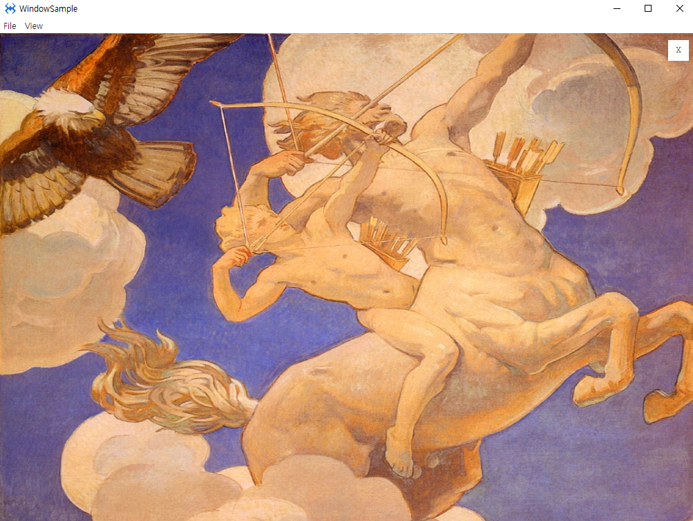
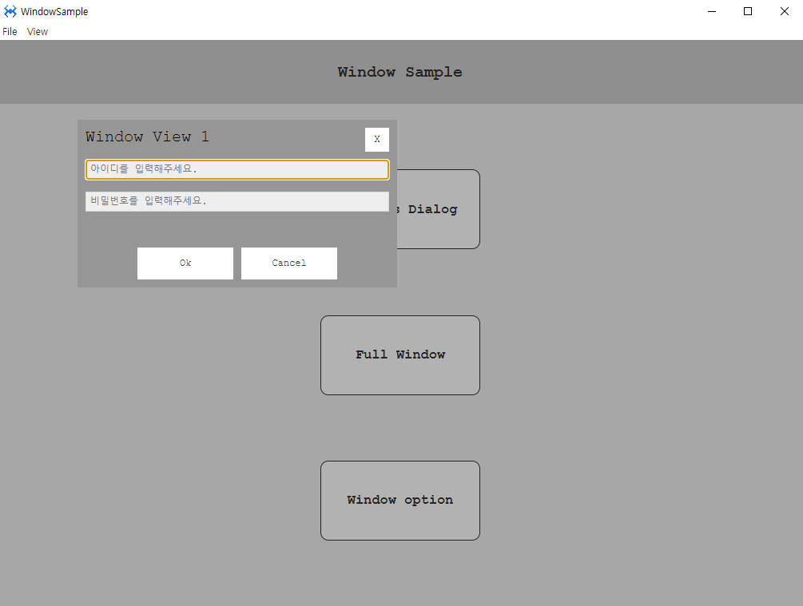

# Window

윈도우 샘플 예제입니다.

File > New Project 에서 프로젝트를 생성합니다. 

<center>



</center>

### 1. MainView.lay 를 오픈합니다.

아래 정보를 참고하여 컴포넌트를 배치합니다.

|Comp|id|text|position|size|Attribute|
|----|--|----|--------|----|---------|
|MainView||||
|AView|TitleView||left :0px, top: 0px|width: 100%, height:80px|
|ALabel|TitleLabel|Window Sample|center X, center Y|width: auto height: auto|
|AFlexLayout|||left :0px, top: 80px	|width: 100% h-stretch:0px |Direction : column , Justify Content : space-evenly ,Align Items : center |
|AButton|openAsBtn|Open as Dialog|left :0px, top: 0px|width: 200px height: 100px|
|AButton|fullWindowBtn|Full Window|left :0px, top: 0px|width: 200px height:100px|
|AButton|optionBtn|Window option|left :0px, top: 0px|width: 200px height:100px|

<center>



</center>

### 2.Views 폴더 생성하기

views 폴더를 생성하고 폴더 내에 WindowView1 , WindowView2 파일을 만듭니다.

<center>



</center>

### 3. WindowView 컴포넌트 배치

아래 정보를 참고하여 컴포넌트를 배치합니다.

### [WindowView1]
<center>



</center>

|Comp|id|text|position|size|Placeholder|
|----|--|----|---------------|-------------|----------------|
|MainView||||
|ALabel|TitleLabel|Window View 1|left :10px, top: 10px|width: auto height: auto|
|ATextField|TextId||left :10px, top: 50px|width: stretch-10 height: 25px|아이디를 입력해주세요.
|ATextField|TextPwd||left :10px, top: 90px|width: stretch-10 height: 25px|비밀번호를 입력해주세요.
|AButton|ButtonClose|X|right :10px, top: 10px|width: 30px height: 30px|
|AButton|ButtonOk|확인|right :50%, bottom:10px margin-right:10px|width: 120px height: 40px||
|AButton|ButtonCancel|취소|left :50%, bottom: 10px|width: 120px height: 40px||

### [WindowView2]
<center>



</center>

|Comp|id|text|position|size|background|
|----|--|----|---------------|-------------|----------------|
|MainView||||
|AView|||left :0px, top: 0px|width: 100% height: 100%|이미지삽입|
|AButton|ButtonClose|X|right :10px, top: 10px|width: 30px height: 30px||


### 3. Open as Dialog

Dialog와 같은 윈도우창을 띄우는 방법입니다.

#### [window 띄우기]
MainView.cls를 오픈합니다. (button id : openAsBtn) 버튼에 Click 이벤트를 설정해줍니다.

윈도우를 다이아로그같이 띄우는 방법입니다.

```js
function MainView*onOpenAsBtnClick(comp, info, e)
{

	// 컨테이너 id 를 설정하고 AWindow 를 생성한다.
	var wnd = new AWindow('sample01');
	
	wnd.openAsDialog('Source/Views/WindowView1.lay', null, 400, 210);	//ADialog 와 같은 효과를 준다.
	//or try this
	//wnd.openAsMenu('Views/WindowView1.lay', null, 400, 210);	//메뉴처럼 띄운다. 배경을 클릭하면 닫힘
	//wnd.openCenter('Views/WindowView1.lay', null, 400, 210); //윈도우를 화면 가운데 위치하도록 띄운다

};
```
#### [window 닫기]

WindowView1 파일을 오픈합니다.

(button id : ButtonClose) 버튼에 Click 이벤트를 설정해줍니다.

```js
function WindowView1*onButtonCloseClick(comp, info, event)
{
	this.getContainer().close(2);
};
```
(button id : ButtonCancel) 버튼에 Click 이벤트를 설정해줍니다.
```js
function WindowView1*onButtonCancelClick(comp, info, event)
{
	//뷰의 컨테이너를 찾아서 닫는다.
	this.getContainer().close(1);
};
```

#### [데이터 주고 받기]

MainView에서 window로 데이터를 주고 받는 방법입니다.

window 띄우기에서 설정한 (button id : openAsBtn)버튼 click 이벤트를 수정하겠습니다.

```js
function MainView*onOpenAsBtnClick(comp, info, e)
{
	// 컨테이너 id 를 설정하고 AWindow 를 생성한다.
	var wnd = new AWindow('sample01');
	
	wnd.setData({ id: "guestId", pw: "guestPw" });
	//윈도우가 닫히면 호출될 콜백함수 셋팅
	wnd.setResultCallback(function(result, data)
  	{
		//확인 버튼을 누른 경우
		if(result==0)
		{
			alert('User ID : ' + data.uid + '\n User PW : ' + data.upw);
		}
	});
	
	wnd.openAsDialog('Source/Views/WindowView1.lay', null, 400, 210);	//ADialog 와 같은 효과를 준다.
	//or try this
	//wnd.openAsMenu('Views/WindowView1.lay', null, 400, 210);	//메뉴처럼 띄운다. 배경을 클릭하면 닫힘
	//wnd.openCenter('Views/WindowView1.lay', null, 400, 210);

};
```

WindowView1.cls 파일을 오픈합니다.<br>
mainView에서 setData로 보낸 데이터를 getData로 받아 텍스트 필드에 띄워줍니다.

```js
//init 실행 후 호출되는 함수
function WindowView1*onInitDone()
{
	super.onInitDone();
	
	//open 시 셋팅한 컨테이너 데이터를 얻어온다.
	var data = this.getContainer().getData();
	
	if(data)
	{
		this.TextId.setText(data.id);
		this.TextPwd.setText(data.pw);
	}
	
};
```
windowView1 텍스트 필드 값을 다시 data에 담아 보냅니다

```js
function WindowView1*onButtonOkClick(comp, info, event)
{
	var uid = this.TextId.getText(),
		upw = this.TextPwd.getText();

	// 텍스트박스 체크
	if(!uid || !upw)
	{
		alert('정보를 입력해주세요.');
		return;
	}
	
	// 뷰의 컨테이너를 찾아서 닫는다. 닫을때 텍스트박스의 데이터를 보낸다.
	var data = { 'uid' : uid, 'upw' : upw };
	
	this.getContainer().close(0, data);
};
```

### [Run]
openAsBtn 버튼을 클릭하게 되면 windowView1 윈도우가 뜨게 되는데,
mainView 에서 setData에 담아 보낸 텍스트 데이터가 텍스트 필드에 보여지는 걸 확인 할 수 있습니다.
<center>



</center>

<center>



</center>

텍스트 필드에서 텍스트를 변경하여 확인 버튼을 눌러주면 windowview에서 보낸 데이터를 MainView에서 확인 할 수 있습니다.
<center>



</center>


### 4.Full Window

window를 전체화면으로 오픈하는 방법입니다

#### [window 오픈]
MainView 에서 fullWindowBtn 버튼에 click 이벤트를 설정합니다.

```js
function MainView*onFullWindowBtnClick(comp, info, e)
{
	var wnd = new AWindow('sample02');
	
	wnd.openFull('Source/Views/WindowView2.lay');
};
```

#### [window 닫기]

windowView2 에서 ButtonClose 버튼에 click 이벤트를 설정합니다
```js
function WindowView2:onButtonCloseClick(comp, info)
{
	//뷰의 컨테이너를 찾아서 닫는다.
	this.getContainer().close();
};
```

#### [Run]

window가 전체화면으로 오픈된 걸 볼 수 있습니다
<center>



</center>

상단 우측 버튼을 클릭하면 윈도우가 닫힙니다.

### 5. Window option

window를 옵션으로 설정해서 오픈하는 방법입니다.

#### [윈도우 옵션]
```
//window option 
//	{
//		isModal: false,				//모달로 띄울지
//		isCenter: false,			//자동 중앙정렬 할지
//		isFocusLostClose: false,	//모달인 경우 포커스를 잃을 때 창을 닫을지
//		isFocusLostHide: false,		//모달인 경우 포커스를 잃을 때 창을 숨길지
//		modalBgOption: afc.isMobile ? 'dark' : 'none',		//none, light, dark 모달인 경우 배경을 어둡기 정도
//		overflow: 'hidden',			//hidden, auto, visible, scroll
//		dragHandle: null,			//드래그 핸들이 될 클래스명이나 아이디, .windowHandle or #windowHandle
//		isResizable: false,			//윈도우 창을 리사이즈 가능하게 할지
//		isDraggable: false,			//윈도우 창을 드래그로 움직이게 할지
//		inParent: false,			//부모 컨테이너 안에 창을 띄울 경우, 모달리스(isModal:false)이고 부모를 클릭해도 항상 부모보다 위에 보이게 하려면 이 값을 true 로 셋팅해야 한다.
//		focusOnInit: true,			//init될때 자동으로 윈도우의 첫번째 컴포넌트(tabIndex기준)에 포커스
//		activePropagation: true		//윈도우가 닫힐 때 활성화 되는 컨테이너의 active 호출여부(onWillActive, onActive, onActiveDone)
//	};

```
#### [윈도우 옵션 설정 후 오픈]
```js
function MainView*onOptionBtnClick(comp, info, e)
{
	// 컨테이너 id 를 설정하고 AWindow 를 생성한다.
	var wnd = new AWindow('sample03');
	
	// 윈도우의 옵션을 설정한다.
	wnd.setWindowOption({
		isModal : true, 			//모달로 띄울지
		isFocusLostClose : true, 	//모달인 경우 포커스를 잃을 때 창을 닫을지
		modalBgOption : 'light',  	//모달인 경우 배경을 어둡기 정도
		isDraggable: true,			//윈도우 창을 드래그로 움직이게 할지
		isResizable: true 			//윈도우 창을 리사이즈 가능하게 할지
	});
	
	
	// url, parnt, top, left, width, height
	// 컨테이너의 open 함수는 비동기이므로 open 호출 후 로드가 완료된 view 에 접근하려면 
	// then 이나 async, await 를 사용해야 한다.
	wnd.open('Source/Views/WindowView1.lay', null, 100, 100, 400, 210).then(()=>
	{
		var view = wnd.getView();
		view.ButtonOk.setText('Ok');
		view.ButtonCancel.setText('Cancel');
	});

};
```
#### [Run]

윈도우 위치와 사이즈를 설정해서 오픈한 윈도우 창입니다.
<center>



</center>

설정한 옵션도 적용되어 오픈된 걸 볼 수 있습니다.