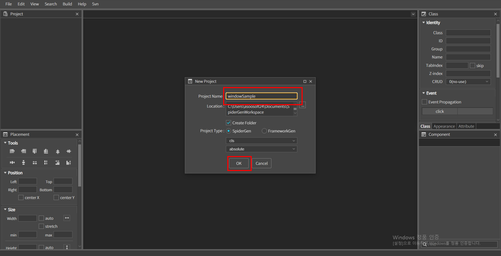
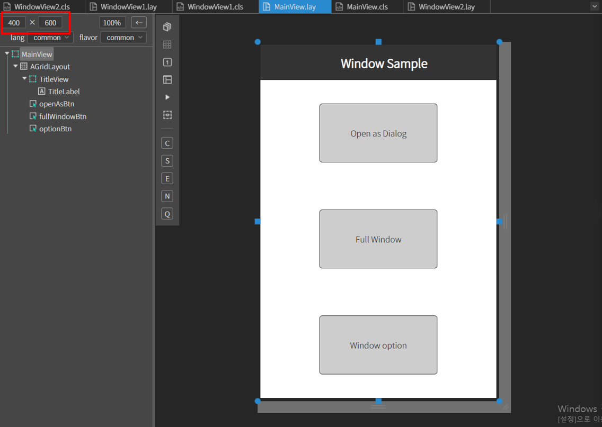
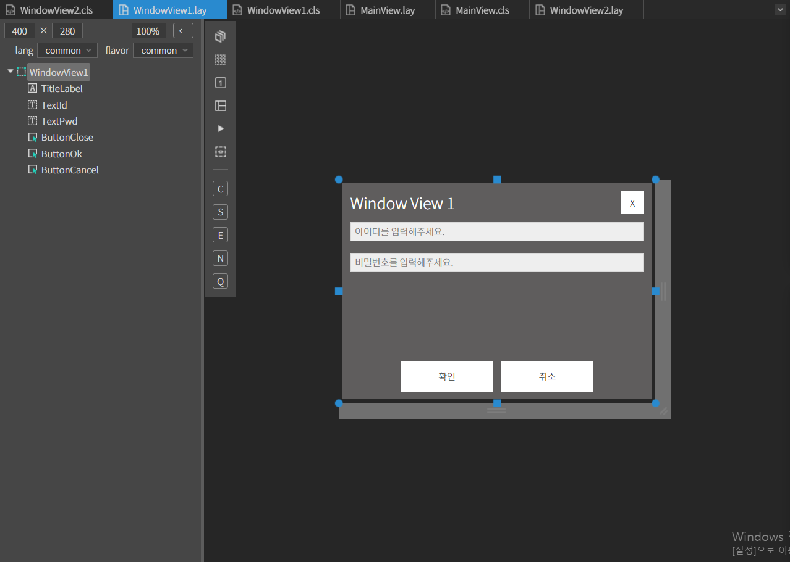
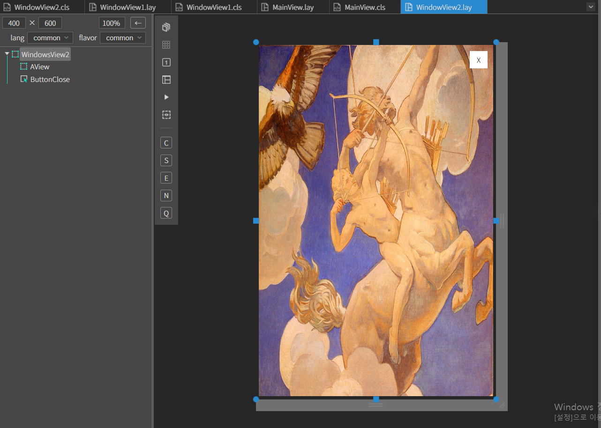
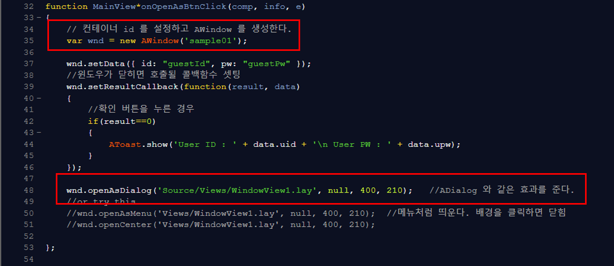
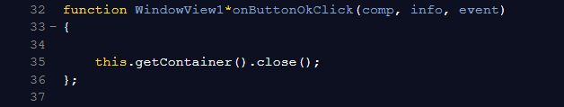
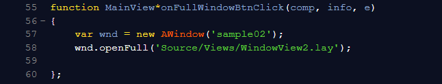

# WindowSample

window 샘플 예제입니다.

<center>



</center>

위 이미지와 같이 프로젝트 이름을 적고 OK 버튼을 누릅니다.

### 1. MainView.lay 를 오픈하고 다음과 같이 컴포넌트를 만들어 줍니다.

|Comp|id|text|position|size|Property
|----|--|----|---------------|-------------|-----------|
|MainView||||
|AGridLayout|||left :0px, top: 0px	|width: 100% height:100%|Rows:4 Cols:1 Cellheight:10%,30%,30%,30%|
|AView|TitleView||left :0px, top: 0px|width: 100% height:100%|
|ALabel|TitleLabel|Window Sample|center X, center Y|width: auto height: auto|
|AButton|openAsBtn|Open as Dialog|left :0px, top: 0px|width: 200px height: 100px|Col H-Align: center, Col V-Align:middle
|AButton|fullWindowBtn|Full Window|left :0px, top: 0px|width: 200px height:100px|Col H-Align: center, Col V-Align:middle
|AButton|optionBtn|Window option|left :0px, top: 0px|width: 200px height:100px|Col H-Align: center, Col V-Align:middle

<br>

<center>



</center>


### 2. Source 폴더 안에 Views 폴더를 생성합니다.

### 3.  Views 폴더 내에 WindowView1, WindowView2 뷰를 각각 추가하고 컴포넌트를 배치합니다.

<WindowView1.lay>

|Comp|id|text|position|size|Placeholder|
|----|--|----|---------------|-------------|----------------|
|MainView||||
|ALabel|TitleLabel|Window View 1|left :10px, top: 10px|width: auto height: auto|
|ATextField|TextId||left :10px, top: 50px|width: stretch-10 height: 25px|아이디를 입력해주세요.
|ATextField|TextPwd||left :10px, top: 90px|width: stretch-10 height: 25px|비밀번호를 입력해주세요.
|AButton|ButtonClose|X|right :10px, top: 10px|width: 30px height: 30px|
|AButton|ButtonOk|확인|right :50%, bottom: 10px|width: 120px height: 40px||
|AButton|ButtonCancel|취소|left :50%, bottom: 10px|width: 120px height: 40px||

<br>

<center>



</center>


<WindowView2.lay>

#### 먼저  프로젝트 폴더에 이미지 파일 넣기

윈도우 파일 탐색기에서 프로젝트 폴더를 열고 Img 폴더를 생성 후 사용할 이미지 파일을 넣습니다<br>

 *  스파이더젠 프로젝트 트리에서 Assets 폴더 위에서 컨텍스트 메뉴를 오픈합니다.(마우스 우측 버튼을 클릭)<br>

 
 
 <br>

 * 컨텍스트 메뉴에서 Add existing files in directory... 메뉴를 클릭합니다. 
   
   :  해당 메뉴는 선택된 폴더내의 모든 파일을 프로젝트로 로드합니다.
   
* 오픈된 폴더 찾기 다이얼로그에서 앞에서 생성한 '프로젝트이름' > Img 폴더를 선택합니다. 그럼 폴더 안에 모든 이미지 파일들이 프로젝트로 로드됩니다.

|Comp|id|text|position|size|background|
|----|--|----|---------------|-------------|----------------|
|MainView||||
|AView|||left :0px, top: 0px|width: 100% height: 100%|이미지삽입|
|AButton|ButtonClose|X|right :10px, top: 10px|width: 30px height: 30px||

<br>

<center>



</center>


### 4. 이제 MainView에서 Open as Dialog 버튼을 눌렀을 때 다이어로그 효과를 주도록 윈도우를 오픈합니다.

MainView.cls에서 다음과 같이 코드를 작성한다.

<center>



</center>


```javascript
var wnd = new AWindow('sample01');

wnd.openAsDialog('Source/Views/WindowView1.lay', null, 400, 210);
```

openAsDialog( viewUrl, parent, width, height )
다이얼로그처럼 작동되도록 옵션을 셋팅하여 윈도우를 오픈한다.

다음과 같이 셋팅한 것과 같다. { isModal:true, isCenter:true }

* viewUrl : 윈도우에 보여질 뷰 리소스 url
* parent : 자신의 부모 컨테이너
* width : 윈도우의 넓이
* height : 윈도우의 높이

#### 위 코드를 작성한 뒤 실행을 하고 Open as Dialog 버튼을 누르면 WindowView1.lay의 레이아웃을 다이얼로그 효과의 윈도우를 오픈 할 수 있습니다.

### 5. window 창 닫기

X 버튼인 ButtonClose에 클릭 이벤트를 설정한뒤 다음에 코드를 작성해줍니다.

<center>



</center>

```javascript
    //뷰의 컨테이너를 찾아서 닫는다.
	this.getContainer().close();
```


### 6. Full Window 버튼 클릭시 윈도우를 전체 화면으로 오픈합니다.

MainView.cls에서 다음과 같이 코드를 작성한다.

<center>



</center>

```javascript
var wnd = new AWindow('sample02');

	wnd.openFull('Source/Views/WindowView2.lay');
```

openFull( viewUrl, parent )
윈도우를 전체 화면으로 오픈한다.

* viewUrl : 윈도우에 보여질 뷰 리소스 url
* parent : 자신의 부모 컨테이너

#### 위 코드를 작성한 뒤 실행을 하고 Full Window 버튼을 누르면 WindowView2.lay의 레이아웃을 윈도우의 전체화면으로 오픈 할 수 있습니다.

창닫기는 5. window 창 닫기를 보고 같은 방법으로 실행하면 됩니다.

### 7.Window Option 

세번째 Window Option 버튼을 누르면 첫번째 버튼을 누른것과 똑같은 레이아웃의 윈도우가 오픈됩니다. 다만 윈도우에는 다양한 옵션이 있는데 다른 옵션을 적용한 효과를 가지고 나오게끔 설정되어있습니다. 

```javascript
window option 
//	{
//		isModal: false,				//모달로 띄울지
//		isCenter: false,			//자동 중앙정렬 할지
//		isFocusLostClose: false,	//모달인 경우 포커스를 잃을 때 창을 닫을지
//		isFocusLostHide: false,		//모달인 경우 포커스를 잃을 때 창을 숨길지
//		modalBgOption: afc.isMobile ? 'dark' : 'none',		//none, light, dark 모달인 경우 배경을 어둡기 정도
//		overflow: 'hidden',			//hidden, auto, visible, scroll
//		dragHandle: null,			//드래그 핸들이 될 클래스명이나 아이디, .windowHandle or #windowHandle
//		isResizable: false,			//윈도우 창을 리사이즈 가능하게 할지
//		isDraggable: false,			//윈도우 창을 드래그로 움직이게 할지
//		inParent: false,			//부모 컨테이너 안에 창을 띄울 경우, 모달리스(isModal:false)이고 부모를 클릭해도 항상 부모보다 위에 보이게 하려면 이 값을 true 로 셋팅해야 한다.
//		focusOnInit: true,			//init될때 자동으로 윈도우의 첫번째 컴포넌트(tabIndex기준)에 포커스
//		activePropagation: true		//윈도우가 닫힐 때 활성화 되는 컨테이너의 active 호출여부(onWillActive, onActive, onActiveDone)
//	};
```

다양한 옵션을 적용하면서 실행해보세요.