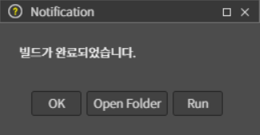

# 07. 웹 & 모바일에서 실행하기

## 1.웹에서 실행하기
스파이더젠 프로젝트를 웹에서 띄우는 방법을 알아봅니다.

### 1.1 자동 실행

스파이더젠에서 프로젝트를 오픈 하고 [Build-Run AsBrowser]를 선택 하면 자동으로 생성되어진 로컬서버에 빌드 된 프로젝트가 옮겨지고 바로 웹에서 확인할 수 있게 됩니다.

<center>


</center>

### 1.2 수동 실행

만약 사용중인 웹서버가 있다면 프로젝트 빌드 후에 생성되는 bin 폴더 내부의 index.html을 포함한 생성된 모든 폴더 및 파일들을 웹서버에 복사하거나 옮겨서 사용할 수 있습니다.


<center>


</center>

bin 폴더가 존재하는 프로젝트 폴더는 스파이더젠에서 프로젝트 루트폴더를 우클릭 하여 아래와 같이 오픈 하거나 빌드 후에 Open Folder를 클릭하여 오픈 할 수 있습니다.

<center>


</center>

<center>



</center>

## 2. 모바일에서 실행하기

### 2.1 Android에서 실행

안드로이드 스튜디오에서 실행하기 위해서는 먼저 이 곳에서 설치를 해야합니다.

설치 후 Android Studio 실행 후 [File > Open]을 선택하여 cordova폴더의 안드로이드 프로젝트를 오픈합니다.

### 2.2 iOS에서 실행

iOS에서 실행하기 위해서는 macOS 환경과 XCode 설치가 필요합니다.

XCode에서 실행하기 위해서는 먼저 이 곳에서 설치를 해야 합니다.

설치 후 XCode 실행 후 [File > Open]을 선택하여 cordova폴더의 prj파일을 오픈합니다.

### 2.3 cordova 플러그인

프로젝트를 진행하다보면 HTML만으로는 불가능한 네이티브의 기능이 필요할 때가 있습니다. 기기의 진동이나 벨소리 울리기, 앱 이름, 버전, 기기의 모델명 등은 네이티브에서만 실행이 가능합니다.

스파이더젠과 네이티브를 이어주는 브릿지 역할을 하는것이 cordova 이고 기능별로 플러그인을 추가합니다. 스파이더젠에서 cordova의 함수를 통해 네이티브로 요청을 하면 네이티브에서 받은 요청에 따라 수행하고 다시 웹브라우저 쪽으로 값을 리턴합니다.

모바일에서 어떤 작업을 수행할것인지에 따라 직접 플러그인을 생성할 수 있습니다.

자세한 사용예는 위의 영상강좌를 통해 확인해 보기 바랍니다.


#### 2.3.1 스파이더젠

스파이더젠 프로젝트에서 버튼을 클릭하는 이벤트함수에 아래와 같이 작성합니다.

``` javascript
function MainView*onAButton1Click(comp, info, e)
{
    cordova.exec( function(result)
    {
        alert(result);
    }, null, "SpidergenPlugin", "sampleMethod", ["PluginTest"]);
};
```

cordova.exec 함수가 cordova를 통해 모바일로 기능을 요청하는 함수입니다.

cordov.exec의 각 파라미터는 다음과 같습니다.


``` javascript
cordova.exec(<성공 시 함수>, <실패 시 함수>, <플러그인 이름>, <행동 이름>, [<인수>]);
```

#### 2.3.2 Android

Android Studio를 실행해여 cordova폴더의 안드로이드 프로젝트를 오픈합니다.

``` javascript
@Override
    public boolean execute(String action, JSONArray args, CallbackContext callbackContext) throws JSONException {
        if (action.equals("screenOrientation")) {
            return routeScreenOrientation(args, callbackContext);
        }
        else if (action.equals("sampleMethod")) {
            String message = args.getString(0);
            this.sampleMethod(message, callbackContext);
            return true;
        }
        return false;
    }
```

screenOrientation은 화면의 방향을 정하는 플러그인이고 sampleMethod는 말그대로 샘플 플러그인입니다.

스파이더젠에서 sampleMethod을 요청했으므로 action이 sampleMethod인 곳 내부가 실행됩니다.

내부에서는 args로 부터 message를 받아오고 sampleMethod함수를 실행합니다. args에는 스파이더젠에서 배열로 보냈던 인수가 차례대로 저장되어있어 get() 함수를 사용하여 원하는 위치의 인수를 얻어올 수 있습니다.

sampleMethod함수를 확인해봅니다.

``` javascript
private void sampleMethod(String message, CallbackContext callbackContext) {
    if (message != null && message.length() > 0) {
        callbackContext.success(message);
    } else {
        callbackContext.error("Expected one non-empty string argument.");
    }
}
```

실행되는 함수 내부를 보면 단순하게 콜백 함수를 실행해주는 내용을 확인할 수 있습니다.

``` javascript
//성공 시
callbackContext.success(message);
//실패 시
callbackContext.error("Expected one non-empty string argument.");
```

이 함수를 사용하여 받은 message를 다시 스파이더젠으로 리턴해주었습니다.

처음에 스파이더젠프로젝트에서 작성했던 콜백함수가 호출되어 alert으로 message가 뜨게 될것입니다.

플러그인을 추가하기 원한다면 sampleMethod 아래에 새로운 else if 문을 사용하여 원하는 이름을 만들고 스파이더젠에서 cordova.exec를 통해 새로 만든 이름으로 호출해주면 됩니다.


#### 2.3.3 iOS

XCode를 실행해여 cordova 폴더의 iOS 프로젝트를 오픈합니다.

``` javascript
 - (void) sampleMethod:(CDVInvokedUrlCommand *)command
    {
         CDVPluginResult* pluginResult = nil;
        NSString* message = [command.arguments objectAtIndex:0];
        if (message != nil) {
                pluginResult = [CDVPluginResult resultWithStatus:CDVCommandStatus_OK messageAsString:message];
            } else {
                pluginResult = [CDVPluginResult resultWithStatus:CDVCommandStatus_ERROR messageAsString:@"Arg was null"];
            }
        [self.commandDelegate sendPluginResult:pluginResult callbackId:command.callbackId];
    }
```

screenOrientation은 화면의 방향을 정하는 플러그인이고 sampleMethod는 말그대로 샘플 플러그인입니다.

스파이더젠에서 sampleMethod을 요청했으므로 sampleMethod 함수가 실행됩니다.

내부에서는 command.arguments로 부터 message를 받아오고 sampleMethod함수를 실행합니다. command.arguments에는 스파이더젠에서 배열로 보냈던 인수가 차례대로 저장되어있어 objectAtIndex 함수를 사용하여 원하는 위치의 인수를 얻어올 수 있습니다.

그 후에는 단순하게 콜백 함수를 실행해주는 내용을 확인할 수 있습니다.

``` javascript
 //성공 시
pluginResult = [CDVPluginResult resultWithStatus:CDVCommandStatus_OK messageAsString:message];
//실패 시
pluginResult = [CDVPluginResult resultWithStatus:CDVCommandStatus_ERROR messageAsString:@"Arg was null"];
```

이 함수를 사용하여 받은 message를 다시 스파이더젠으로 리턴해주었습니다.

처음에 스파이더젠프로젝트에서 작성했던 콜백함수가 호출되어 alert으로 message가 뜨게 될것입니다.

플러그인을 추가하기 원한다면 sampleMethod 아래에 새로운 함수를 추가하여 원하는 이름을 만들고 스파이더젠에서 cordova.exec를 통해 새로 만든 이름으로 호출해주면 됩니다.