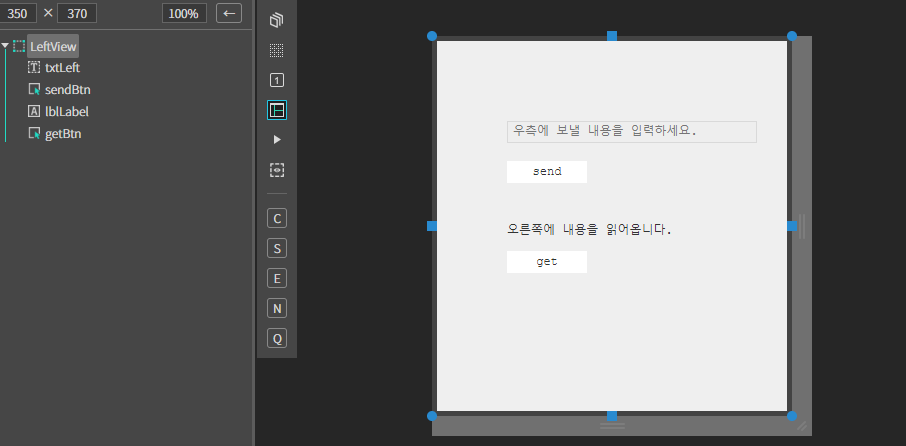
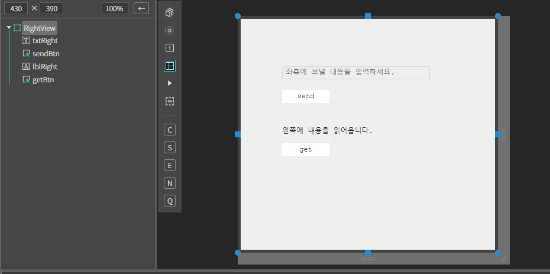
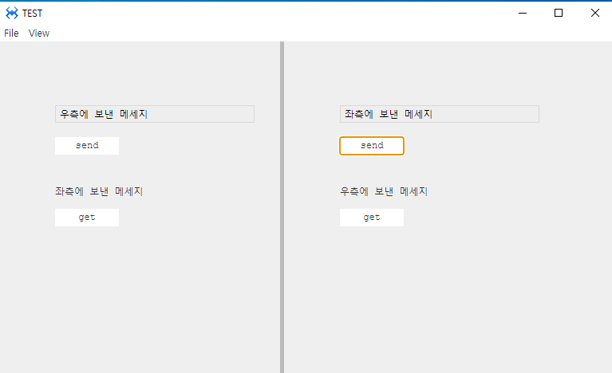
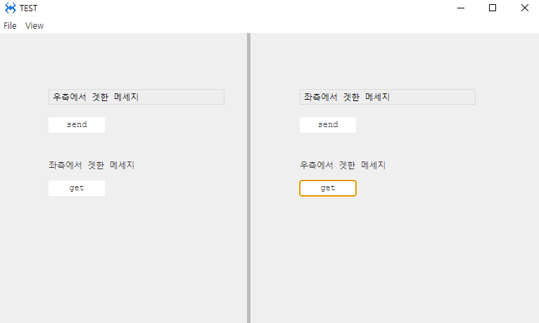

# 0. SplitView
스플릿뷰는 뷰를 설정한 크기의 영역으로 나누는 뷰 컴포넌트 입니다.

## a. SplitView Attribute

## b. SplitView Example

### 1. MainView.lay의 레이아웃에 컴포넌트를 추가합니다.<br>
* 아래 내용을 참고하여 컴포넌트를 배치합니다. 

|component|id|position|size|
|------|---|---|---|
|ASplitView|splitView|left:0px, top:0px|width:100%, height:500px|

### 2. Source 폴더 아래 Views 폴더를 생성합니다.

### 3. Views 폴더에 LeftView, RightView를 추가합니다.

### 4. MainView.cls에 다음과 같이 멤버변수를 추가합니다.

```javascript
class MainView()
{
	super();
	
	this.leftView =  null; 
    this.rightView = null; 
    
}
```

### 5. MainView.cls onInitDone() 함수에서 다음 내용을 참고해서 스플릿을 생성합니다.
|view count	|left view|right view|direction|
|------|---|---|---|
|2|width: 300px|width: -1(전체사이즈에서 300px를 뺀 나머지 사이즈)|row|

```javascript

function MainView*onInitDone()
{
	super.onInitDone();

	//스플릿 생성 
	this.splitView.createSplit(2, [480, -1], 'row'); 

    //스플릿에 뷰 설정  
    this.leftView = this.splitView.setSplitView(0, 'Source/Views/LeftView.lay');     
    this.rightView = this.splitView.setSplitView(1, 'Source/Views/RightView.lay');     

};
```
* createSplit( count, sizeArr, splitDir, barSize )

    내부에 분할 아이템을 생성한다.

    *  count : <Number> 아이템의 갯수
    *  sizeArr : <Array> 사이즈 배열 (-1일 경우 자동)
    *  splitDir : <String> 분리 방향 (row:좌우, column:상하)
    *  barSize : <Number> 분할 바의 사이즈

* setSplitView( inx, view )

    매개변수 inx 에 해당하는 아이템에 뷰를 설정한다.

    매개변수 view는 문자열일 경우 해당하는 뷰를 생성한다.

    * inx <Number> 인덱스
    * view <AView> 설정 할 뷰
    * Returns <AView>

### 6. LeftView.lay 파일을 오픈합니다

 * 아래 내용을 참고해서 컴포넌트를 배치합니다.

|component|id|position|size|text|placeholder|
|------|---|---|---|--|-|
|ATextField|txtLeft|left: 20px, top:50px	|w-stretch: 20px, height: auto||우측에 보낼 내용을 입력하세요.
|ALabel|lblLabel	|left: 20px, top:150px|w-stretch: 20px, height: auto |오른쪽에 내용을 읽어 옵니다.|
|AButton|btnSend|left: 20px, top:80px|width: 80px, height: 22px|send	
|AButton|btnGet|left: 20px, top:180px|width: 80px, height: 22px|get

<br>

### 7. LeftView.cls 파일을 오픈하고 멤버변수를 다음과 같이 설정합니다.
```javascript
class LeftView()
{
	super();

	this.mainView = null;     
    this.rightView = null; 

}
extends AView;
```
 *  onInitDone()에 다음과 같이 수정합니다.

```javascript
function LeftView*onInitDone()
{
	super.onInitDone();

	this.mainView = this.getContainer().getView();     
    this.rightView = this.mainView.splitView.getSplitView(1);   
};
```
 * send 버튼에 click 이벤트 설정을 합니다.

 ```javascript
function LeftView*onSendBtnClick(comp, info, e)
{
    var sendTxt = this.txtLeft.getText(); 

    if(!sendTxt || sendTxt.length < 1){ 

        alert('전송할 내용을 입력하세요.'); 
        return; 
    } 

    this.rightView.lblRight.setText(sendTxt); 
};

 ```
 * get 버튼에 click 이벤트 설정을 합니다.

```javascript
function LeftView*onGetBtnClick(comp, info, e)
{

	 var getTxt = this.rightView.txtRight.getText(); 

    if(!getTxt || getTxt.length < 1){ 
        alert('입력된 내용이 없습니다.'); 
        return; 
    } 

    this.lblLabel.setText(getTxt); 

};

```

### 8. RightView.lay 파일을 오픈합니다

*  다음 내용을 참고해서 컴포넌트를 배치하세요.

|component|id|position|size|text|placeholder|
|------|---|---|---|--|-|
|ATextField|txtRight|left: 20px, top:50px	|w-stretch: 20px, height:auto||좌측에 보낼 내용을 입력하세요.
|ALabel|lblRight|left: 20px, top:150px|w-stretch: 20px, height:auto |왼쪽에 내용을 읽어 옵니다.|
|AButton|btnSend|left: 20px, top:80px|width:80px, height:22px|send	
|AButton|	btnGet|left: 20px, top:180px|width:80px, height:22px|get

<br>

### 9. rightView.cls 파일을 오픈하고 멤버변수를 다음과 같이 설정합니다.
```javascript
class RightView()
{
	super();

	this.mainView = null;     
	this.leftView = null;  

}
extends AView;

```
 *  onInitDone()에 다음과 같이 수정합니다.
```javascript
function LeftView*onInitDone()
{
	super.onInitDone();

	this.mainView = this.getContainer().getView();     
	this.leftView = this.mainView.splitView.getSplitView(0);  
};

```
 * send 버튼에 click 이벤트 설정을 합니다.
```javascript
function RightView*onSendBtnClick(comp, info, e)
{

	 var sendTxt = this.txtRight.getText(); 

    if(!sendTxt || sendTxt.length < 1){ 
        alert('전송할 내용을 입력하세요.'); 
        return; 
    } 

    this.leftView.lblLabel.setText(sendTxt); 


};
```
 * get 버튼에 click 이벤트 설정을 합니다.
```javascript
function RightView*ongetBtnClick(comp, info, e)
{
	 var getTxt = this.leftView.txtLeft.getText(); 

    if(!getTxt || getTxt.length < 1){ 
       alert('입력된 내용이 없습니다.'); 
        return; 
    } 

    this.lblRight.setText(getTxt); 

};
```
### 10.F5를 누르거나 Build > Run Project 를 클릭하여 프로젝트를 Run 합니다

<br>

* 좌우측에 텍스트 필드에 각각 내용을 입력하고 send 버튼을 클릭해봅니다. 서로 상대편의 레이블에 내용이 잘 출력되는걸 확인합니다.<br>

<br>
* 이번에는 각 뷰의 get 버튼을 클릭합니다. 서로 상대편의 텍스트 필드 내용을 가져오는지 확인합니다.<br>