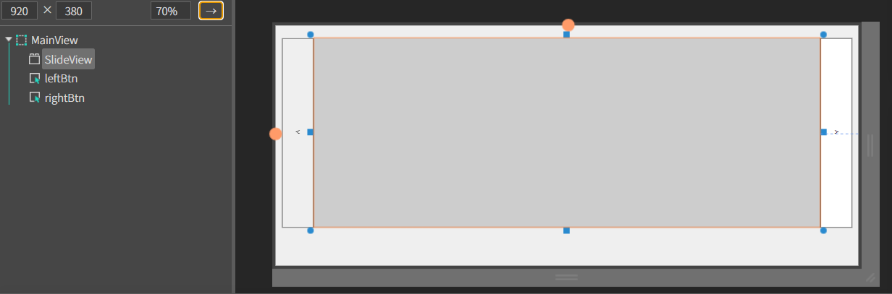
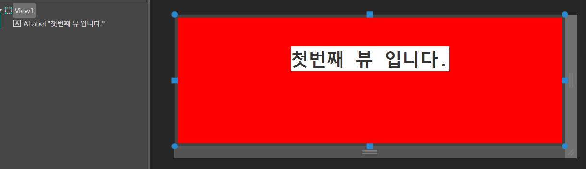
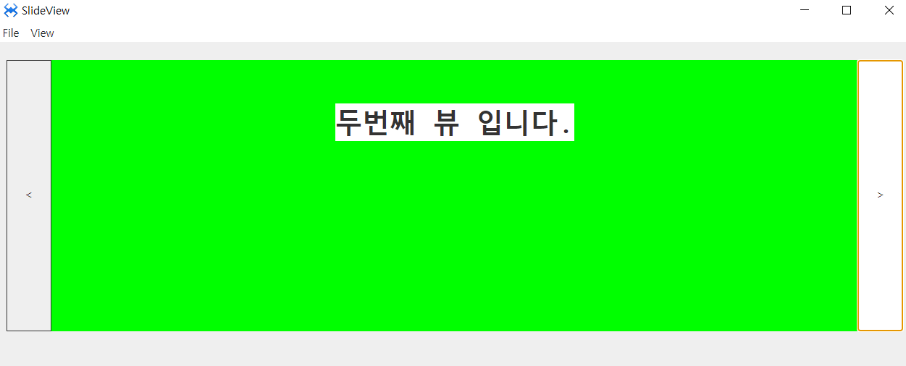

# SlideView
슬라이드 뷰 컴포넌트 입니다.

## a. SlideView Attribute
### **Option**<br>

**Direction  :** 자식 요소의 방향성을 설정하는 속성입니다
* **vertical  :** 자식 요소가 수직 방향으로 슬라이드 됩니다.
* **horizontal  :** 자식 요소가 수평 방향으로 슬라이드 됩니다.

## b. SlideView Example

### 1. MainView.lay의 레이아웃에 컴포넌트를 추가합니다.<br>

 * 다음 내용을 참고해서 컴포넌트를 배치합니다.

|component|id|position|size|text|
|---------|--|--------|----|----|
|ASlideView|SlideView|left:60px, top:20px|w-stretch:60px, height:300px|
|AButton|leftBtn|left:10px, top:20px|width:50px, height:300px|<
|AButton|rightBtn|right:10px, top:20px  |width:50px, height:300px|>


<br>

### 2. Source 폴더 안에 Views 폴더를 생성합니다

### 3.  Views 폴더 내에 view1,view2,view3 뷰를 각각 추가합니다.

|view|background|text|
|----|----------|----|
|View1|red|첫번째 뷰 입니다|
|View2|green|두번째 뷰 입니다|
|View3|blue|세번째 뷰 입니다|

<br>
 * 나머지 view2,view3 도 위의 표와 사진을 참고하여 컴포넌트를 배치합니다.

### 4.MainView.cls 파일을 오픈하고 다음과 같이 소스 내용을 수정합니다.
```javascript
function MainView*onInitDone()
{
	super.onInitDone();

	this.SlideView.addItem('Source/Views/View1.lay', [1]);
	this.SlideView.addItem('Source/Views/View2.lay', [2]);
	this.SlideView.addItem('Source/Views/View3.lay', [3]);

};

```

### 5. leftBtn 버튼에 click 이벤트를 설정합니다.
```javascript
function MainView*leftBtnClick(comp, info, e)
{
	this.SlideView.slidePrev();
};
```
### 6. rightBtn 버튼에 click 이벤트를 설정합니다.
```javascript
function MainView*rightBtnClick(comp, info, e)
{
    this.SlideView.slideNext();
};
```

### 7.F5를 누르거나 Build > Run Project 를 클릭하여 프로젝트를 Run 합니다.


<br>

### leftBtn, rightBtn 을 클릭하여 슬라이드를 확인합니다.