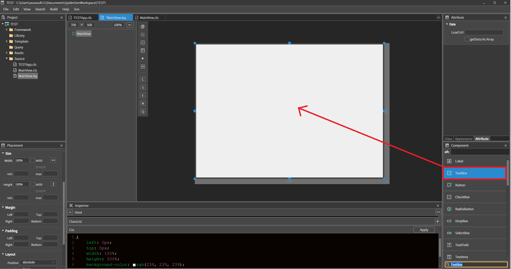
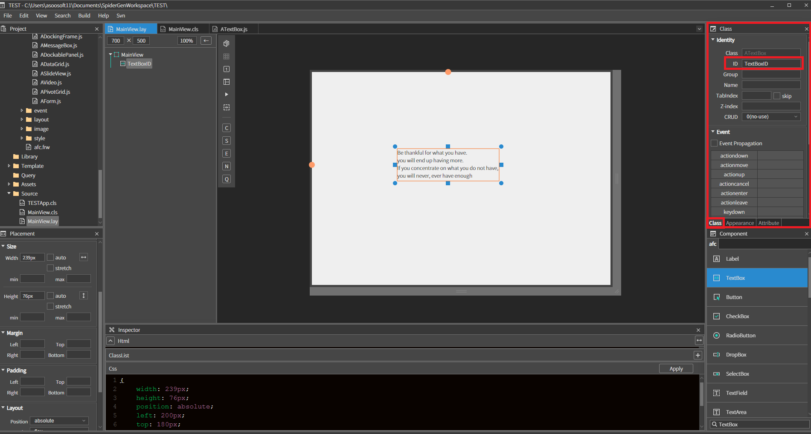
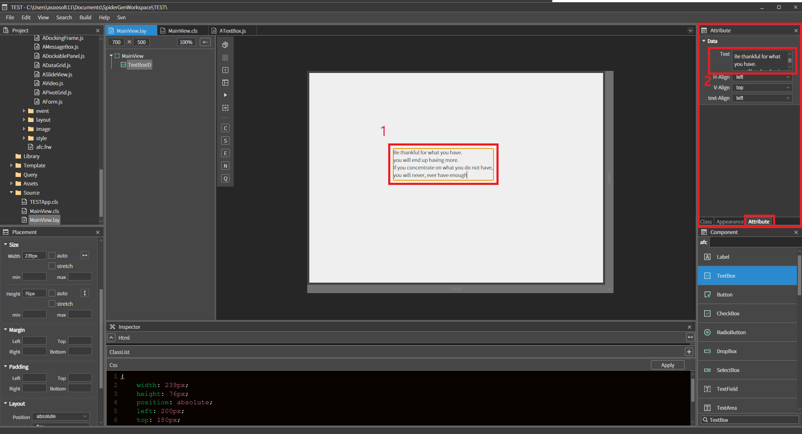
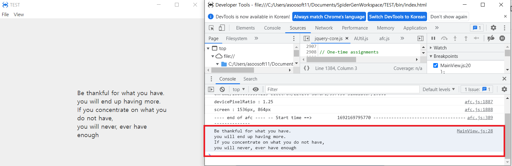

#  B.TextBox
멀티라인 텍스트를 출력하는 컴포넌트 입니다.

## a.Textbox Attribute

### **Data**<br>
**Text**  : 멀티라인 텍스트를 설정하는 속성입니다. 태그를 이용해서 개행을 할 수 있습니다<br>

**H-Align  :** 텍스트 가로 정렬
* **Left  :** 텍스트 좌측 수평 정렬 <br>
* **center  :** 텍스트 중앙 수평 정렬 <br>
* **right  :** 텍스트 우측 수평 정렬 <br>

**V-Align  :** 텍스트 세로 정렬
* **top  :** 텍스트 위로 수직 정렬<br>
* **center  :** 텍스트 중앙 수직 정렬<br>
* **bottom  :** 텍스트 아래로 수직 정렬<br>

**text-Align :** 텍스트 콘텐츠 정렬
* **Left  :** 콘텐츠 왼쪽 정렬<br>
* **center  :** 컨텐츠 왼쪽 정렬<br>
* **right  :** 컨텐츠 왼쪽 정렬<br>


## b. Textbox Example

### 1. MainView의 레이아웃에 컴포넌트를 추가합니다.<br>

<br>
 * 컴포넌트 리스트에서 TextBox 컴포넌트를 더블 클릭하거나 컴포넌트 리스트에서 레이아웃으로 드래그하여 위와 같이 배치합니다.<br>
<br>

<br>
 * class pane에서 ID를 'TextBoxID'로 입력합니다.<br><br>

<br>
 * 레이아웃에서 TextBox에 텍스트를 설정하는 두 가지 방법입니다<br>
1 레이아웃의 TextBox를 더블 클릭해서 Text를 설정할 수 있습니다<br>
2 Attribute pane에서 Text에 입력해서 설정할 수 있습니다.<br>

### 2.소스코딩을 이용하여 TextBox에 설정된 텍스트를 console에 출력하기.<br>
 * MainView.cls 파일을 오픈합니다.<br>
 * 상단의 파일탭에서 MainView.lay 탭을 더블 클릭하거나 우측의 프로젝트 트리에서 MainView.cls 파일을 더블 클릭합니다.<br>
 * 모든 화면뷰는 onInitDone() 함수가 존재하며 이 함수는 화면이 생성될 때 딱 한번 실행됩니다.<br>
 * onInitDone() 함수에서 아래와 같이 코드를 입력합니다.<br>

```javascript
function MainView*onInitDone()
{
	super.onInitDone();

	var getTextBox = null;
  	getTextBox = this.TextBoxID.getText();
  	console.log(getTextBox);
	
};
```
### 3.F5를 누르거나 Build > Run Project 를 클릭하여 프로젝트를 Run 합니다.<br>
 * 프로젝트가 열리면 F12를 누르거나 view > show DevTools 클릭해서 개발자 도구를 열어줍니다.<br>
 
<br>
 * console창에 textbox 텍스트가 출력되는 것을 확인할 수 있습니다.
