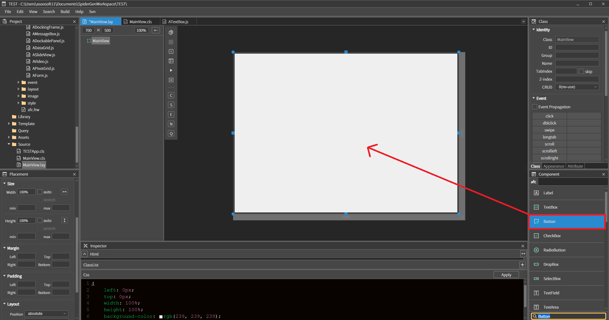
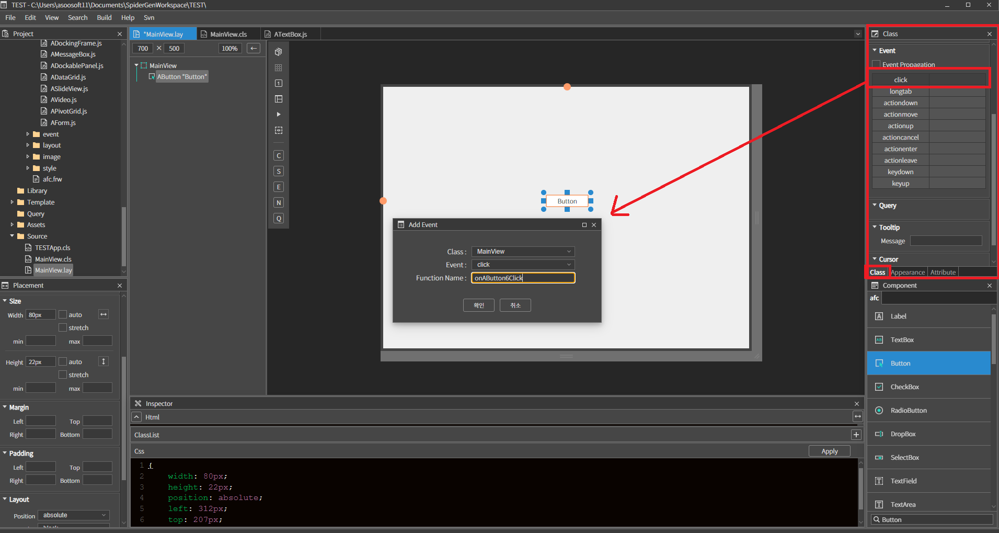
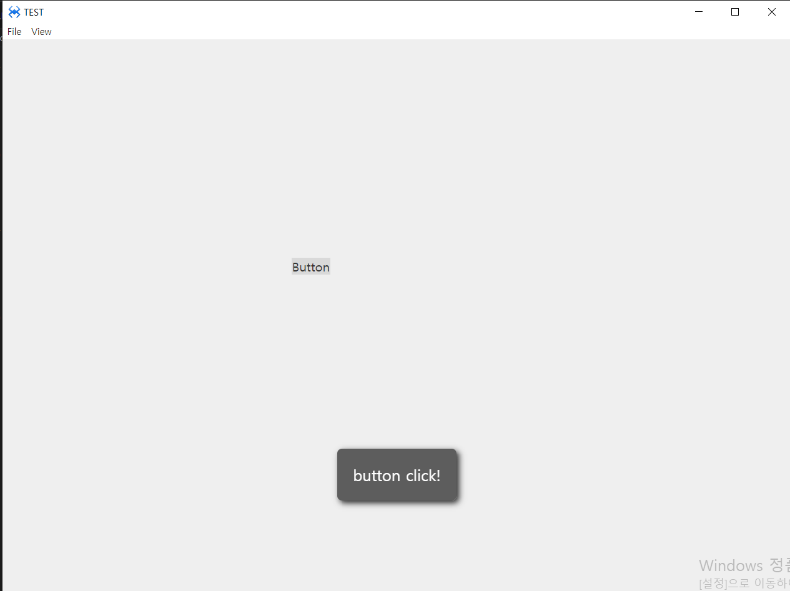

#  C. Button
버튼 컴포넌트 입니다

## a.Button Attribute
버튼의 속성 입니다. 글로벌 속성은 04. Global Properties 을 참고하세요.
### **Data**<br>
**Text**  : 버튼의 텍스트를 설정하는 속성입니다.<br>

 **Align  :** 텍스트의 정렬을 설정하는 속성입니다.<br>
* **Left  :** 텍스트 좌측 정렬 <br>
* **center :**  텍스트 중앙 정렬 <br>
* **right  :** 텍스트 우측 정렬 <br>

**Icon  :** 버튼에 아이콘을 설정하는 속성입니다. <br>
* **after Text :**  삽입된 아이콘이 텍스트 다음에 위치합니다.<br>
* **new line Text :**  삽입된 아이콘과 텍스트를 위아래로 위치 시킵니다. After Text  옵션을 이용해서 텍스트와 아이콘의 위 아래 위치를 변경 할 수 있습니다.<br>

**Icon margin :**  아이콘 마진 설정 속성입니다.<br>
**Icon size :**  아이콘 사이즈 설정 속성입니다.<br>
### **Option**<br>
**fast Click :**  (제거된 기능)<br>
**Tool Button  :** 버튼의 background-image 의 position 을 변경하여 버튼 이미지를 표시하게 처리<br>
**Check Button :**  버튼을 체크박스처럼 사용하는 기능, default 스타일과 down 스타일 번갈아 사용하는 옵션입니다. <br>
**Down State :**  자동으로 배경색 밝기를 조절하여 누른 느낌을 주는 옵션입니다.<br>

### **Style**<br>
**Over  :** 버튼의 마우스 오버시 스타일을 설정하는 속성입니다.<br>
**Down :**  버튼의 마우스 다운시 스타일을 설정하는 속성입니다.<br>
**Disable  :** 버튼 비활성화시 스타일을 설정하는 속성입니다.<br>


## b. Button Example

### 1. MainView의 레이아웃에 Button 컴포넌트를 추가합니다.<br>

<br>

### 2. Button에 Click 이벤트를 설정합니다.
<br>
 * Class < Event < click 을 더블 클릭하면 이벤트를 설정할 수 있습니다.<br>
확인 버튼을 누르면 자동으로 MainView.cls에 함수가 추가됩니다.

### 3. 추가된 매핑 함수에 아래와 같이 버튼이 클릭될 시 토스트 메시지를 출력하게 수정합니다.

```javascript
function MainView*onAButtonClick(comp, info, e)
{

	alert('button click!');

};
```

### 4. F5를 누르거나 Build > Run Project 를 클릭하여 프로젝트를 Run 합니다.

<br>

 * button 클릭 시 alert이 출력되는 것을 확인할 수 있습니다.<br>
