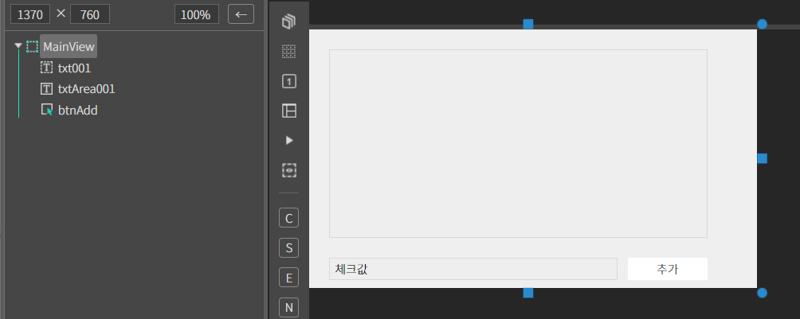
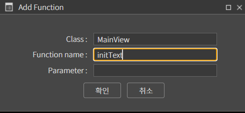
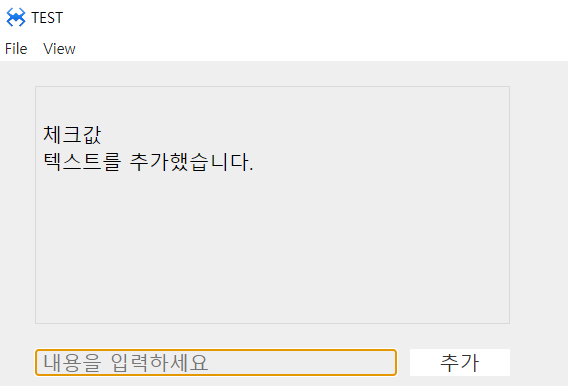

# I. TextArea
여러줄을 입력 할 수 있는 텍스트 입력기 컴포넌트 입니다.
## a. TextArea Attribute
### **Data**<br>
**Text  :** 텍스트 값을 설정하는 속성입니다.<br>
**Placeholder  :** 플레이스홀더를 설정하는 속성입니다.<br>
**Align  :** 텍스트의 정렬을 설정하는 속성입니다.
* **left :**  텍스트를 좌측으로 정렬합니다.
* **center :**  텍스트를 중앙으로 정렬합니다.
* **right :**  텍스트를 우측으로 정렬합니다.

**Alt  :** 텍스트영역의 대체 텍스트를 설정하는 속성입니다.<br>
**IME :**  텍스트 입력모드(국문/영문속성입니다.)을 설정하는 (IE 브라우저만 가능)
* **none :**  입력 모드를 설정하지 않고 현재 로컬 상태를 그대로 사용합니다.
* **english  :** 영문 입력 모드로 설정합니다.
* **korean  :** 국문 입력 모드로 설정합니다.


### 1. MainView의 레이아웃에 컴포넌트를 추가합니다.<br>
 
* 아래 정보를 참고해서 컴포넌트를 배치합니다. 

|component|ID|Text|placeholder|
|------|---|---|--|
|ATextField|txt001|체크값|내용을 입력하세요
|ATextArea|txtArea001||
|AButton|btnAdd|추가|
<br>

<br>

### 2. 버튼에 클릭 이벤트를 설정합니다. 이벤트 함수 내용은 아래와 같습니다.

```javascript
function MainView*onBtnAddClick(comp, info, e)
{
    var txt = this.txt001.getText(); 

    if(!txt || txt.length < 1){ 
        alert.show('추가할 내용을 입력하세요.');         
        return; 
    } 

    //기존의 텍스트에 새 텍스트 추가 
    this.txtArea001.setText( 
        this.txtArea001.getText() + '\n' + this.txt001.getText() 
    ); 

    //사용자 함수 
    this.initText(); 

};
```
### 3.사용자 함수 initText() 함수를 추가합니다.
* MainView.cls에서 직접 문법 형식에 맞게 입력을 하거나 Ctrl + Alt + F 클릭하고 오픈된 다이얼 로그에 Function Name을 initText라고 입력하시면 코드뷰에 함수가 생성됩니다.

<br>

```javascript
function MainView*initText()
{

	//입력 텍스트 초기화 
	this.txt001.setText('');

};
```


### 4.F5를 누르거나 Build > Run Project 를 클릭하여 프로젝트를 Run 합니다

* 먼저 실행 화면에서 텍스트를 입력하지 않고 추가 버튼을 클릭해서 메시지 토스트를 확인합니다.<br>
* 두번째로 텍스트를 입력하고 추가 버튼을 클릭해 봅니다. TextArea 컴포넌트 영역에 입력하는 텍스트가 잘 추가되는지 확인합니다.<br>
* 마지막으로 지금까지 입력된 내용 다음에 TextArea에 직접 입력을 해봅니다.<br>

<br>