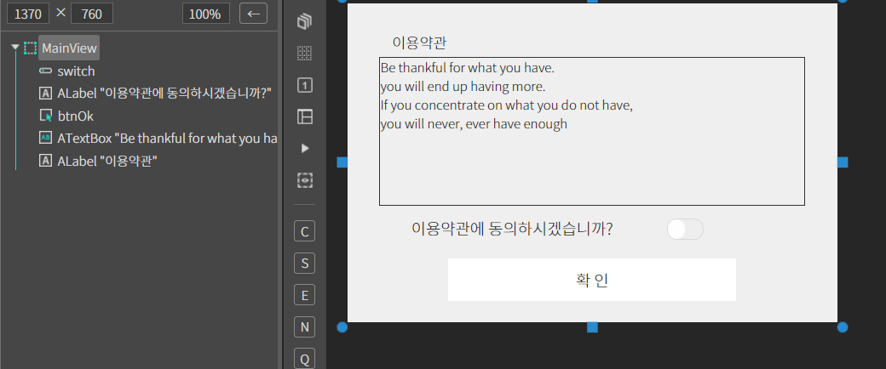
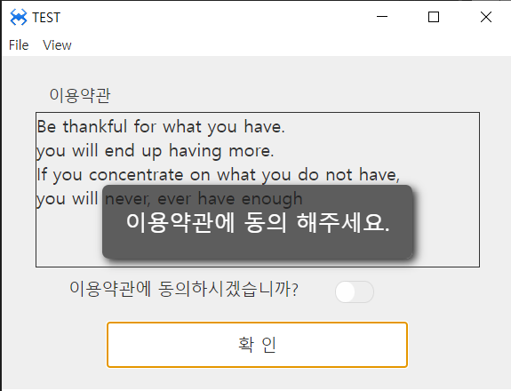
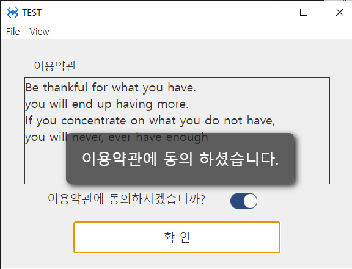

# J. SwitchButton
스위치 버튼 컴포넌트 입니다.
## a. SwitchButton Attribute
### **Style**<br>

**On  :** 스위치 버튼이 On 상태일때 스타일을 지정합니다.<br>
**Off :**  스위치 버튼이 Off 상태일때 스타일을 지정합니다.<br>

## b. SwitchButton Example

### 1. MainView의 레이아웃에 컴포넌트를 추가합니다.<br>

* 아래 정보를 참고해서 컴포넌트를 배치합니다. 

|component|ID|Text|
|------|---|---|
|ALabel|labelID|이용약관|
|ALabel|select1|이용약관에 동의하십니까? |
|ASwitchButton|switch||
|ATextBox|select2|기본내용|
|AButton|btnOk|확인|
<br>

<br>

### 2. 확인 버튼에 Click 이벤트 설정하고 설정한 함수 내용은 아래과 같이 수정합니다.
```javascript
function MainView*onBtnOkClick(comp, info, e)
{
	   //스위치 버튼의 선택 결과를 확인한다. 
    if(!this.switch.getValue()) 
    { 
        alert('이용약관에 동의 해주세요.'); 
    } 
    else 
    { 
        alert('이용약관에 동의 하셨습니다.'); 
    } 
};

```

### 3.F5를 누르거나 Build > Run Project 를 클릭하여 프로젝트를 Run 합니다.

<br>
* 스위치 버튼을 좌측 스위치 상태에서 확인버튼 클릭 메시지 확인. 우측상태로 스위칭하고 확인버튼 클릭 메시지를 확인합니다.<br>

<br>