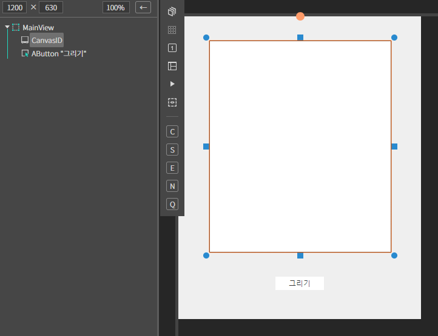
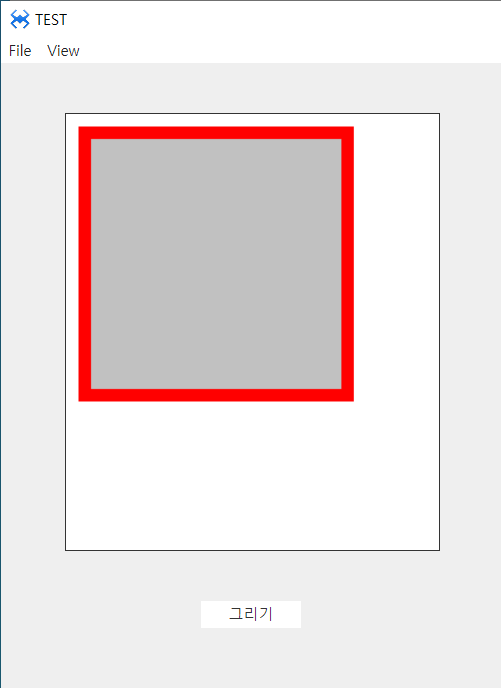

#  M. Canvas
캔버스 컴포넌트 입니다.
## a. Canvas Attribute

## b. Canvas Example

### 1. MainView.lay의 레이아웃에 컴포넌트를 추가합니다.<br>


 

 * canvas id : CanvasID<br>
 * button text : 그리기<br>
 
### 1. 버튼에 클릭 이벤트를 설정해줍니다.<br>
 * 아래와 같이 소스를 수정해줍니다.
```javascript
function MainView*onAButton1Click(comp, info, e)
{

    //this.캔버스아이디.ctx 으로 캔버스 컨텍스트에 접근한다.

	this.CanvasID.ctx.strokeStyle = "red";
	this.CanvasID.ctx.lineWidth = "20";
	this.CanvasID.ctx.fillStyle = "#c1c1c1";
	
	this.CanvasID.ctx.rect(20,20,200,200);
	this.CanvasID.ctx.stroke();
	this.CanvasID.ctx.fill();

};
```


### 4.F5를 누르거나 Build > Run Project 를 클릭하여 프로젝트를 Run 합니다
 

* 그리기 버튼을 클릭하면 context가 출력됩니다.