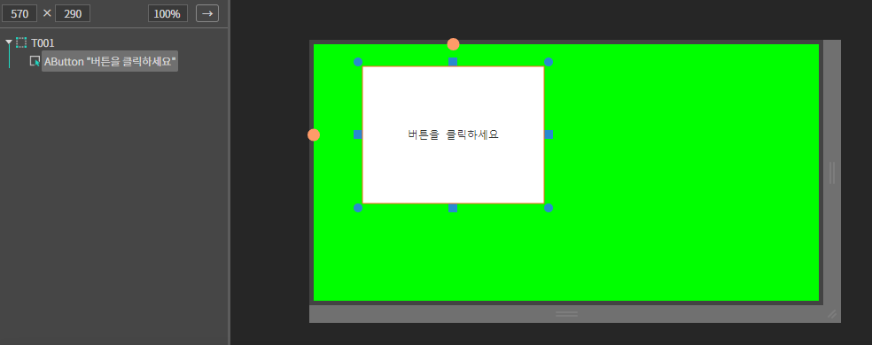
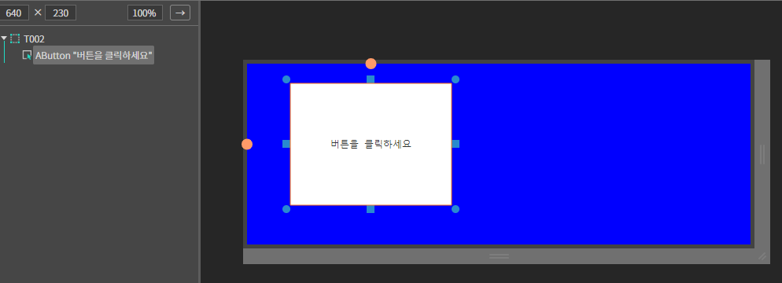
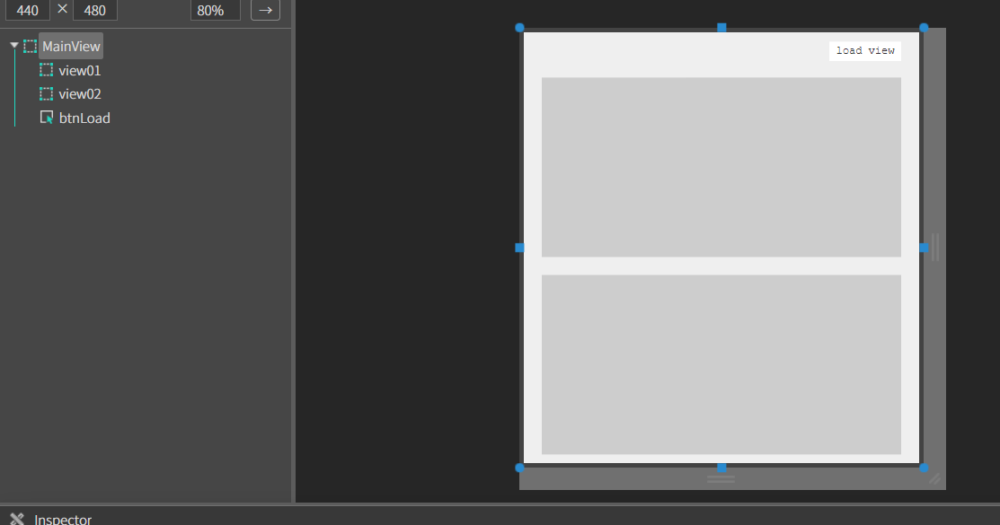
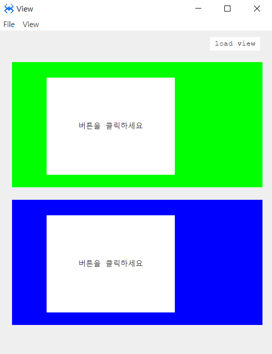
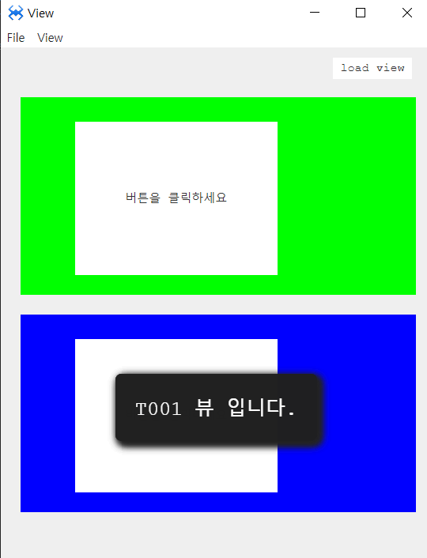

# Q. View
뷰 컴포넌트 입니다.
## a. View Attribute
### **Info**<br>

**Load Url  :** 뷰에 로드할 레이아웃 파일(.lay) 경로를 설정하는 속성입니다.


## b. View Example


### 1. Source 폴더 밑에 Views라는 폴더를 생성합니다.

### 2. Views 폴더 내에 T001 이름으로 뷰를 생성합니다.
* 뷰의 배경색을 연두색으로 변경합니다.

 

 ### 4. 버튼을 추가합니다. 버튼에 Click 이벤트를 설정합니다.
 ```javascript
 function T001:onAButton1Click(comp, info, e) 
{ 

    alert('T001뷰 입니다.'); 

};  
 ```
 ### 5. Views 폴더 내에 T002 이름으로 뷰를 생성합니다.
 * 뷰의 배경색을 파란색으로 변경합니다.

 

  ### 4. 버튼을 추가합니다. 버튼에 Click 이벤트를 설정합니다.
 ```javascript
 function T002:onAButton1Click(comp, info, e) 
{ 

    alert('T002뷰 입니다.'); 

};  
 ```
 ### 5. MainView의 레이아웃에 컴포넌트를 추가합니다.<br>

* 아래 정보를 참고해서 컴포넌트를 배치합니다. 

|component|ID|position|size|text
|------|---|---|---|---|
|AButton|btnLoad|right:20px, top:10px|width:80px, height:20px	|load view
|AView|view01|left:20px, top:50px|width:400px, height:200px	
|AView|view02|left:20px, top:270px|width:400px, height:200px	

 

 * 이 뷰들은 각각 서브뷰 T001, T002를 로드하여 보여주는 역할을 합니다.
 ### 6. load view 버튼에 click이벤트를 설정합니다.

 ```javascript
 function MainView:onBtnLoadClick(comp, info, e) 
{ 
    //뷰를 로드 합니다. 
    this.view01.loadView('Source/Views/T001.lay'); 

    this.view02.loadView('Source/Views/T002.lay'); 

}; 
 ```

 ### 4. F5를 누르거나 Build > Run Project 를 클릭하여 프로젝트를 Run 합니다.
 * Load View 버튼을 클릭합니다. MainView에 뷰 T001, T002가 로드 되는걸 확인합니다.

 

  * 로드된 각 T001, T002뷰에 버튼을 클릭해서 출력되는 메시지를 확인합니다.
  
 