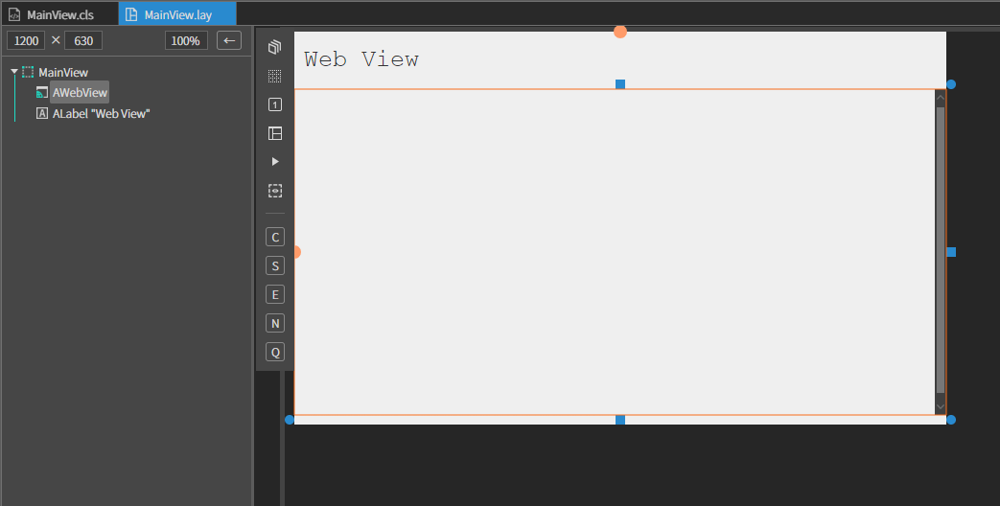
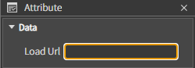

# U. WebView
웹뷰 컴포넌트 입니다.
## a. WebView Attribute
### **Data** 
**Load Url  :** 웹뷰에 로드할 Url 주소를 설정하는 속성입니다.

## b. WebView Example

### 1. MainView.lay의 레이아웃에 컴포넌트를 추가합니다. 

 

* Attribute > data 에서 로드할 URL을 설정합니다 

 

### 4.F5를 누르거나 Build > Run Project 를 클릭하여 프로젝트를 Run 합니다

  

* 해당 URL의 내용이 로드 되는지 확인합니다.