# W. GridLayout
화면의 영역을 구분하기 위해 사용되는 그리드레이아웃 컴포넌트 입니다.

## a. GridLayout Attribute

GridLayout 컴포넌트의 속성은 레이아웃에 배치후 더블 클릭을 통해서 설정 할 수 있습니다.

**Rows  :** 현재 로우의 총 개수 
**Cols  :** 현재 컬럼의 총 개수 

**Cell Heigth  :** 선택한 셀의 높이를 설정하는 속성입니다. 
**Cell Width  :** 선택한 셀의 넓이를 설정하는 속성입니다 
**Cell Padding  :** 선택한 셀의 패딩을 설정하는 속성입니다. 
**Cell Color :**  선택한 셀의 배경색을 설정하는 속성입니다. 
**Cell Borders :**  
  선택된 셀의 top line만 border를 설정합니다. 
 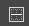 선택된 셀의 horizontal middle line 만 border를 설정합니다. 
  선택된 셀의 bottom line만 border를 설정합니다. 
 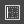 선택된 셀의 left line만 border를 설정합니다. 
  선택된 셀의 vertical middle line만 border를 설정합니다. 
 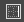 선택된 셀의 right line만 border를 설정합니다. 
 
**All  :** 선택된 셀의 모든 border를 설정합니다. 
**OutLine  :** 선택된 셀의 테두리 line만 border를 설정합니다. 
**Clear  :** 선택된 셀에 적용된 border를 초기화합니다. 

**Cell Context Menu**

**Merge  :** 현재 선택한 셀들을 하나의 셀로 합병합니다. 
**Split  :** Merge 된 셀을 Merge 전의 셀들로 분리합니다. 
**Insert Row :**  현재 선택한 셀의 앞에 Row를 추가합니다. 
**Delete Row :** 현재 선택한 셀의 Row를 삭제합니다. 
**Insert Col  :** 현재 선택한 셀의 앞에 Column을 추가합니다. 
**Delete Col :**  현재 선택한 셀을 삭제합니다. 

**Col H-Align :**  현재 선택한 셀내의 element를 가로 정렬 합니다.

* **center :**  셀 내의 element를 중앙 정렬 합니다.
* **left :**  셀 내의 element를 좌측 정렬 합니다.
* **right  :** 셀 내의 element를 우측 정렬 합니다.
* **justify  :** 셀 내의 element를 넓이 만큼 사이즈를 조정 합니다.

**Col V-Align :**  현재 선택한 셀내의 element를 세로 정렬 합니다.

* **middle :**  셀 내의 element를 세로 중앙에 정렬 합니다.
* **top  :** 셀 내의 element를 맨 상단으로 정렬 합니다.
* **bottom :**  셀 내의 element를 맨 하단으로 정렬 합니다.
* **baseline :**  셀 내의 element를 기준선에 맞추어 정렬 합니다.

## b. GridLayout Example

### 1. MainView.lay의 레이아웃에 컴포넌트를 추가합니다. 

 * 추가한 GridLayout 컴포넌트를 선택하고 Placement > Size  ,   버튼을 이용해 컴포넌트가 뷰에 꽉 차게 조정합니다.

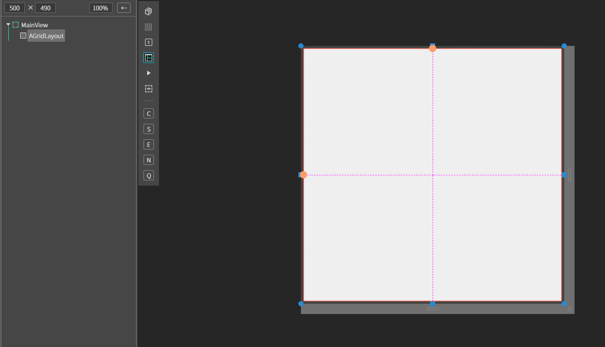 

### 2. 추가한 GridLayout 컴포넌트의 속성 다이얼로그를 오픈 합니다.
* 오픈 방법은 GridLayout 컴포넌트를 더블 클릭합니다. 
또는 선택후 마우스 우측 버튼 클릭해서 컨텍스트 메뉴를 오픈하고 Grid Layout Property 메뉴를 선택합니다.

### 3. GridLayout Property 다이얼로그에 다음과 같이 속성을 설정합니다.

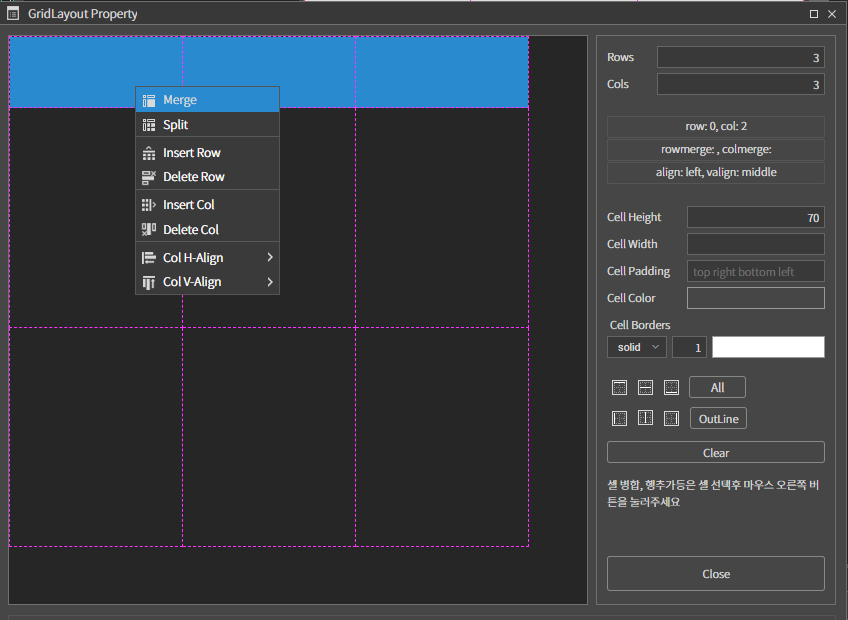 
*  Rows : 3, Cols : 3
1행 1열을 선택하고 Cell Width:150px, Cell Height : 70으로 설정합니다 
* 1행 1열, 1행 2열, 1행 3열 모든 컬럼을 선택(드래그)하고 Cell Context Menu에서 Merge 를 선택해서 셀을 병합 합니다.

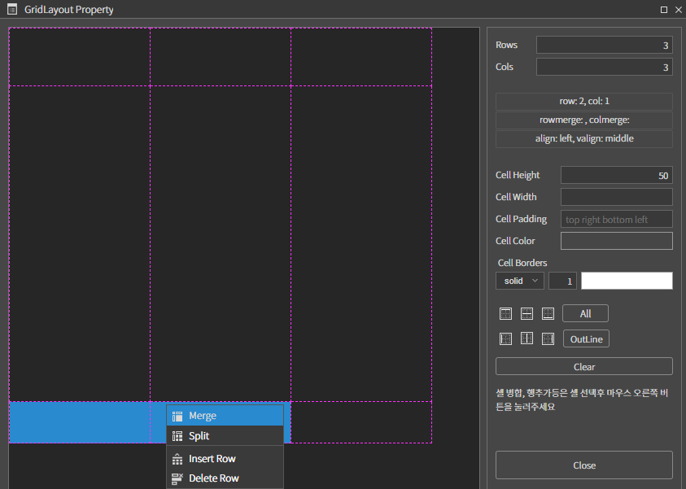 
* 3행 1열을 선택하고 Cell Height : 50px로 설정합니다. 3행 1열, 3행 2열을 병합 합니다.

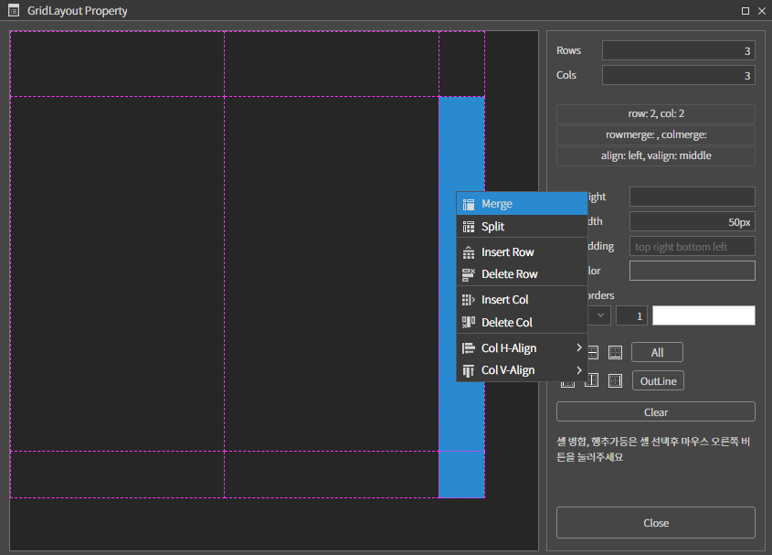 
* 2행 3열을 선택하고 Cell Width : 50px로 설정하고 2행 3열과 3행 3열을 같이 선택하고 병합니다.

* 레이아웃이 5개의 영역으로 구분 되었습니다.

### 4. 1행 병합된 Cell 에 AView 를 드래그앤 드롭으로 추가합니다. 
* Placement > Size  ,   버튼을 이용해 GridLayout 컴포넌트가 뷰에 꽉 차게 조정합니다. 
* 병합된 Cell 내의 AView에 다음 내용을 참고해 컴포넌트를 배치합니다. 

|component|position|size|text|
|------|---|---|---|
|ALabel|left:10px, top:26px	|width:auto, height:auto|검색|
|ATextField|left:40px, top:24px|w-stretch:100px, height:22px||
|AButton|right:10px, top:24px|width:80px, height:22px|검색|

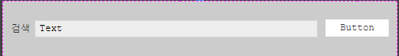

* 세로 중간에 위 3개의 컴포넌트가 위치하게 하기 위해 3개의 컴포넌트를 모두 선택(Ctrl + 선택객체) 하고 Placement > Align-View Based > Middle 을 선택합니다.

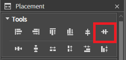 
 

### 5. 고정된 영역에 AView를 추가하고 앞 8번과 같이 추가한 뷰가 셀에 가득차게 하고 각 뷰의 컬러를 연두, 파랑, 노랑 색으로 설정합니다.
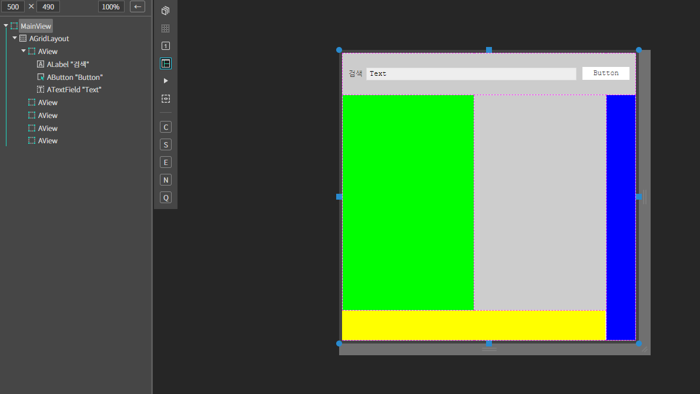 
 

### 6.F5를 누르거나 Build > Run Project 를 클릭하여 프로젝트를 Run 합니다
* 시뮬레이터의 창 사이즈를 줄이거나 늘려 봅니다. 
* 고정 영역(배경컬러가 있는 영역)이 유지 되면서 유동적으로 레이아웃이 변경되는 걸 확인합니다.

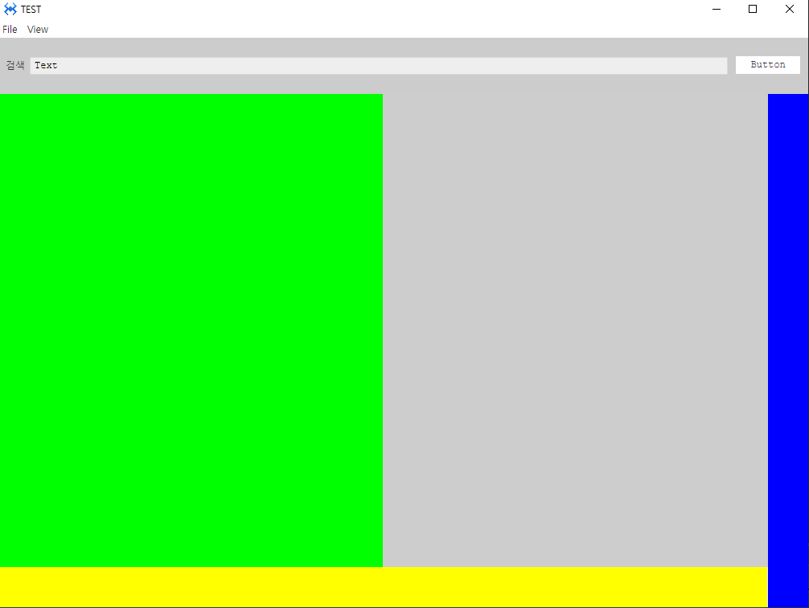 
 
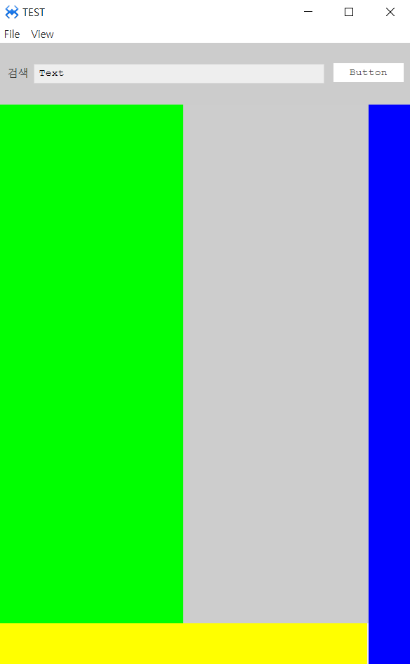 
 