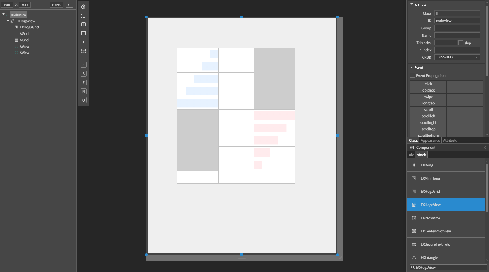
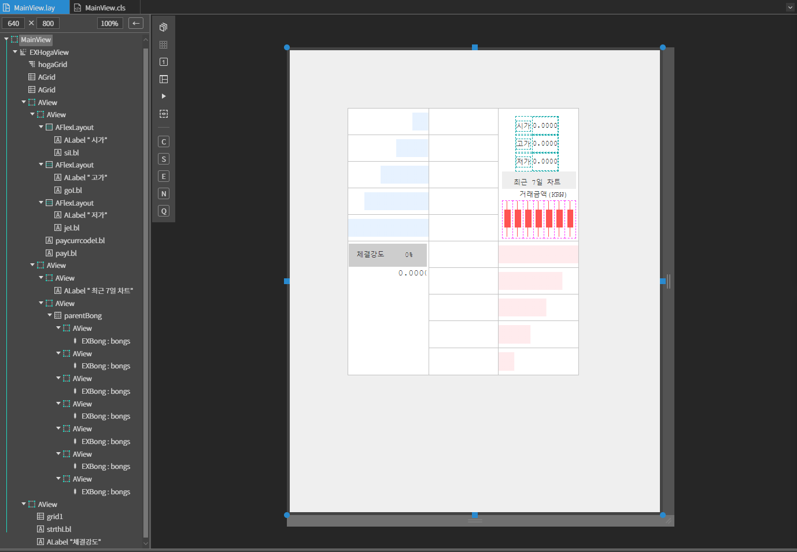
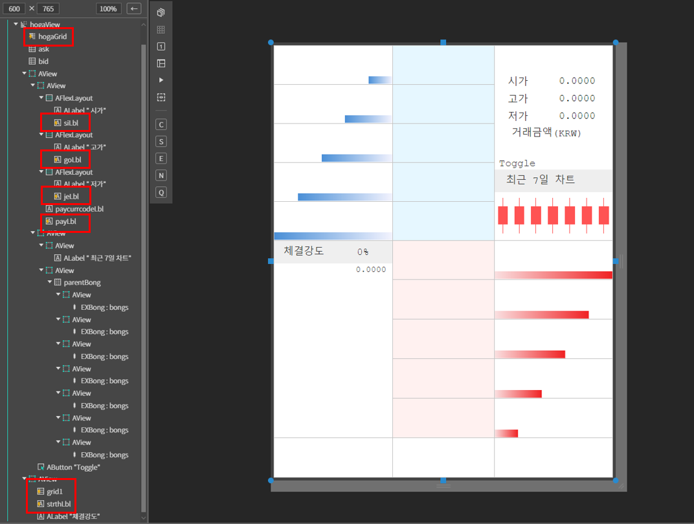
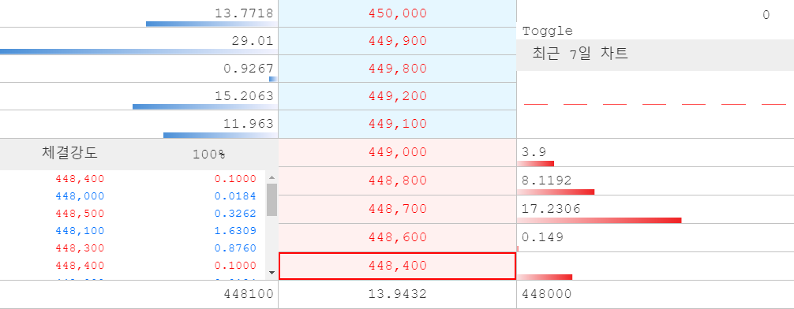

# EXHogaView

## a. EXHogaView Attribute

### Info

**Auto Resize Children :** 자동으로 자식들의 위치, 높이를 변경할지 안할지에 대한 값 <br>
**Show Count :** 현재 뷰에서 보여줄 호가(행)의 개수<br>


## b.EXHogaView Example


### 1. MainView의 레이아웃에 EXHogaView 컴포넌트를 추가합니다.<br>

<br>

### 2. 양 쪽 view 공간을 다음과 같이 세팅합니다. 
이 부분은 상황에 따라 어떤 정보를 넣어주냐에 따라 달라집니다. 예시로 꾸며보도록 하겠습니다.

<br>


### 3. 컴포넌트 데이터 세팅

view공간을 제외하면 EXHogaGrid와 똑같기 때문에 같은 방법으로 데이터를 세팅합니다.

```js
function MainView*onInitDone()
{
	super.onInitDone();

    // 1. 첫번째 방법 키값으로 세팅
	this.hogaGrid.setData([{
    ask_remain5: 1000,  ask_hoga5: 3000, tmp: '',
    ask_remain4: 2000,  ask_hoga4: 2900,
    ask_remain3: 3000,  ask_hoga3: 2800,
    ask_remain2: 4000,  ask_hoga2: 2700,
    ask_remain1: 5000,  ask_hoga1: 2600,
    tmp2: '',           bid_hoga1: 2500, bid_remain1: 5000, 
                        bid_hoga2: 2400, bid_remain2: 4000,
                        bid_hoga3: 2300, bid_remain3: 3000, 
                        bid_hoga4: 2200, bid_remain4: 2000, 
                        bid_hoga5: 2100, bid_remain5: 1000, 

    // 현재가와 기본가를 설정하는 방법 1)setData 안에서 이렇게 바로 설정 할 수 있다.
	//cur_price: 2500,    base_price: 2300
}]);

    // 2) 현재가와 기본가를 설정하는 함수를 이용 할 수 있다.
    this.hogaGrid.setBasePrice(2500);
	this.hogaGrid.setCurrentPrice(2300);
	


    // 2. 두번째 방법 배열만으로 세팅

//     this.hogaGrid.setData([[
//     1000,   3000, '',
//     2000,   2900,
//     3000,   2800,
//     4000,   2700,
//     5000,   2600,
//     '',     2500, 5000,
//             2400, 4000, 
//             2300, 3000, 
//             2200, 2000, 
//             2100, 1000
// ]]);
//      this.hogaGrid.setBasePrice(2500);
//      this.hogaGrid.setCurrentPrice(2300);
};

```

### 4. view 공간에 데이터를 받아올 컴포넌트에 쿼리파일을 연결합니다.

<br>

현재 예시에서는 EXHogaGrid에 호가당 변하지않는 하나의 데이터를 넣었습니다. 위의 데이터로 실행했을 때 화면은 EXHogaGrid를 참고해주시고 각 호가와 컴포넌트들에 실시간으로 변하는 RealData로 연결했을 때 실행화면을 보겠습니다. RealData 연결 매뉴얼은 차후 업데이트 하겠습니다.

### 5. F5를 누르거나 Build > Run Project 를 클릭하여 프로젝트를 Run 합니다.

<br>

<br>

다음과 같이 실시간으로 데이터들이 변화하는 모습을 확인 할 수 있습니다.
