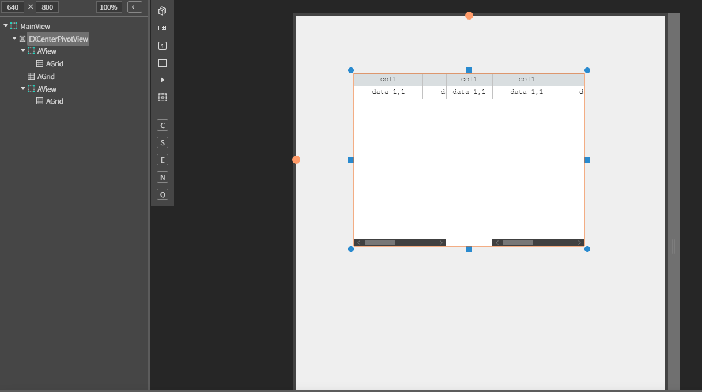
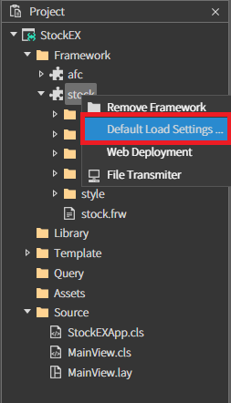
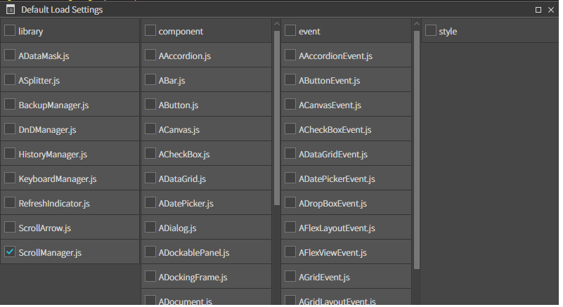
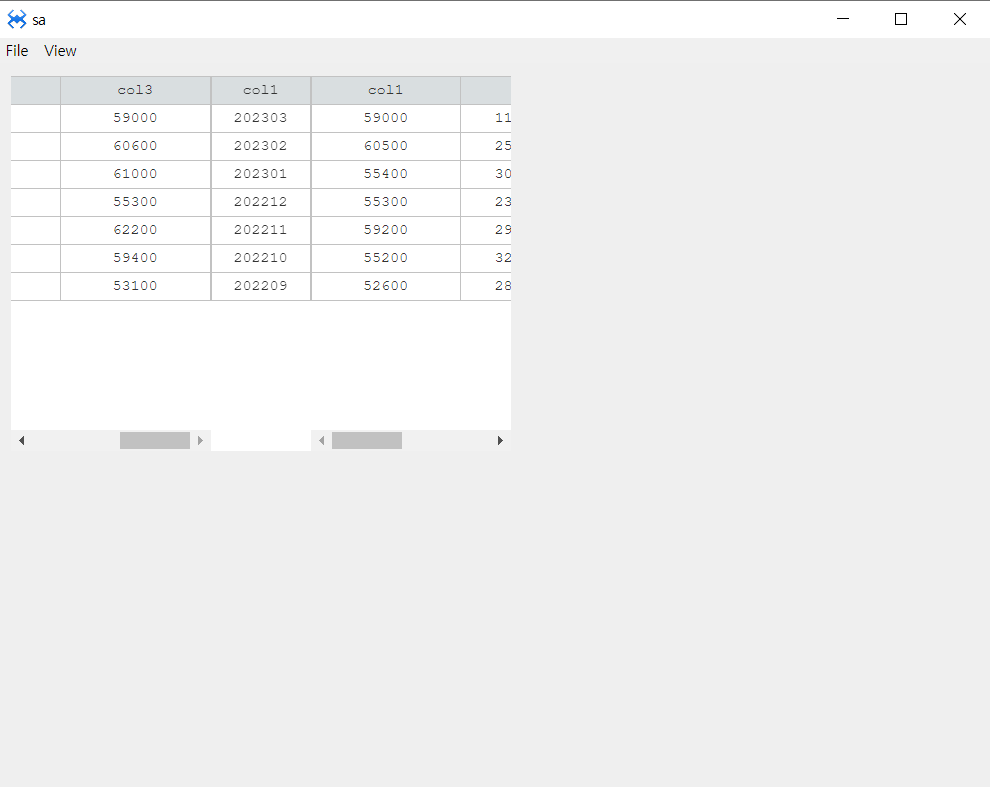

# EXCenterPivotView
EXCenterPivotView 컴포넌트


## a. EXCenterPivotView Appearance


## b.EXCenterPivotView Example


### 1. MainView의 레이아웃에 EXCenterPivotView 컴포넌트를 추가합니다.<br>

 아래 내용을 참고하여 컴포넌트를 배치합니다. 

<br>

|component|id|text|Placeholder|
|---------|--|----|-----------|
|EXCenterPivotView|EXCenterPivotView||
|AView||||
|AGrid|leftGrid  ||좌측 그리드
|AGrid|pivotGrid  ||중간 그리드
|AView||||
|AGrid|rightGrid ||우측 그리드

 
### 2. 모듈 추가

Project > Framework >stock (우클릭) > Default Load Settings... 을 클릭합니다.




library 에서 ScrollManager.js 에 체크한 뒤 x 버튼을 클릭해서 저장해줍니다.



### 2. 컴포넌트 데이터 세팅

사용할 데이터 배열입니다.

```js
function MainView*init(context, evtListener)
{
	super.init(context, evtListener);
	 	 var ValueArr = [
			["202303",	"60600",	"61500",	"59000",	"59000",	"114236866",	"688823"],
			["202302",	"61000",	"63800",	"60600",	"60500",	"259275907",	"1617970"],
			["202301",	"55300",	"64600",	"61000",	"55400",	"304721328",	"1848161"],
			["202212",	"62200",	"62600",	"55300",	"55300",	"234543029",	"1389690"],
			["202211",	"59400",	"62900",	"62200",	"59200",	"290682036",	"1774165"],
			["202210",	"53100",	"59500",	"59400",	"55200",	"326537635",	"1856033"],
			["202209",	"59700",	"58400",	"53100",	"52600",	"288615372",	"1602331"]
	];

	
	for(var i=0; i< ValueArr.length ; i++)
	{
		this.EXCenterPivotView.addRow( [ ValueArr[i][1], ValueArr[i][2], ValueArr[i][3] ] , [ValueArr[i][0]], [ ValueArr[i][4], ValueArr[i][5], ValueArr[i][6] ]);
	}
};


```

 
### 3. F5를 누르거나 Build > Run Project 를 클릭하여 프로젝트를 Run 합니다.

<br>

 