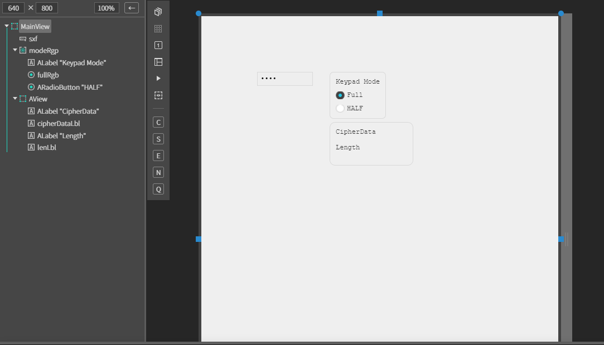
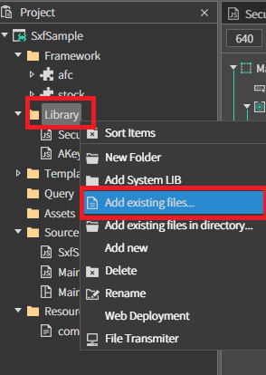
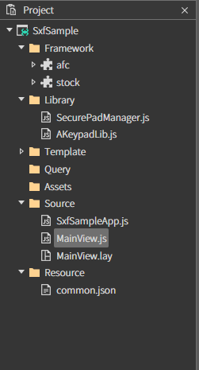
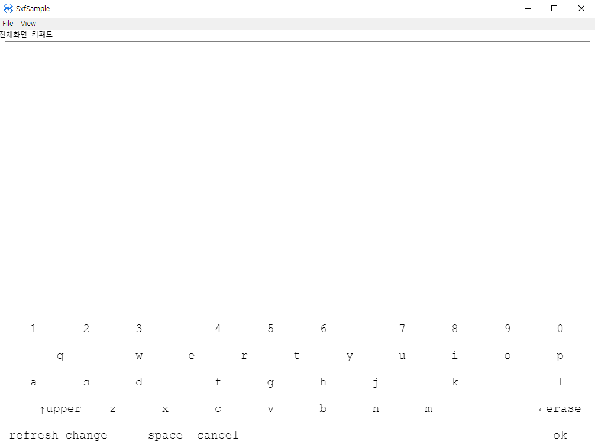

# EXSecureTextField

보안키패드를 띄워주는 텍스트필드 상속 컴포넌트<br>
SecurePadManager 또는 SecureWebPadManager 의 함수를 이용하여 호출한다.

## a. EXSecureTextField Appearance

### Data
**Text** : 텍스트를 설정하는 속성입니다. <br>
**Placeholder :** 플레이스홀더 값을 설정하는 속성입니다.<br>

 **Align  :** 텍스트의 정렬을 설정하는 속성입니다.<br>
* **Left  :** 텍스트 좌측 정렬 <br>
* **center :**  텍스트 중앙 정렬 <br>
* **right  :** 텍스트 우측 정렬 <br>

**Pad Title :**<br>
**Data Type :** 데이터 타입 설정<br>
**Return Type :** 리턴 타입 설정<br>
* **Hash  :** 해쉬 타입 <br>
* **Plain :**  텍스트 중앙 정렬 <br>

**Min Length :** 입력 가능한 텍스트의 최소 길이를 설정하는 속성입니다.<br>
**Max Length :** 입력 가능한 텍스트의 최대 길이를 설정하는 속성입니다.<br>

## b.EXSecureTextField Example

### 1. MainView.lay의 레이아웃에 컴포넌트를 추가합니다.<br>

 * 다음 내용을 참고해서 컴포넌트를 배치합니다.
 
<br>

|component|id|text|event|Attribute|
|---------|--|----|-----|---|
|EXSecureTextField|sxf||onSxfChange|
|ARadioGroup|modeRgp||onModeRgpChange|DefaultID : fullRgb
|ALabel||Keypad Mode|
|ARadioButton|fullRgb|Full|
|ARadioButton||HALF|
|AView||||
|ALabel||CipherData
|ALabel|cipherDataLbl
|ALabel||Length
|ALabel|lenLbl

### 2. 모듈 추가

외부 업체에서 제공하는 보안키패드 모듈울 적용시켜야합니다.<br>
업체마다 제공하는 함수가 다르기 때문에 실제론 업체의 가이드문서를 가지고 적용합니다. 

* 샘플에서 제공하는 보안 키패드 라이브러리는 보안 기능이 없는 예제를 위한 모듈입니다.

외부 보안키패드 모듈을 라이브러리에 추가하고 SecurePadManager.js 파일을 생성하여 추가합니다.<br>

* **추가 방법**

<br>

윈도우 파일 탐색기에서 프로젝트 폴더를 열고 Library 폴더에 사용할  외부 보안키패드 모듈 파일을 넣습니다<br>

스파이더젠 프로젝트 트리에서 Library 폴더 위에서 컨텍스트 메뉴를 오픈합니다.(마우스 우측 버튼을 클릭)<br>

 컨텍스트 메뉴에서 Add existing files... 메뉴를 클릭합니다. 

   *  해당 메뉴는 선택된 파일을 프로젝트로 로드합니다.


<br>

위에서 생성했던 SecurePadManager.js 파일 소스를 수정합니다.

```js
var SecurePadManager = {
	isEnable: true,
	openPad: function(padOption, callback, sxf) {
	
		sxf.reset();
		sxf.setCipherData(null);
		this.keypadLib = new AKeypadLib();
		this.keypadLib.setOption(padOption);
		this.callback = callback;
		this.keypadLib.startKeypad(sxf, function(data, len) {
			callback(!!data, data, len);
		});
	},
	closePad: function() {
		if(this.keypadLib) this.keypadLib.stopKeypad();
	}
}

```
### 4. 이벤트 설정

ExSecureTextField 에 change 이벤트 설정을 합니다.

```js
function MainView*onSxfChange(comp, info, e)
	{
		this.cipherDataLbl.setText(comp.getCipherData() + '/' + comp.getText().length);
	}

```
ALabel ID : ModeRgp 에 Change 이벤트 설정을 합니다.

```js
// 보안 키패드 전체화면 모드/ 하프모드 설정 함수

function MainView*onModeRgpChange(comp, info, e)
	{
		this.sxf.padOption.fullMode = comp.getSelectBtn().getValue() == 'full';
	}
```


### 3. F5를 누르거나 Build > Run Project 를 클릭하여 프로젝트를 Run 합니다.

EXSecureTextField 컴포넌트를 클릭하면 전체화면 모드인 보안키패드가 오픈됩니다. 

<br>
