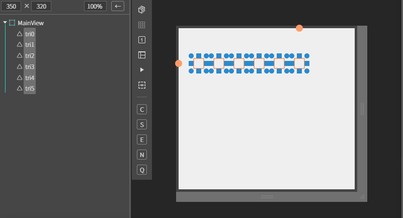

# EXTriangle

상한, 상승, 보합, 하한, 하락 대비 부호를 표현하는 컴포넌트

## a. EXTriangle Appearance

### Data

**Use StockColor** 대비부호 색상 <br>
**Up Color** : 상한, 상승 색상 설정<br>
**Down Color**  하한, 하락 색상 설정<br>

**Direction:** 방향 속성 <br>
**Clear - 0 :** 보합 표현<br>
**High Up -1 :** 상한 표현<br>
**Up -2 :** 상승 표현<br>
**Steady -3 :** 보합 표현<br>
**High Down -4 :** 하한 표현<br>
**Down -5 :** 하락 표현<br>

## b. EXTriangle Example

### 1. MainView의 레이아웃에 EXBong 컴포넌트를 추가합니다.<br>

<br>

### 2. 컴포넌트 데이터 세팅

```js
function MainView*onInitDone()
{
	super.onInitDone();
	
 // setData(0:보합, 1:상한, 2:상승, 3:보합, 4:하한, 5:하락)
	this.tri0.setData(0);
	this.tri1.setData(1);
	this.tri2.setData(2);
	this.tri3.setData(3);
	this.tri4.setData(4);
	this.tri5.setData(5);
};
```
각 대비부호를 표현하기 위해 0~5까지의 파라미터를 setData 함수를 통해 설정합니다. 

### 3. F5를 누르거나 Build > Run Project 를 클릭하여 프로젝트를 Run 합니다.

<br>

각 파라미터 값에 따라 대비부호가 달라지는 것을 볼 수 있습니다.