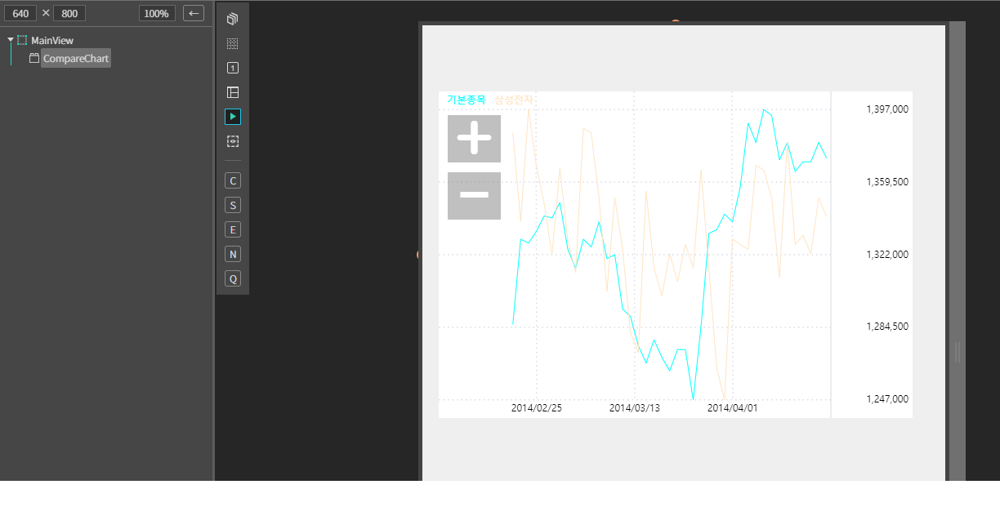
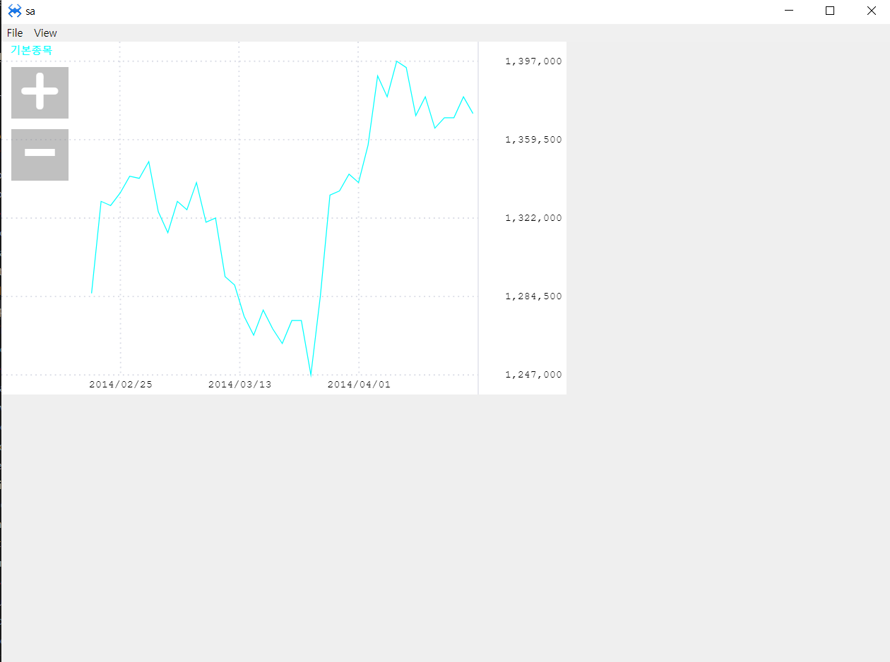

# CompareChart


CompareChart 차트 컴포넌트

## a. CompareChart Appearance


### Color
**Text** : 텍스트 색상 설정<br>
**Up** :  상승 색상 설정<br>
**Divide Line** : 그래프와 설명 구분선 색상 설정<br>
**Down** : 하락 색상 설정<br>
**Dot** :  눈금선 색상 설정<br>

 


## b. CompareChart Example


### 1. MainView의 레이아웃에 CompareChart 컴포넌트를 추가합니다.<br>

<br>

컴포넌트 ID : CompareChart

### 2. 컴포넌트 데이터 세팅

```js
function MainView*onInitDone()
{
	super.onInitDone();
    
    //Date 일자, Start Price 시가, High Price 고가,Low Price 저가,End Price 종가,Trade Qty 거래량,Trade Price 거래대금
	var ValueArr = [
		[20140417,1376000,1380000,1368000,1372000,54664,1371400,1347700,1315333.3333333333,177027.6,244619.15,221857.01666666666],
		[20140416,1370000,1392000,1363000,1380000,186171,1373000,1342200,1314533.3333333333,206091.6,247825.35,223466.71666666667],
		[20140415,1386000,1387000,1369000,1370000,219396,1371200,1336650,1313466.6666666667,233103.8,246155.35,223258.13333333333],
		[20140414,1365000,1386000,1365000,1370000,211720,1376000,1332050,1312166.6666666667,231657.4,246231.15,223859.61666666667],
		[20140411,1362000,1368000,1359000,1365000,213187,1381400,1326850,1311016.6666666667,232360.4,244465.15,223581.76666666666],
		[20140410,1369000,1380000,1360000,1380000,199984,1384400,1322350,1309916.6666666667,263324.4,244642.6,223944.46666666667],
		[20140409,1394000,1395000,1364000,1371000,321232,1386400,1317850,1308800,299722.8,246393.6,225516.95],
		[20140408,1387000,1399000,1375000,1394000,212164,1383600,1314000,1307533.3333333333,287876.6,242911.25,225646.2],
		[20140407,1397000,1397000,1374000,1397000,215235,1372600,1310400,1305500,289767.8,241382.85,228173.18333333332],
		[20140404,1377000,1397000,1377000,1380000,368007,1361800,1306550,1303466.6666666667,299760.2,239278.7,231669.58333333334],
		[20140403,1351000,1395000,1351000,1390000,381976,1352800,1304500,1301983.3333333333,268753.6,228427,232361.01666666666],
		[20140402,1350000,1357000,1343000,1357000,262001,1341400,1301300,1300550,275869.8,217944.95,232582.48333333334],
		[20140401,1345000,1345000,1331000,1339000,221620,1327000,1299950,1299716.6666666667,293248.4,212336.4,234794.4],
		[20140331,1345000,1345000,1322000,1343000,265197,1308600,1298750,1299000,303424.4,209155.55,239932.93333333332],
		[20140328,1320000,1338000,1320000,1335000,212974,1294600,1297850,1298433.3333333333,278680.6,207999.85,245854.65],
		[20140327,1290000,1333000,1285000,1333000,417557,1282200,1298550,1299050,269371,211583.5,247941.11666666667],
		[20140326,1269000,1290000,1248000,1285000,348894,1268000,1298950,1300100,209617.2,198597,244485.16666666666],
		[20140325,1269000,1270000,1241000,1247000,272500,1264800,1301800,1302150,170392.6,194070.35,242772.86666666667],
		[20140324,1260000,1274000,1259000,1273000,141478,1271000,1306150,1304950,160075,189230.65,241891.31666666668],
		[20140321,1269000,1273000,1262000,1273000,166426,1269600,1308900,1307616.6666666667,167059.4,189581.8,243079.75],
		[20140320,1270000,1272000,1262000,1262000,118788,1270000,1311750,1310183.3333333333,177121.4,195606.7,243108.45],
		[20140319,1280000,1285000,1268000,1269000,152771,1275600,1312950,1312933.3333333333,200364.6,199210.6,244646.11666666667],
		[20140318,1270000,1283000,1266000,1278000,220912,1280600,1314000,1315133.3333333333,220127.4,197751.8,245733],
		[20140317,1275000,1276000,1258000,1266000,176400,1289400,1314850,1317083.3333333333,212264.2,192616.85,244638.6],
		[20140314,1270000,1285000,1270000,1275000,216736,1300200,1315800,1319316.6666666667,211614.6,193183.5,244683.4],
		[20140313,1294000,1313000,1290000,1290000,235004,1313000,1317100,1321233.3333333333,198462,188567.45,244422.21666666667],
		[20140312,1320000,1320000,1293000,1294000,251585,1320200,1317500,1323233.3333333333,185928.2,182655.7,245492.83333333334],
		[20140311,1320000,1327000,1309000,1322000,181596,1327400,1318150,1325333.3333333333,165577.2,180103.85,244842.8],
		[20140310,1320000,1330000,1317000,1320000,173152,1326000,1317600,1327300,160858.6,183708.05,244401.4],
		[20140307,1339000,1339000,1329000,1339000,150973,1327000,1315450,1329533.3333333333,174644.8,182850.1,243847.83333333334],
		[20140306,1329000,1329000,1310000,1326000,172335,1329000,1312250,1331016.6666666667,201379.6,185245.05,244380.76666666666],
		[20140305,1335000,1341000,1330000,1330000,149830,1332000,1308900,1332916.6666666667,198478,191825.75,245001.73333333334],
		[20140304,1320000,1329000,1315000,1315000,158003,1334400,1304250,1334616.6666666667,220184.2,199260.9,246119.23333333334],
		[20140303,1336000,1340000,1321000,1325000,242083,1338200,1300950,1337050,223724.8,207393.75,246085.38333333333],
		[20140228,1337000,1349000,1332000,1349000,284647,1338800,1298300,1339416.6666666667,205008.4,211548.8,244546.6],
		[20140227,1335000,1342000,1330000,1341000,157827,1335000,1294850,1341833.3333333333,205463.8,216498.3,242053.21666666667],
		[20140226,1337000,1343000,1325000,1342000,258361,1324000,1291950,1344383.3333333333,212071.6,220308.3,242971.06666666668],
		[20140225,1332000,1340000,1326000,1334000,175706,1313600,1289450,1346516.6666666667,185118.4,220736.55,241782.28333333333],
		[20140224,1334000,1345000,1321000,1328000,148501,1305800,1288100,1348933.3333333333,173619.8,225953,241715.93333333332],
		[20140221,1333000,1333000,1300000,1330000,286924,1297200,1286650,1351216.6666666667,181466.2,228864.9,241446.01666666666],
		[20140220,1290000,1296000,1281000,1286000,190866,1291400,1286550,1353216.6666666667,148964.4,225345.2,239522.15]
	];
	this.CompareChart.setData(ValueArr);
};

```
### 3. F5를 누르거나 Build > Run Project 를 클릭하여 프로젝트를 Run 합니다.
<br>

