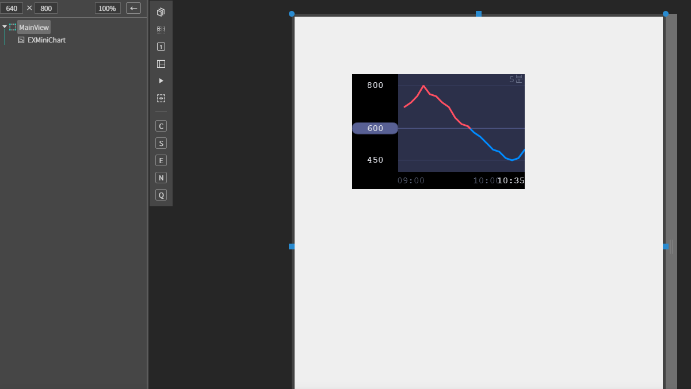
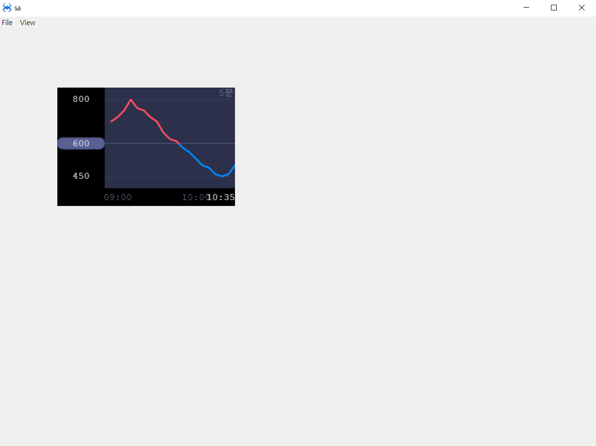

# EXMiniChart


EXMiniChart 차트 컴포넌트

## a. EXMiniChart Appearance

### Color
**Text** : 텍스트 색상 설정<br>
**Up** : 기준값 이상 그래프 색상 설정<br>
**Left Text** : 값  색상 설정<br>
**Down** : 기준값 이하 그래프 색상 설정<br>
**Time Text** : 항목(시간)값 색상 설정<br>
**Cont Back** : 차트영역 색상 설정<br>
**Base Text** : 기준값 색상 설정<br>
**Cont Border** : 차트영역 테두리 색상 설정<br>
**Base Line** : 기준값 라인 색상 설정<br>
**Divide Line** : 그래프와 설명 구분선 색상 설정<br>


## b. EXMiniChart Example


### 1. MainView의 레이아웃에 EXMiniChart 컴포넌트를 추가합니다.<br>

<br>

컴포넌트 ID : EXMiniChart

### 2. 컴포넌트 데이터 세팅

```js
function MainView*onInitDone()
{
	super.onInitDone();
    //시간, 값
	var ValueArr = [
		["1035", 500],
		["1030", 460],
		["1025", 450],
		["1020", 460],
		["1015", 490],
		["1010", 500],
		["1005", 530],
		["1000", 560],
		["0955", 580],
		["0950", 610],
		["0945", 620],
		["0940", 650],
		["0935", 700],
		["0930", 720],
		["0925", 750],
		["0920", 760],
		["0915", 800],
		["0910", 750],
		["0905", 720],
		["0900", 700]
	];
	// 기준값
	var basePrice = 600;
	this.EXMiniChart.setData(ValueArr ,basePrice);
};

```
### 3. F5를 누르거나 Build > Run Project 를 클릭하여 프로젝트를 Run 합니다.
<br>

