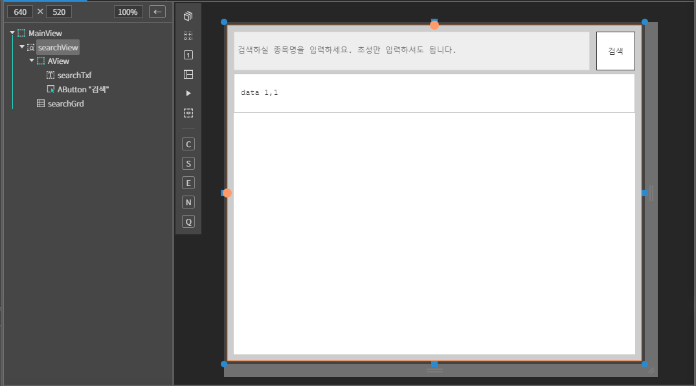
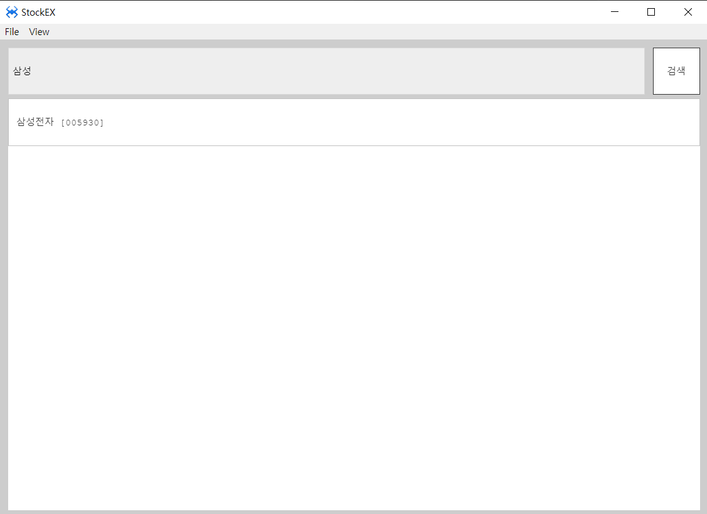

# EXSearchView

검색 뷰 컴포넌트 

## a. EXSearchView Appearance

### Info
Search Key

## b.EXSearchView Example


### 1. MainView의 레이아웃에 EXSearchView 컴포넌트를 추가합니다.<br>

 아래 내용을 참고하여 컴포넌트를 배치합니다. 

<br>


|component|id|text|Placeholder|
|---------|--|----|-----------|
|ExSearchView|searchView||
|AView||||
|ATextField|searchTxf||검색하실 종목명을 입력하세요. 초성만 입력하셔도 됩니다
|AButton||검색|
|AGrid|searchGrd|

### 2. 모듈 추가

Project > Framework >stock (우클릭) > Default Load Settings... 을 클릭합니다.


library 에서 Search.js 에 체크한 뒤 x 버튼을 클릭해서 저장해줍니다.


### 2. 컴포넌트 데이터 세팅

사용할 데이터 배열입니다.

```js
function MainView*init(context, evtListener)
{
	super.init(context, evtListener);
	
	this.mockData = 
	[
		{
			name: "삼성전자",
			code: "005930"
		}, 
		{
			name: "LG",
			code: "003550"
		}, 
		{
			name: "현대자동차",
			code: "005380"
		}, 
		{
			name: "SK",
			code: "034730"
		}, 
		{
			name: "KT",
			code: "030200"
		},
		{
			name: "에코프로",
			code: "086520"
		}
	];	
};
```
SetData 함수를 사용하여 검색할 객체 또는 배열을 지정해 줍니다.

```js
function MainView*onActiveDone(isFirst)
{
	super.onActiveDone(isFirst);

	this.searchView.setData(this.mockData);
};

```

searchBtn 에 click 이벤트를 설정해주고 소스를 수정합니다.
```js
// 검색 버튼 클릭
function MainView*onConfirmClick(comp, info, e)
{
	var thisObj = this;
	var search = this.searchTxf.getText();
	var searchResult = this.searchView.searchData(search);
	
	this.searchGrd.removeAll();
	
	searchResult.map((ele) => {
		thisObj.searchGrd.addRow([ele.name + `  [${ele.code}]`]);
	});
};

```

### 3. F5를 누르거나 Build > Run Project 를 클릭하여 프로젝트를 Run 합니다.

<br>

searchTxf에 검색할 텍스트를 적고 검색 버튼을 눌러 검색이 되는지 확인합니다.