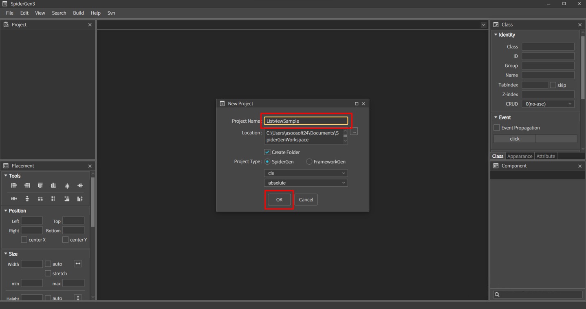
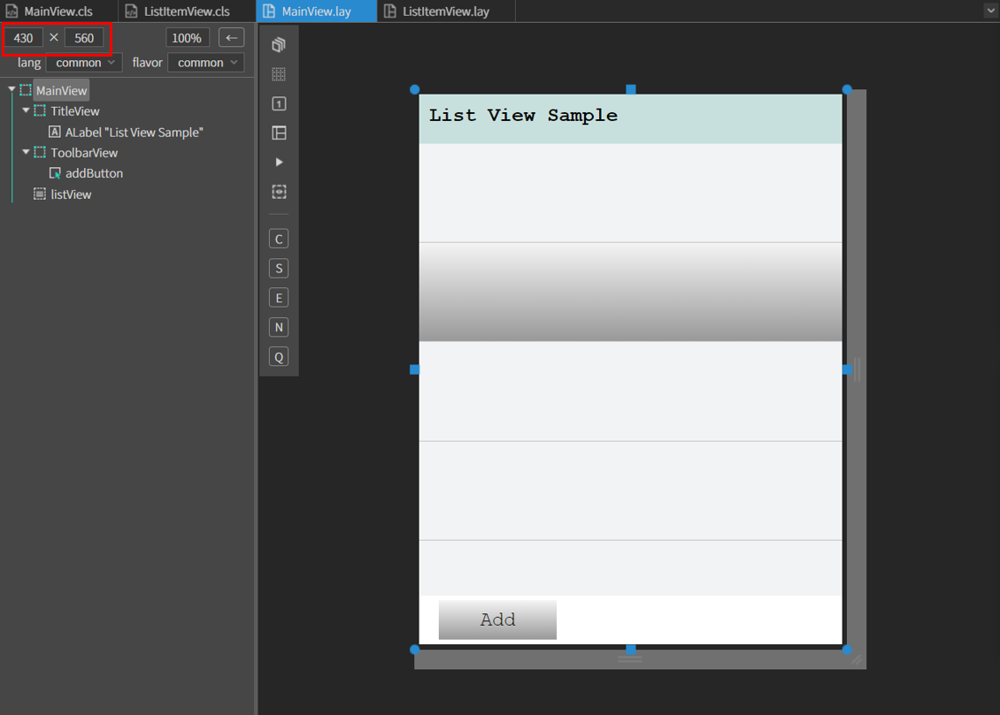
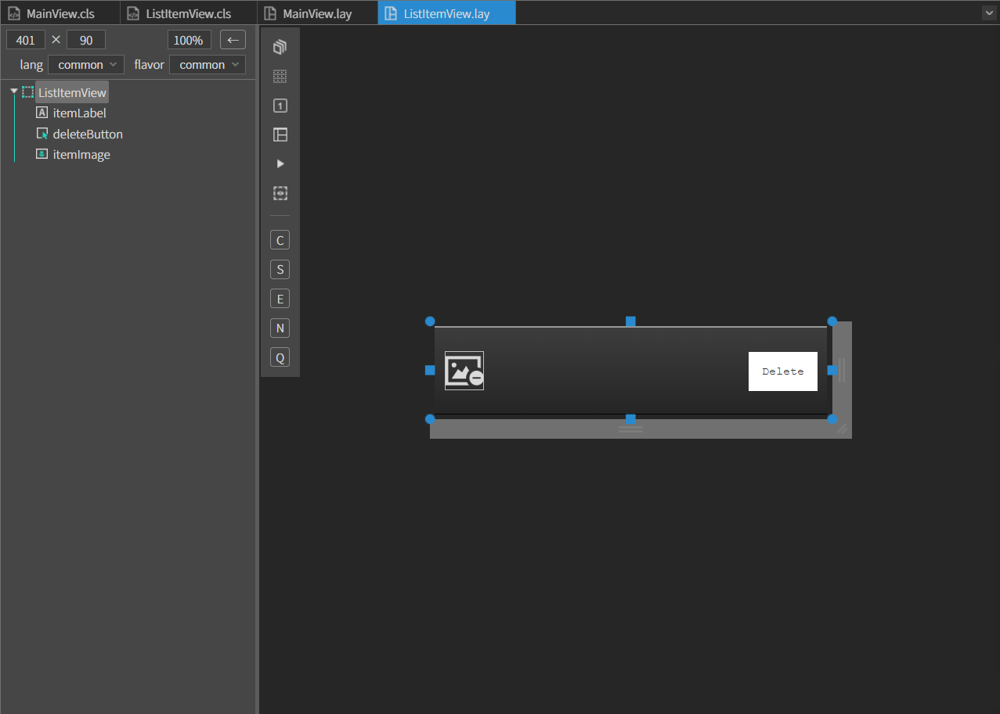
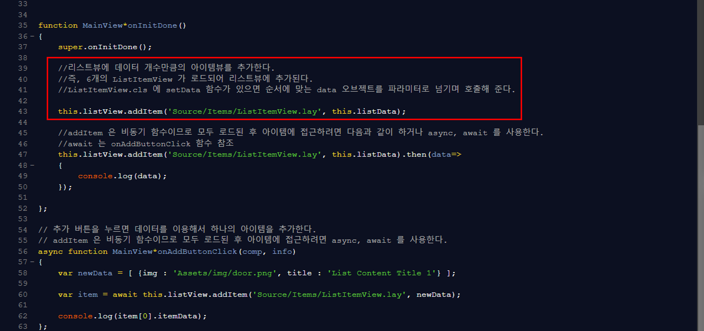
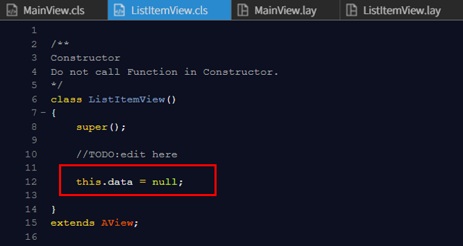
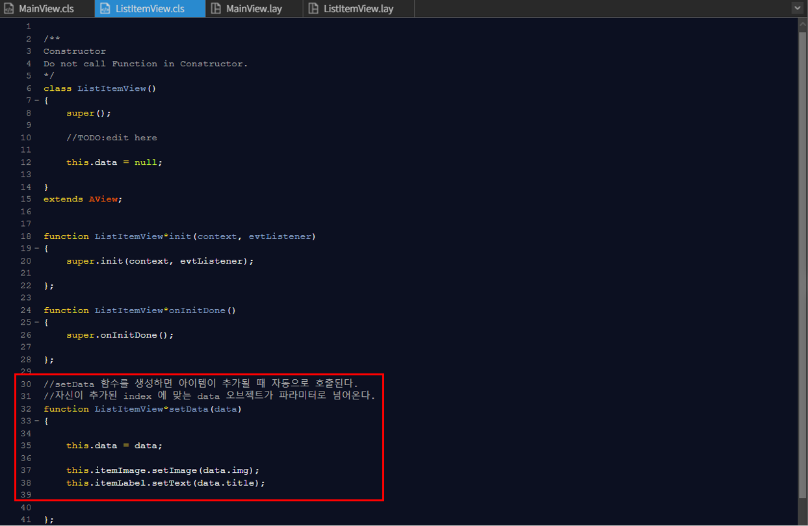
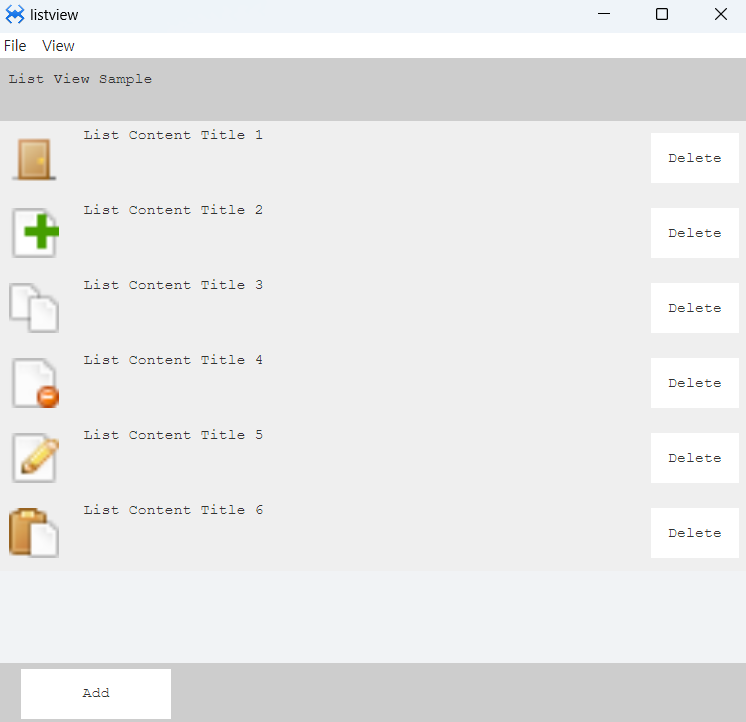
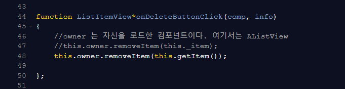
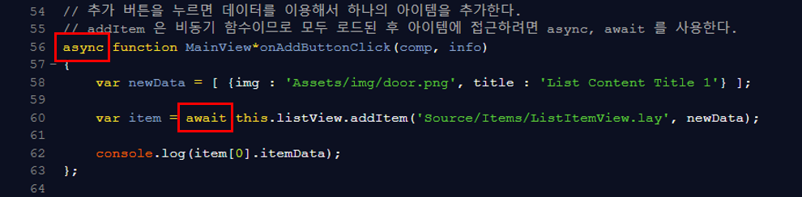
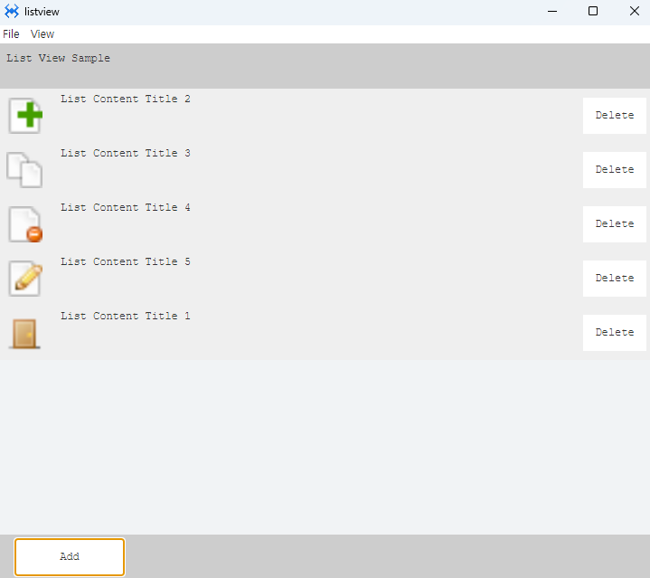

# Listview

리스트뷰 샘플 예제입니다.

<center>



</center>

위 이미지와 같이 프로젝트 이름을 적고 OK 버튼을 누릅니다.

### 1. MainView.lay 를 오픈하고 다음과 같이 컴포넌트를 만들어 줍니다.

|Comp|id|text|position|size|
|----|--|----|---------------|-------------|
|MainView||||
|AView|TitleView||left :0px, top: 0px	|width: 100% height: 50px|
|ALabel||List View Sample|left :10px, top: 10px|width: auto height: auto|
|AView|ToolbarView||left :0px, bottom: 0px|width: 100% height: 50px|
|AButton|addButton|Add|left :20px, top: 5px|width: 120px height: 40px||
|AListView|listView||left :0px, top: 50px|width: 100% height: stretch-50px|

<br>

<center>


</center>

### 2. Source 폴더 안에 Items 폴더를 생성합니다.

* 생성한 Items 폴더 내에 ListItemView 이름의 뷰를 추가하고 
아래 정보를 참고해서 컴포넌트를 배치합니다.

|component|ID|position|size|Text|
|------|---|---|---|---|
|ListItemView|||width:100%, height:100%|
|ALabel|itemLabel|left:70px, center Y |w-stretch:90px, height:50px
|AButton|deleteButton|right:10px,  center Y |width:70px, height:40px|Delete
|Aimage|itemImage|left:10px,  center Y |width:40px, height:40px|

<br>

<center>


</center>

### 3.  프로젝트 폴더에 이미지 파일 넣기

윈도우 파일 탐색기에서 프로젝트 폴더를 열고 Img 폴더를 생성 후 사용할 이미지 파일을 넣습니다<br>

 *  스파이더젠 프로젝트 트리에서 Assets 폴더 위에서 컨텍스트 메뉴를 오픈합니다.(마우스 우측 버튼을 클릭)<br>

 
 
 <br>

 * 컨텍스트 메뉴에서 Add existing files in directory... 메뉴를 클릭합니다. 
   
   :  해당 메뉴는 선택된 폴더내의 모든 파일을 프로젝트로 로드합니다.
   
* 오픈된 폴더 찾기 다이얼로그에서 앞에서 생성한 '프로젝트이름' > Img 폴더를 선택합니다. 그럼 폴더 안에 모든 이미지 파일들이 프로젝트로 로드됩니다.

### 4. 먼저 리스트뷰에 추가할 데이터를 만들고 아이템뷰를 추가합니다.
*  MainView.cls 파일을 오픈하고 다음과 같이 클래스에 리스트뷰에 표시할 데이터를 만들어줍니다.

 <center>


</center>

```javascript
this.listData = 
	[
		{img : 'Assets/img/door.png', title : 'List Content Title 1'},
		{img : 'Assets/img/page_white_add.png', title : 'List Content Title 2'},
		{img : 'Assets/img/page_white_copy.png', title : 'List Content Title 3'},
		{img : 'Assets/img/page_white_delete.png', title : 'List Content Title 4'},
		{img : 'Assets/img/page_white_edit.png', title : 'List Content Title 5'},
		{img : 'Assets/img/page_white_paste.png', title : 'List Content Title 6'}
	];

```

* 들어갈 데이터는 배열 형태로 넣어줄 데이터를 key:value 형식으로 넣어줍니다.

ex) img라는 key에 이미지 경로를 value값에 넣고 title이라는 key에 원하는 제목을 value값에 넣어줍니다.

* 데이터를 생성했으면 이제 아이템뷰를 추가합니다. addItem함수를 사용해 리스트아이템뷰 경로와 데이터 변수를 넣습니다.

<br>

<center>


</center>

```javascript
    this.listView.addItem('Source/Items/ListItemView.lay', this.listData);
```

### 5.리스트 되는 ItemView를 수정해서 이미지와 레이블 내용을 추가하겠습니다.
ListItemView.cls 파일을 오픈하고 클래스에 설정되는 데이터를 저장하기 위한 멤버 변수를 추가합니다.

<br>

<center>


</center>

```javascript
    this.data = null;
```

### 6. 데이터가 바인딩 될때 호출되는 setData 메소드를 추가하고 내용을 다음과 같이 수정합니다.

<br>

<center>


</center>

```javascript
    this.data = data;

	this.itemImage.setImage(data.img);
	this.itemLabel.setText(data.title);
```

#### 여기까지만 진행해도 다음과 같이 리스트뷰에 아이템뷰를 나타낼수 있습니다.

<br>

<center>


</center>


### 7. Delete 버튼 기능 추가 

 ListItemView.cls의 setData 함수 밑에 다음과 같이 DeleteButtonclick 이벤트를 설정하면 Delete 눌러서 아이템뷰를 삭제 할 수 있습니다.

<br>

<center>


</center>

```javascript
    this.owner.removeItem(this.getItem());
```

### 8. Add 버튼 기능 추가 

MainView.cls로 돌아가서 AddButtonClick 이벤트를 다음과 같이 설정한다.

addItem은 비동기 함수이므로 모두 로드된 후 아이템에 접근하려면 async, await을 사용한다.

<br>

<center>


</center>


```javascript
async function MainView*onAddButtonClick(comp, info)
{
	var newData = [ {img : 'Assets/img/door.png', title : 'List Content Title 1'} ];
	
	var item = await this.listView.addItem('Source/Items/ListItemView.lay', newData);
	
	console.log(item[0].itemData);
};
```

### 9. F5를 누르거나 Build > Run Project 를 클릭하여 프로젝트를 Run 합니다.

#### 그럼 다음과 같이 삭제와 추가 기능을 이용 할 수 있는 리스트뷰를 확인 할 수 있습니다.

<br>

<center>


</center>

