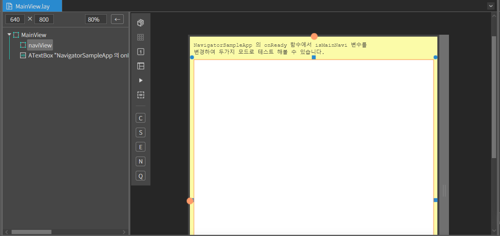
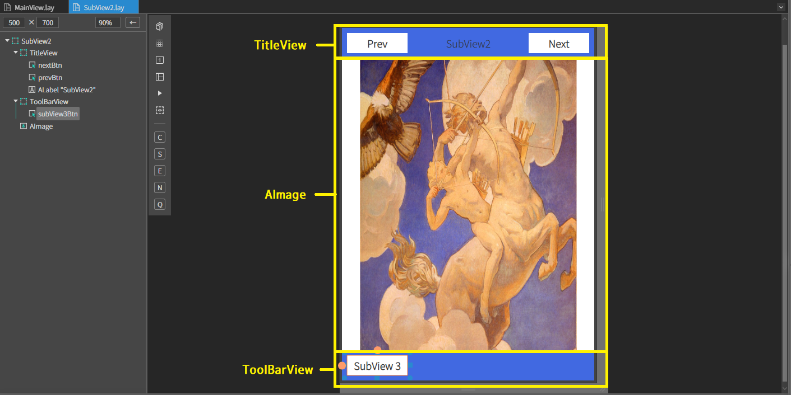
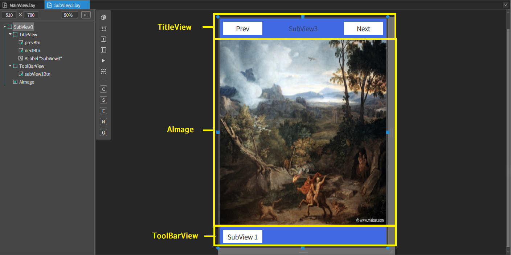
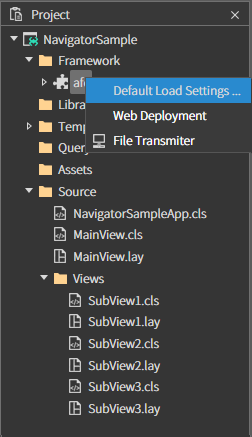
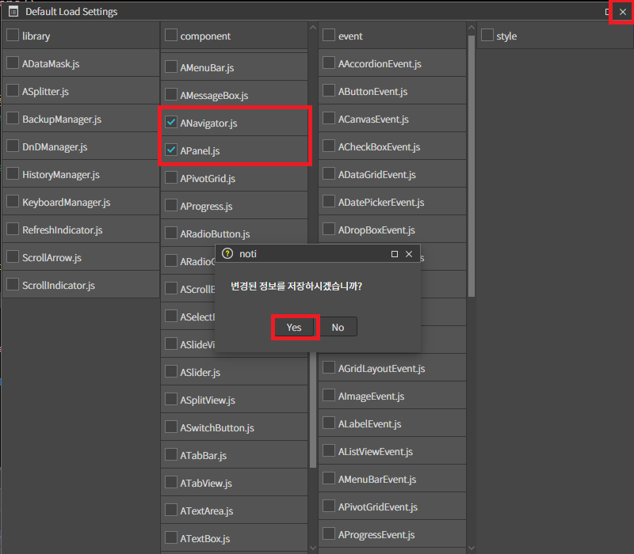
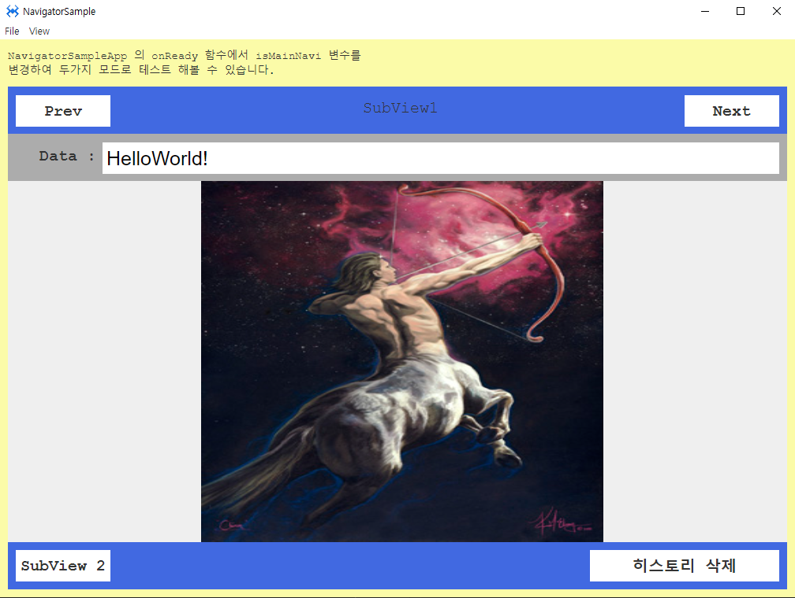
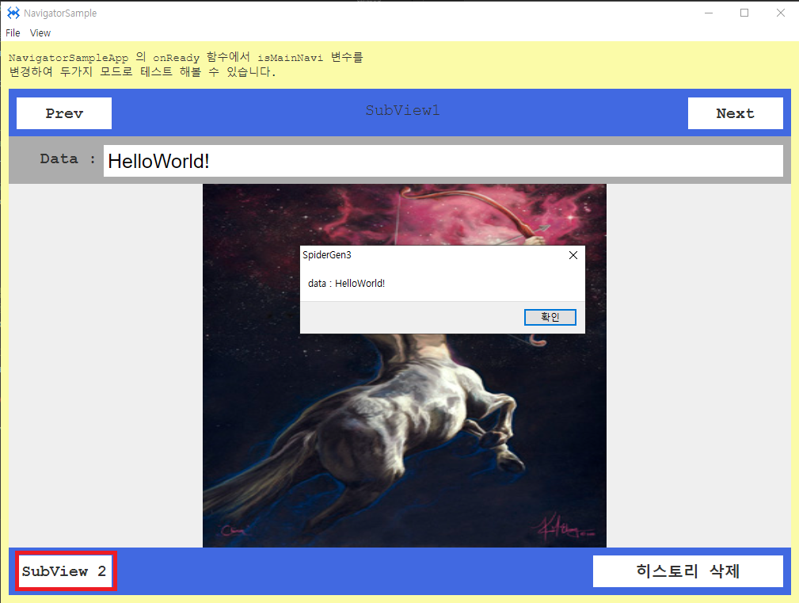

# Navigator 

네비게이터 샘플 예제입니다.

File > New Project 에서 프로젝트를 생성합니다. 

<center>


</center>

위 이미지와 같이 프로젝트 이름을 적고 OK 버튼을 누릅니다.

### 1. MainView.lay 를 오픈합니다.

아래 정보를 참고하여 컴포넌트를 배치합니다.

|Comp|id|text|Background color|size|Position|
|----|--|----|----------------|----|--------|
|MainView|||rgb(251, 251, 168)|width : 100% height :100%|Left : 0px, Top : 0px|
|AView|naviView||rgb(255, 255, 255)|w-stretch : 10px h-stretch : 10px|Left : 10px, Top : 60px|
|ATextBox||NavigatorSampleApp 의 onReady 함수에서 isMainNavi 변수를 변경하여 두가지 모드로 테스트 해볼 수 있습니다.|width : 460px height : 40px|Left : 10px, Top : 10px|


<center>


</center>

### 2. Views 폴더를 생성합니다
Views 폴더 안에 subView1,subView2,subView3 각 세 개의 view를 생성합니다. 

### 3. subView에 컴포넌트를 배치합니다.

아래 정보를 참고하여 각각 view에 컴포넌트를 배치합니다.

 ### [SubView 1]
<center>


</center>

|Comp|id|text|Background color|size|Position|
|----|--|----|---------------|------|-----|
|AView|TitleView||rgb(65, 105, 225)|width :100% height :60px|Left : 0px, Top:0px|
|AButton|prevBtn|Prev||width :120px height :40px|Left : 10px, center Y|
|AButton|nextBtn|Next||width :120px height :40px|Right : 0px,center Y|
|ALabel||SubView1||width :auto height :auto|center X, center Y|
|AView|InfoView|||width :100% height :60px|Left : 0px, Top:60px|
|ALabel||Data :||width :102px height :auto|Left : 10px, Top:16.5px|
|ATextField|TextData|HelloWorld!||width :stretch 10px height :40px|Left : 120px, Top:11px|
|AView|ToolBarView||rgb(65, 105, 225)|width :100% height :60px|Left : 0px, Bottom:0px|
|AButton|subView2Btn|SubView 2||width :120px height :40px|Left :10px, Top:10px|
|AButton|histClearBtn|히스토리 삭제||width :240px height :40px|Right : 10px, Top:10px|
|AImage|Img1|||width :510px height :stretch 60px|center X, Top:120px|

 ### [SubView 2]
<center>


</center>


|Comp|id|text|Background color|size|Position|
|----|--|----|---------------|--------|--------|
|AView|TitleView||rgb(65, 105, 225)|width :100% height :60px|Left : 0px, Top:0px|
|AButton|nextBtn|Next||width :120px height :40px|Right : 10px, Top:10px|
|AButton|prevBtn|Prev||width :120px height :40px|Left : 10px,Top:10px|
|ALabel||SubView2||width :auto height :auto|center X ,Top:15.5px|
|AView|ToolBarView||rgb(65, 105, 225)|width :100% height :60px|Left : 0px, Bottom:0px|
|AButton|subView3Btn|SubView 3||width :120px height :40px|Left : 10px, Top:10px|
|AImage||||width :429px height :stretch 60px|center X, Top:60px|


### [SubView 3]

<center>


</center>


|Comp|id|text|Background color|size|Position|
|----|--|----|---------------|--------|--------|
|AView|TitleView||rgb(65, 105, 225)|width :100% height :60px|Left : 0px, Top:0px|
|AButton|prevBtn|Prev||width :120px height :40px|Left : 10px, Top:10px|
|AButton|nextBtn|Next||width :120px height :40px|Right : 10px,Top:10px|
|ALabel||SubView3||width :auto height :auto|center X ,Top:15.5px|
|AView|ToolBarView||rgb(65, 105, 225)|width :100% height :60px|Left : 0px, Bottom:0px|
|AButton|subView1Btn|SubView 1||width :120px height :40px|Left : 10px, Top:10px|
|AImage||||width :100% height :stretch 60px|Left : 0px, Top:60px|

### 4. ANavigator.js,APanel.js import하기

네비게이터를 사용하려면 ANavigator,APanel 이 필요합니다.

<center>


</center>

project > Framework >afc (우클릭) > Default Load Settings... 클릭
<center>


</center>
 ANavigator.js 와 APanel.js 를 찾아 체크해 준 뒤 우측 상단에 x 버튼을 누르면 '변경된 정보를 저장하시겠습니까'라는 다이얼로그 창에 Yes버튼을 눌러줍니다.

  * code 란에서 아래와 같이 코드를 입력하여 import 하는 방법도 있습니다

  ```
  import "Framework/afc/component/APanel.js" 
  ```

### 5.네비게이터 셋팅하기

source > NavigatorSampleApp.cls 파일을 오픈합니다.

아래와 같이 소스를 수정해줍니다.

```js
function NavigatorSampleApp*onReady()
{
	super.onReady();
	
	//다음과 같이 두가지 방법으로 사용할 수 있다.
	//isMainNavi 값을 true, false 로 변경하여 다음 두가지 경우를 테스트 해 볼 수 있다.
	var isMainNavi = false;

	// 응용프로그램 전체를 네비게이터 방식으로 동작하게 하는 경우
	if(isMainNavi)
	{
		var navigator = new ANavigator('testNavi');
		navigator.registerPage('Source/Views/SubView1.lay', 'SubView1');
		navigator.registerPage('Source/Views/SubView2.lay', 'SubView2');
		navigator.registerPage('Source/Views/SubView3.lay', 'SubView3');
		
		navigator.goPage('SubView1');
	}

	//or
	
	//기본 메인 컨테이너 셋팅 후, 
	//화면의 특정 영역에서 네비게이터를 사용하는 경우, Source/MainView.cls 소스 참조
	else
	{
		this.setMainContainer(new APage('main'));

		this.getMainContainer().open('Source/MainView.lay');
	}
};

```

Source > MainView.cls 파일을 오픈하여 아래와 같이 소스를 수정합니다.

```js

function MainView*onInitDone()
{
	super.onInitDone();

	//TODO:edit here
	
	//url 대신 null 을 셋팅하면 빈 컨테이너가 뷰내부에 생성된다. 컨테이너 아이디는 생략 가능
	//loadContainer 는 비동기 함수이므로 then 을 사용하거나 async, await 를 사용해야 한다.
	this.naviView.loadContainer( null, 'viewCntr').then(cntr=>
	{
		//두번째 파라미터에 컨테이너를 셋팅하면 지정한 컨테이너의 내부에서 네비게이터가 작동된다.
		var navi = new ANavigator('testNavi', cntr);

		navi.registerPage('Source/Views/SubView1.lay', 'SubView1');
		navi.registerPage('Source/Views/SubView2.lay', 'SubView2');
		navi.registerPage('Source/Views/SubView3.lay', 'SubView3');

		navi.goPage('SubView1');
	});

};

```


### 6. SubView1 에 click Event 설정하기
Source > Views > SubView1 에서 각 버튼에 이벤트 설정을 해주어야합니다
 * Subview1.lay > Class에서 click 이벤트 설정을 해주거나 SubView1.cls에서 직접 코드를 작성하여 click 이벤트를 설정해줍니다.

 ```js
 //Prev 버튼을 클릭을 했을 경우..(Button id :prevBtn)

function SubView1*onPrevBtnClick(comp, info, e)
{
	//컨테이너에 있는 네비게이터를 이용하는 방법
	var navi = this.getContainer().navigator;
	
	//이전페이지로 이동가능한지 체크, 비교하지 않아도 없는 경우는 이동하지 않는다.
	if(navi.canGoPrev()) navi.goPrevPage();
	
	else alert("이전 페이지 히스토리가 없습니다.");

};

 ```

  ```js
 //Next 버튼을 클릭을 했을 경우..(Button id :nextBtn)

function SubView1*onNextBtnClick(comp, info, e)
{
	//이름으로 네비게이터 를 찾는 방법
	var navi = ANavigator.find('testNavi');
	
	//다음페이지로 이동가능한지 체크, 비교하지 않아도 없는 경우는 이동하지 않는다.
	if(navi.canGoNext()) navi.goNextPage();
	
	else alert("다음 페이지 히스토리 정보가 없습니다.");

};

 ```
 ```js
 //서브뷰2 페이지로 이동 (Button Id : subView2Btn)
function SubView1*onSubView2BtnClick(comp, info, e)
{
    this.getContainer().navigator.goPage('SubView3');
};
```

```js
//페이지 히스토리 삭제 (Button Id : histClearBtn)
function SubView1*onHistClearBtnClick(comp, info, e)
{

    this.getContainer().navigator.clearHistory();
        
        alert("페이지 히스토리 삭제되었습니다.");

};

```


### 7. SubView2 에 click Event 설정하기

아래 코드를 참고하여 소스를 수정합니다.


```js
//prev 버튼을 클릭을 했을 경우..(Button id :pervBtn)
function SubView2*onPrevBtnClick(comp, info, e)
{
	//컨테이너에 있는 네비게이터를 찾아서 
	var navi = this.getContainer().navigator;
	
	if(navi.canGoPrev()) navi.goPrevPage();
	else alert("이전 페이지 히스토리 정보가 없습니다.");

};
```

```js
//Next 버튼을 클릭을 했을 경우..(Button id :nextBtn)
function SubView2*onNextBtnClick(comp, info, e)
{
	//이름으로 네비게이터 를 찾는 방법
	var navi = ANavigator.find('testNavi');
	
	if(navi.canGoNext()) navi.goNextPage();
	else alert("다음 페이지 히스토리 정보가 없습니다.");
};
```

```js
 //서브뷰3 페이지로 이동 (Button Id : subView3Btn)
function SubView2*onSubView3BtnClick(comp, info, e)
{
	this.getContainer().navigator.goPage('SubView3');

};
```


### 8. SubView3 에 click Event 설정하기


```js
//prev 버튼을 클릭을 했을 경우..(Button id :prevBtn)
function SubView3*onPrevBtnClick(comp, info, e)
{
	var navi = this.getContainer().navigator;
	
	if(navi.canGoPrev()) navi.goPrevPage();
	else alert("이전 페이지 히스토리 정보가 없습니다.");

};
```

```js
//Next 버튼을 클릭을 했을 경우..(Button id :nextBtn)
function SubView3*onNextBtnClick(comp, info, e)
{
	//이름으로 네비게이터 를 찾는 방법
	var navi = ANavigator.find('testNavi');
	
	if(navi.canGoNext()) navi.goNextPage();
	else alert("다음 페이지 히스토리 정보가 없습니다.");

};
```
```js
 //서브뷰1 페이지로 이동 (Button Id : subView1Btn)
function SubView3*onSubView1BtnClick(comp, info, e)
{

	this.getContainer().navigator.goPage('SubView1');

};


```


### 9. 페이지 이동하며 데이터 주고 받기

SubView1 에서 TextField(id :TextData) 에 적힌 값을 SubView2로 보내는 방법입니다.

SubView1.cls에서 설정한 이벤트의 "onSubView2BtnClick" 코드를 수정합니다.


 ```js
 //서브뷰2 페이지로 이동 (Button Id : subView2Btn)
function SubView1*onSubView2BtnClick(comp, info, e)
{
	// 입력된 값을 SubView2 로 넘기면서 페이지 이동하는 방법
	var data = 
	{
		textData: this.TextData.getText()
	};
	
	//마지막으로 이동한 네비게이터를 이용하는 방법
	//var navi = ANavigator.getLastNavigator();
	var navi = this.getContainer().navigator;
	
	//이동하려는 페이지에 데이터를 전달하는 방법
	navi.goPage('SubView2', data);
};
```
SubView2.cls에서 다음 코드를 넣어줍니다.

```js
//활성화 시점마다 매번 호출되는 함수
//최초로 호출되는 경우 isFirst 가 true
function SubView2*onActiveDone(isFirst)
{
	// 페이지데이터를 저장한다.
	var data = this.getContainer().getData();
	
	if(data)
	{
		alert('data : ' + data.textData);
	}
};


```
### 10. F5를 누르거나 Build > Run Project 를 클릭하여 프로젝트를 Run 합니다.

<center>


</center>

하단에 SubView를 눌러 페이지 이동을 합니다.

<center>


</center>

SubView1 textField에 적힌 데이터가 SubView2로 이동될 때 데이터가 전달 되는 것을 알 수 있습니다.

이 외에도 prev Next 등 버튼을 눌러 각 이벤트에 맞게 페이지 이동이 되는 것을 확인합니다.