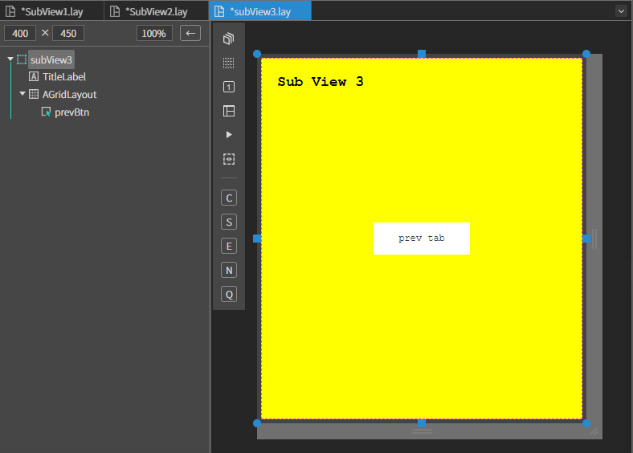

# TabView

TabView 샘플 예제입니다.

File > New Project 에서 프로젝트를 생성합니다. 

<center>


</center>

위 이미지와 같이 프로젝트 이름을 적고 OK 버튼을 누릅니다.

### 1. MainView.lay 를 오픈합니다.


|Comp|id|text|size|Position|
|----|--|----|------|-----|
|AView|||width :100% height :50px|Left : 0px, Top:0px|
|ALabel|titleLabel|TabView Sample|width :auto height :auto|center X, Top:0px|
|ATabView|tabView||width :100% height : stretch 60px|Left : 0px, Top:50px|
|AView|||width :100% height :60px|Left : 0px,Bottom:0px|
|AButton|ButtonTabShow|Show Tab|width :120px height :40px|Left : 10px, Top:10px|
|AButton|ButtonTabHide|Hide Tab|width :120px height :40px|Left : 150px, Top:10px|


<center>


</center>

### 2. View 폴더를 생성합니다
폴더 안에 subView 1,subView 2,subView 3 각 세 개의 view를 생성합니다. 

### 3. subView에 컴포넌트를 배치합니다.

아래 정보를 참고하여 컴포넌트를 배치합니다.

 ### [SubView 1]
 <center>


</center>


|Comp|id|text|size|Position|BackgroundColor|
|----|--|----|----|--------|---------------|
|MainView|SubView1||width :100% height :100%|Left : 0px, Top:0px|rgb(0, 255, 0)
|ALabel|TitleLabel|Sub View 1|width :auto height :auto|Left : 20px, Top : 20px|
|AButton|selectBtn|Select Tab2|width :120px height : 40px|center X, center Y|

 
 ### [SubView 2]
 <center>


</center>


|Comp|id|text|size|Position|BackgroundColor|
|----|--|----|----|--------|---------------|
|MainView|SubView2||width :100% height :100%|Left : 0px, Top:0px|rgb(0, 0, 255)
|ALabel|TitleLabel|Sub View 2|width :auto height :auto|Left : 20px, Top : 20px|
|AButton|selectBtn|Select Tab3|width :120px height : 40px|center X, center Y|

 
 ### [SubView 3]
 <center>



</center>

|Comp|id|text|size|Position|BackgroundColor|
|----|--|----|----|--------|---------------|
|MainView|SubView3||width :100% height :100%|Left : 0px, Top:0px|rgb(255, 255, 0)
|ALabel|TitleLabel|Sub View 3|width :auto height :auto|Left : 20px, Top : 20px|
|AButton|prevBtn|prev tab|width :120px height : 40px|center X, center Y|

### 4. TabView에 탭 추가하기

TabView에 탭을 추가하는 방법은 두 가지가 있습니다

#### [1번 방법]

직접 코드를 작성하여 추가하는 방법입니다.

 'addTab' 함수를 통해 탭을 추가합니다

```js

//init이 된 후 불려지는 함수
function MainView*onInitDone()
{
	super.onInitDone();
	
	//탭 정보를 추가한다. 
	//정보만 추가하고 실제로 화면이 로드되지는 않는다.
	//화면은 탭이 선택되는 시점에 로드된다.
	this.tabView.addTab('탭1', 'Source/Views/SubView1.lay', 'tab1');
	this.tabView.addTab('탭2', 'Source/Views/SubView2.lay', 'tab2');
	this.tabView.addTab('탭3', 'Source/Views/SubView3.lay', 'tab3');

	
};

```

기본적으로 첫번째 탭이 선택되도록 'SelectTabById'함수를 사용하여 추가로 코드를 작성합니다.

```js

//init이 된 후 불려지는 함수
function MainView*onInitDone()
{
	super.onInitDone();
	
	//탭 정보를 추가한다. 
	//정보만 추가하고 실제로 화면이 로드되지는 않는다.
	//화면은 탭이 선택되는 시점에 로드된다.
	this.tabView.addTab('탭1', 'Source/Views/SubView1.lay', 'tab1');
	this.tabView.addTab('탭2', 'Source/Views/SubView2.lay', 'tab2');
	this.tabView.addTab('탭3', 'Source/Views/SubView3.lay', 'tab3');
	
	
	//기본적으로 첫번째 탭이 선택되도록
	//탭 아이디로 선택
	//selectTab 은 비동기 함수이므로 함수 호출 후, 탭의 컨텐츠 로드가 완료된 후의 작업이 필요하면 
	//then 이나 async, await 를 사용해야 한다.
	this.tabView.selectTabById('tab1').then(data=>
	{
		var selView = this.tabView.getSelectedView();
		console.log(selView.TitleLabel.getText());
	});	
	
	//로드되어지는 각 뷰에서 처리할 경우 단순히 호출해도 됨.
	//this.tabView.selectTabByIndex(0);	//인덱스로 선택
	
};
```
#### [2번 방법]

MainView.lay > tabView클릭 > Attribute > Items > add 버튼을 누릅니다
 <center>


</center>

아래와 같이 추가할 탭의 정보를 적고 OK 버튼을 누릅니다.

 <center>


</center>

ID : 고유 아이디<br>
Name : 버튼 타이틀<br>
URL : 탭 버튼 클릭시 보여줄 컨텐츠의 url<br>

MainView.cls 에서 기본적으로 보여질 첫번째 탭을 코드를 통해 설정합니다.

```js
function MainView*onInitDone()
{
	super.onInitDone();
	
    this.tabView.selectTabById('tab1').then(data=>
        {
            var selView = this.tabView.getSelectedView();
            console.log(selView.TitleLabel.getText());
        });	
}
```
### 5. TabView Attribute 설정하기

 <center>


</center>

탭의 히스토리 기능을 이용하기 위해선 Select history에 체크를 해야합니다.

Height 값도 40px로 맞춰줍니다.

### 6. MainView.cls 소스 수정하기

#### [Event 설정]

Source > MainView 에서 각 버튼에 이벤트 설정을 해주어야합니다
 * MainView.lay > Class에서 click 이벤트 설정을 해주거나 MainView.cls에서 직접 코드를 작성하여 click 이벤트를 설정해줍니다.

```js
 //Show Tab 버튼을 클릭을 했을 경우..(Button id :ButtonTabShow)
function MainView*onButtonTabShowClick(comp, info)
{	
	// 탭 영역을 보여준다.
	this.tabView.showTabArea();
};
```

```js
 //Hide Tab 버튼을 클릭을 했을 경우..(Button id :ButtonTabHide)
function MainView*onButtonTabHideClick(comp, info)
{
	// 탭 영역을 숨긴다.
	this.tabView.hideTabArea();
};
```

#### [라벨 변경]

탭에 따라 라벨을 변경하는 소스입니다.

직접 코드를 작성하여 추가해줍니다

```js
// 라벨을 변경한다.
function MainView*setTitle(title)
{
	this.titleLabel.setText(title);
};
```

### 7. SubView1.cls 소스 수정하기

Source > Views > Subview1.cls 파일을 오픈합니다.

#### [라벨 변경]

MainView에 setTitle 함수에 접근하기 위한 코드입니다.

```js
function SubView1*onActiveDone(isFirst)
{
	super.onActiveDone(isFirst);

	//아래와 같이 변수 뒤에 데이터 형을 지정하면
	//형을 알 수 없는 객체도 자동완성 기능을 이용할 수 있다.
	var mainView:MainView = this.getContainer().getView();	//MainView 객체는 컨테이너의 기본뷰이므로 이와 같이 얻어올 수 있다.
	mainView.setTitle(this.TitleLabel.getText());
	
	alert('Select Tab2 버튼을 클릭해 보세요.');
};
```

#### [이벤트 설정]

'SelectBtn' 에 Click 이벤트 설정을 합니다.

```js
//tab2 로드하기
function SubView1*onSelectBtnClick(comp, info, e)
{
	//owner 는 자신을 로드한 컴포넌트이다. 여기서는 ATabView 이다.
	this.owner.selectTabById('tab2');

};
```

### 8. SubView2.cls 소스 수정하기

Source > Views > Subview2.cls 파일을 오픈합니다.

#### [라벨 설정]
```js
function SubView2*onActiveDone(isFirst) 
{
	super.onActiveDone(isFirst);

	var mainView:MainView = this.getContainer().getView();	//MainView 객체는 컨테이너의 기본뷰이므로 이와 같이 얻어올 수 있다.
	
	mainView.setTitle(this.TitleLabel.getText());
};
```
#### [이벤트 설정]
```js
//tab3 로드하기
function SubView2*onSelectBtnClick(comp, info, e)
{
	//owner 는 자신을 로드한 컴포넌트이다. 여기서는 ATabView 이다.
	this.owner.selectTabById('tab3');

};
```

### 9. SubView3.cls 소스 수정하기

Source > Views > Subview3.cls 파일을 오픈합니다.
#### [라벨 설정]
```js
function SubView3*onActiveDone(isFirst) 
{
	super.onActiveDone(isFirst);

	var mainView:MainView = this.getContainer().getView();	//MainView 객체는 컨테이너의 기본뷰이므로 이와 같이 얻어올 수 있다.
	
	mainView.setTitle(this.TitleLabel.getText());
};
```

#### [이벤트 설정]
```js
// 이전에 선택했던 뷰로 돌아간다.
function SubView3*onPrevBtnClick(comp, info, e)
{
	//owner 는 자신을 로드한 컴포넌트이다. 여기서는 ATabView 이다.
	var tabview:ATabView = this.owner;
	
	//위와 같이 변수 뒤에 데이터 형을 지정하면
	//형을 알 수 없는 객체도 자동완성 기능을 이용할 수 있다.
	tabview.goPrevSelect();
};
```

### 10. F5를 누르거나 Build > Run Project 를 클릭하여 프로젝트를 Run 합니다.


 <center>


</center>

Select Tab2 버튼을 눌러 탭 이동을 합니다.

 <center>


</center>
탭이 이동되고 MainView 의 라벨도 Sub View 2 로 변경된 걸 확인 할 수 있습니다.

이 외에도 하단에 Show Tab , Hide Tab 버튼을 클릭해서 탭 영역을 숨기고 보여주는 것을 확인합니다.