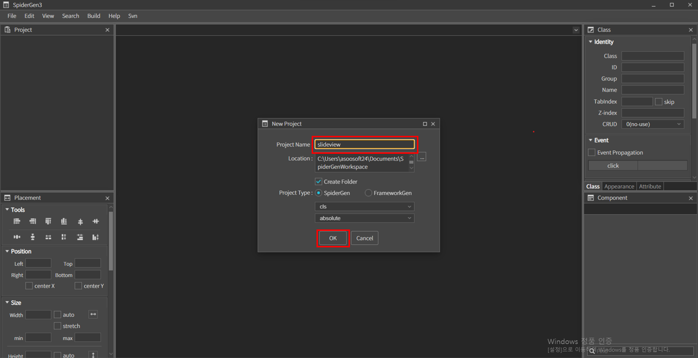
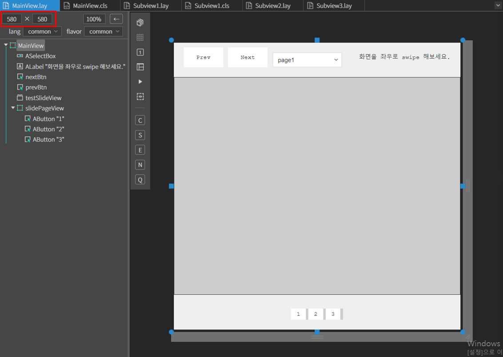
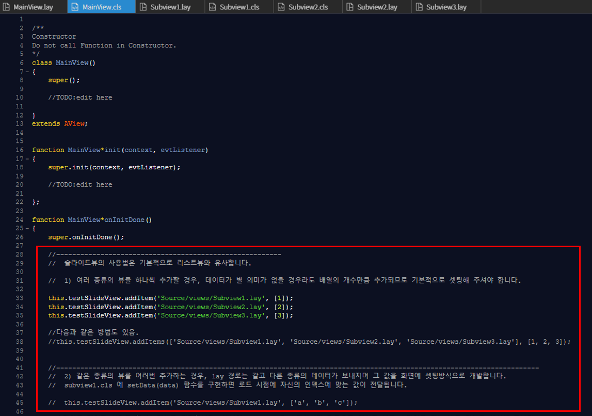
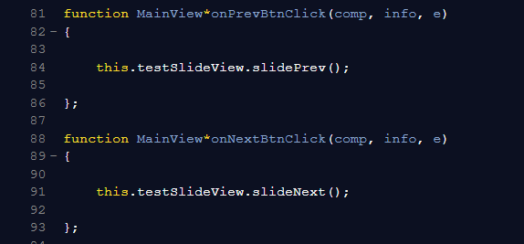
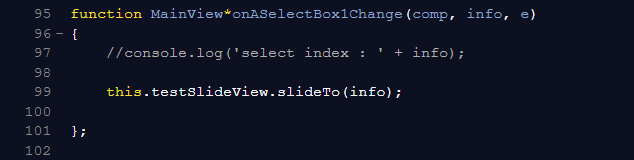
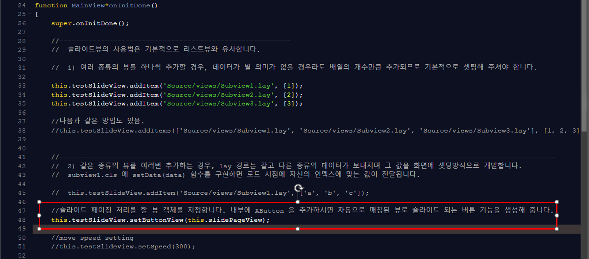
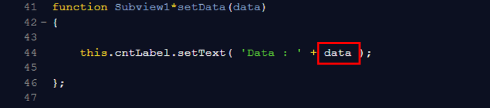
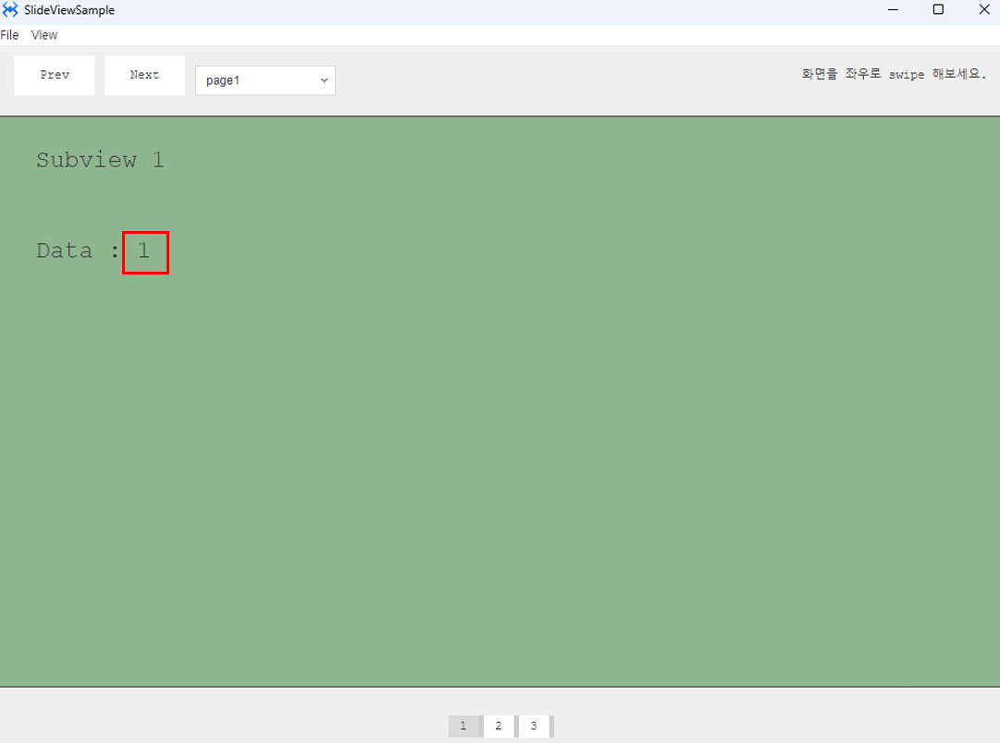
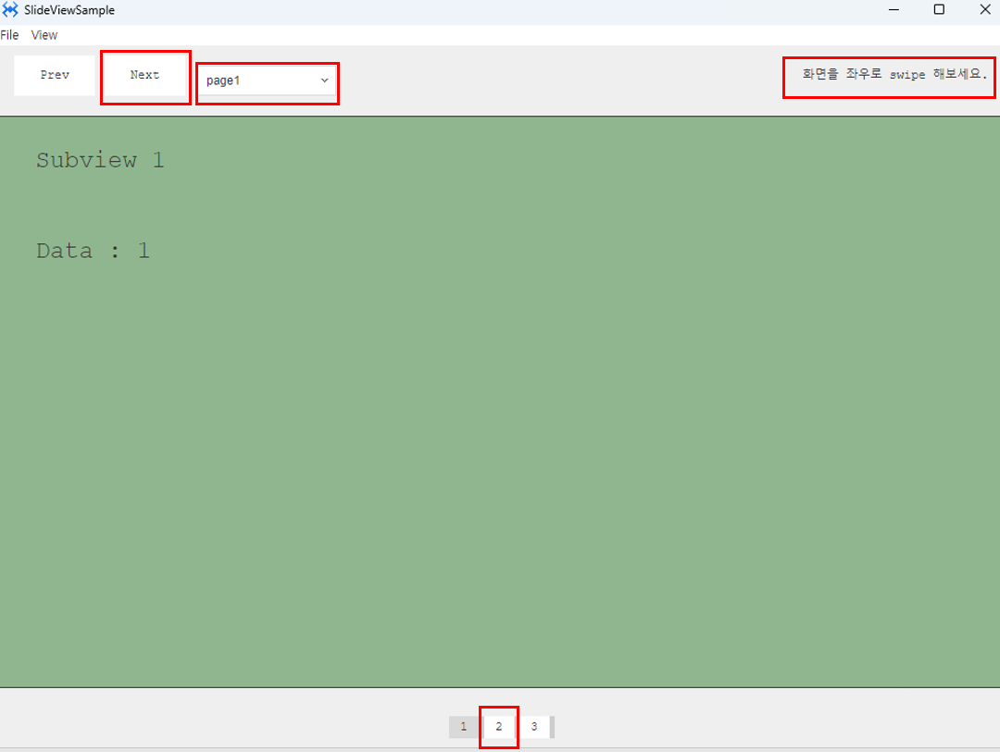
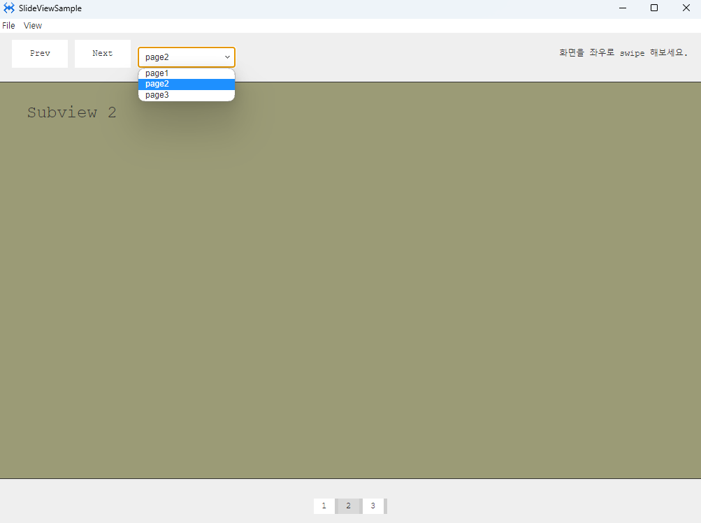

# Slideview

슬라이드뷰 샘플 예제입니다.

<center>



</center>

위 이미지와 같이 프로젝트 이름을 적고 OK 버튼을 누릅니다.

### 1. MainView.lay 를 오픈하고 다음과 같이 컴포넌트를 만들어 줍니다.

|Comp|id|text|position|size|layout|attribute
|----|--|----|---------------|-------------|----------------|-----------|
|MainView||||
|ASelectBox|||left :200px, top: 20px	|width: 140px height: 30px||Data: page1,0 page2,1 page3,2|
|ALabel||화면을 좌우로 swipe 해보세요.|right :20px, top: 20px|width: 190px height: auto|
|AButton|nextBtn|Next|left :110px, top: 10px|width: 80px height: 40px|
|AButton|prevBtn|Prev|left :20px, top: 10px|width: 80px height: 40px||
|ASlideView|testSlideView||left :0px, top: 70px|width: 100% height: stretch-50px|
|AView|slidePageView||center-x, Bottom: 20px|width: auto height: auto||
|AButton||1|left :0px, top:0px, margin-right:5px|width: 30px height: 22px |position:static display: inline-block|
|AButton||2|left :0px, top:0px, margin-right:5px|width: 30px height: 22px|position:static display: inline-block||
|AButton||3|left :0px, top:0px, margin-right:5px|width: 30px height: 22px|position:static display: inline-block||

<br>

<center>



</center>

### 2. Source 폴더 안에 views 폴더를 생성합니다.

### 3.  views 폴더 내에 Subview1, Subview2, Subview3 뷰를 각각 추가하고 컴포넌트를 배치합니다.

<Subview1.lay>
|view|background|text|position|
|----|----------|----|--------|
|Subview1|rgb(143, 182, 143)||
|ALabel||Subview1|left:40px, top:30px
|ALabel||Data : |left:40px, top:120px

<br>

<Subview2.lay>
|view|background|text|position|
|----|----------|----|--------|
|Subview2|rgb(155, 155, 118)||
|ALabel||Subview2|left:40px, top:30px
|ALabel|||left:40px, top:120px

<br>

<Subview3.lay>
|view|background|text|position|
|----|----------|----|--------|
|Subview3|rgb(199, 166, 166)||
|ALabel||Subview3|left:40px, top:30px
|ALabel|||left:40px, top:120px

### 4.MainView.cls 파일을 오픈하고 다음과 같이 소스 내용을 수정합니다.

슬라이드뷰의 사용법은 기본적으로 리스트뷰와 유사합니다.

여러 종류의 뷰를 하나씩 추가할 경우, 데이터가 별 의미가 없을 경우라도 배열의 개수만큼 추가되므로 기본적으로 셋팅해 주셔야 합니다.

<center>



</center>

```javascript
function MainView*onInitDone()
{
	super.onInitDone();

	this.testSlideView.addItem('Source/views/Subview1.lay', [1]);
	this.testSlideView.addItem('Source/views/Subview2.lay', [2]);
	this.testSlideView.addItem('Source/views/Subview3.lay', [3]);

};

```

### 5. prevBtn 버튼과 nextBtn 버튼에  click 이벤트를 설정합니다.


<center>



</center>

```javascript
function MainView*onPrevBtnClick(comp, info, e)
{

	this.testSlideView.slidePrev();

};

function MainView*onNextBtnClick(comp, info, e)
{

	this.testSlideView.slideNext();

};

```

#### 여기까지 진행만으로 Prev, Next 버튼으로 슬라이드뷰를 사용 할 수 있습니다. 

### 6. 셀렉트박스를 이용한 슬라이드 뷰 이동

셀렉트박스에 change 이벤트를 설정 후 다음과 같은 코드를 넣어준다.

<center>



</center>


### 7. 페이징버튼을 이용한 슬라이드 뷰 이동

슬라이드 페이징 처리를 할 뷰 객체를 지정합니다. 내부에 AButton 을 추가하시면 자동으로 매칭된 뷰로 슬라이드 되는 버튼 기능을 생성해 줍니다.

<center>



</center>


```javascript
this.testSlideView.setButtonView(this.slidePageView);
```


### 8. setData(data) 함수

setData(data) 함수를 구현하면 로드 시점에 자신의 인덱스에 맞는 값이 전달됩니다.

데이터 값을 확인하기 위해 Subview1.cls에 setData(data) 함수를 만들어 data코드를 넣어줍니다.


<center>



</center>

실행하면 해당 자리에 슬라이드뷰 자신의 인덱스 값을 확인 할 수 있습니다.


<center>



</center>


### 9. F5를 누르거나 Build > Run Project 를 클릭하여 프로젝트를 Run 합니다.

<center>



</center>

next버튼, 셀렉트박스, 마우스 swipe(선택 후 옆으로 드래그), 페이징 버튼의 방법으로 다음 페이지로 이동 할 수 있습니다. 


<center>



</center>